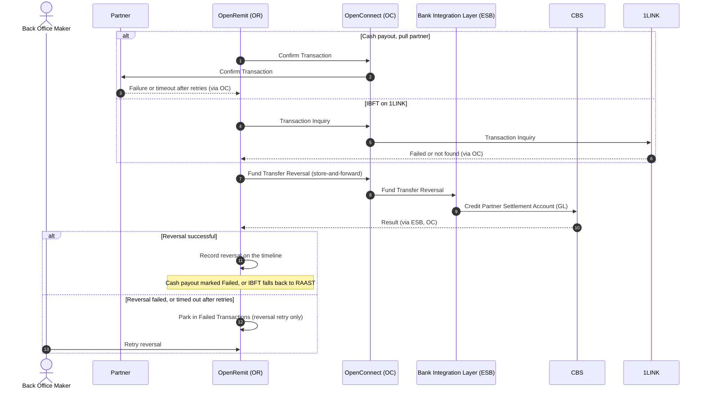

import { Hero, Capabilities } from '@site/src/components/DocKit';

<Hero title="Automatic" accent="FT Reversal" subtitle="When a step after posting fails, OpenRemit reverses the fund transfer automatically, so a partner is never debited for a payment that was not delivered." />

<Capabilities tags={['Standard', 'Requires Bank Integration']} />

## Overview

Some flows post a fund transfer on CBS before the payment is final. If a later step fails, OpenRemit automatically posts a **Fund Transfer Reversal** through the Bank Integration Layer, returning the funds to the Partner Settlement Account (GL). Reversals that cannot be delivered immediately are queued through store-and-forward. A reversal that fails is parked for a manual reversal retry only.

## Significance

- **Ledger integrity**: the partner's account is restored whenever a payment is not delivered.
- **Safe rail fallback**: an IBFT is only moved to the next rail after the previous rail's debit has been reversed, preventing double payment.
- **Cash payout safety**: if a pull partner does not confirm a cash payout, the posting is reversed and cash is not handed over.
- **Reconciliation**: every reversal is logged against the transaction and shown on its timeline.

## Usage

### When reversal is triggered

| Flow | Trigger | Reversal posting |
|---|---|---|
| [COC / OTC cash payout](./coc-otc-cash-payout.md) (pull partner) | Confirm Transaction to the partner fails, or times out after retries | Debit the branch or sub-agent settlement account, credit the partner (store-and-forward) |
| [IBFT](./ibft-rail-fallback.md), primary rail 1LINK | Payment fails, or the 1LINK inquiry finds it failed or not found | Credit the partner, then fall back to RAAST |
| [IBFT](./ibft-rail-fallback.md), secondary rail RAAST | RAAST inquiry returns RJCT (rejected) | RAAST FT reversal, then park for manual Move to RTGS |

### Who uses it

| Role | Portal and menu | What they do |
|---|---|---|
| (system) | — | Posts reversals automatically |
| Back Office Maker | Back Office → **Failed Transactions** | Retries a reversal that failed |

### APIs involved

| Interface | API | Used for |
|---|---|---|
| Bank Integration Layer (ESB) | Fund Transfer Reversal | Reverse an internal fund transfer on CBS |
| Bank Integration Layer (ESB) → RAAST | RAAST FT reversal | Reverse a rejected RAAST payment |
| OpenConnect → 1LINK | Transaction Inquiry | Confirm the 1LINK outcome before reversing |

## Sequence Diagram

## Outcomes & Edge Cases

| Stage | Condition | Outcome |
|---|---|---|
| Cash payout confirmation (pull) | Failed | Marked failed; FT reversed via store-and-forward |
| Cash payout confirmation (pull) | Timeout | Retried; then FT reversed via store-and-forward and marked failed with "Notify partner timeout" |
| 1LINK | Payment failed, or inquiry finds failed / not found | Partner debit reversed, then fallback to RAAST |
| 1LINK reversal | Success | Fallback to RAAST |
| 1LINK reversal | Failed | Parked in Failed Transactions; only the reversal can be retried |
| 1LINK reversal | Timeout | Retried; then parked for a manual reversal retry |
| RAAST inquiry | RJCT | RAAST FT reversal |
| RAAST reversal | Success | Parked for manual Move to RTGS |
| RAAST reversal | Failed | Parked; only the reversal can be retried (manual settlement) |
| RAAST reversal | Timeout | Retried; then parked for a manual reversal retry |

## Related

- [Back Office: Failed Transactions](../../back-office/failed-transactions.md)
- [Back Office: Transactions](../../back-office/transactions.md)
- [COC / OTC Cash Payout](./coc-otc-cash-payout.md)
- [IBFT / P2P with Rail Fallback](./ibft-rail-fallback.md)
- [Reversal File Upload](./reversal-file-upload.md)
