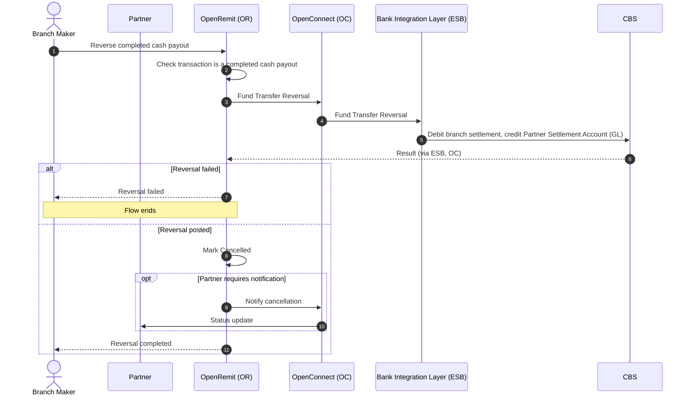

import { Hero, Capabilities } from '@site/src/components/DocKit';

<Hero title="Branch OTC" accent="Full Reversal" subtitle="Undo a completed cash payout end to end when the Branch Maker finds that the details captured were wrong." />

<Capabilities tags={['Standard', 'Requires Bank Integration']} />

## Overview

If a cash payout completed end to end but the Branch Maker then finds that the data captured was incorrect, the Branch Maker can reverse the whole transaction. OpenRemit posts a reversal that credits the funds back to the Partner Settlement Account (GL) and debits the branch / teller settlement account, marks the transaction *Cancelled*, and notifies the partner through its API where the partner requires it.

## Significance

- **Correct records**: wrong beneficiary details on a completed cash payout can be corrected at source instead of being carried into reporting.
- **Ledger integrity**: the branch settlement account and the Partner Settlement Account (GL) are both restored.
- **Partner alignment**: the partner is told the transaction was cancelled, so it can be re-issued correctly.
- **Traceability**: every cash payout carries branch code and user details, so reversals can be attributed and reported.

## Usage

### Who uses it

| Role | Portal and menu | What they do |
|---|---|---|
| Branch Maker | Branch Portal → **Transaction History** | Identifies the completed payout and reverses it |

### Steps

1. Find the completed cash payout in **Transaction History**.
2. Initiate the full reversal.
3. OpenRemit posts the reversal on CBS: debit the branch / teller settlement account, credit the Partner Settlement Account (GL).
4. The transaction is marked *Cancelled*, and the partner is notified through its API if required.

### APIs involved

| Interface | API | Used for |
|---|---|---|
| Bank Integration Layer (ESB) | Fund Transfer Reversal | Reverse the cash payout posting on CBS |
| Partner system | Transaction status notification | Inform the partner of the cancellation, where required |

## Configuration

| Parameter | Description | Default |
|---|---|---|
| Partner notification | Notify the partner of the cancellation through its API | default: enabled where the partner supports it |

## Sequence Diagram

## Outcomes & Edge Cases

| Stage | Condition | Outcome |
|---|---|---|
| Eligibility | Completed cash payout | Reversal can be initiated |
| Reversal posting | Success | Partner credited, branch debited; transaction *Cancelled* |
| Partner notification | Required by the partner | Partner notified through its API |

:::caution[TBD]
The source specification does not define:
- The Branch Portal screen and button used to start the reversal.
- Whether a Branch Checker must approve it.
- How long after completion a reversal is allowed.
- The behaviour if the reversal posting fails or times out.
:::

## Related

- [Branch Portal: Transaction History](../../branch-portal/transaction-history.md)
- [Branch Portal: Transaction Approval](../../branch-portal/transaction-approval.md)
- [COC / OTC Cash Payout](./coc-otc-cash-payout.md)
- [Automatic FT Reversal](./automatic-ft-reversal.md)
