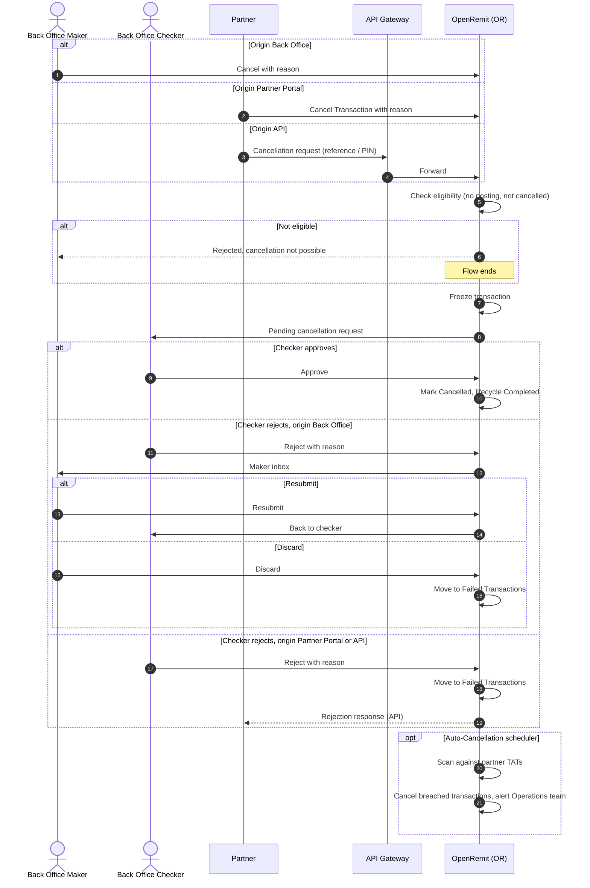

import { Hero, Capabilities } from '@site/src/components/DocKit';

<Hero title="Transaction" accent="Cancellation" subtitle="Stop a transaction before any money moves: on request from the Back Office, Partner Portal or API, for unpaid cash payouts, or automatically when a turnaround time is breached." />

<Capabilities tags={['Standard', 'Configurable']} />

## Overview

A transaction can be cancelled only while **no debit or credit has been posted** for it. Cancellation never generates reversal entries. Requests can come from three origins (Back Office, Partner Portal, API) and are approved by the **Back Office Checker**. While a request is pending, the transaction is frozen. Two further mechanisms exist: **COC Cancel**, for unpaid cash payouts from push partners, and **Auto-Cancellation**, driven by per-partner turnaround times (TAT).

## Significance

- **Stops unwanted payouts**: transactions that should not be paid can be stopped safely before any posting.
- **Safe by design**: cancellation is blocked once a posting exists, so the ledger never needs a cancellation reversal.
- **Four-eyes control**: a different checker approves every manual cancellation.
- **Retention compliance**: unpaid or stuck transactions are cleared automatically according to each partner's retention policy.
- **Full audit**: origin, requester, timestamps, checker decision and reason are logged for every cycle.

## Usage

### Who uses it

| Role | Portal and menu | What they do |
|---|---|---|
| Back Office Maker | Back Office → **Failed Transactions** → Cancel / COC Cancel | Raises cancellation requests |
| Back Office Checker | Back Office → Checker inbox | Approves or rejects them |
| Partner (maker) | Partner Portal → **Failed Transactions** → Cancel Transaction | Raises a cancellation request |
| Partner | API Gateway | Raises a cancellation request against an unpaid reference / PIN |
| Operations team | Back Office → Auto-cancellation configuration | Sets TATs per partner and stage |

### Manual cancellation

1. The requester selects an eligible transaction and enters a mandatory reason.
2. The request goes to the Back Office Checker, and the transaction is **frozen**: no payout, credit posting or amendment can happen on it.
3. **Approve**: the transaction is marked *Cancelled* and its lifecycle *Completed*.
4. **Reject**, origin Back Office: the request returns to the Back Office Maker inbox to **Resubmit** or **Discard** (moves to Failed Transactions).
5. **Reject**, origin Partner Portal or API: terminal. The transaction goes to Failed Transactions, and an API requester receives the rejection.

### Eligibility (Failed Transactions → Cancel)

The **Cancel Transaction** option is shown only for FT and IBFT transactions, and is hidden when the transaction:

- is already cancelled,
- is a cash payout (use COC Cancel instead), or
- has already completed its internal debit or payment stage.

### COC Cancel (push partners only)

- Lists cash payouts from push partners that have **not moved to Fund Transfer** and **not been paid**, e.g. the beneficiary never came to collect.
- The Back Office Maker raises the request; a **different** Back Office Checker approves or rejects it.
- **Approve**: *Cancelled*, removed from the list, and blocked from any further payment.
- **Reject**: not cancelled; the rejection is recorded on the request.
- Only one pending request is allowed per transaction. If the transaction is paid or moves to Fund Transfer while the request is pending, it is not cancelled on approval.

### Auto-Cancellation

| Rule | Behaviour |
|---|---|
| Title Fetch failure | A transaction that fails at Title Fetch is cancelled automatically |
| Stage TAT | A transaction that stays failed at a stage beyond the partner's TAT for that stage is cancelled automatically |
| Retention TAT | A scheduler scans unpaid cash payouts (*Available for Payout*) and pending / discrepant / unprocessed direct deposits with no financial impact. Breaches are cancelled and the Operations team is alerted. A warning alert fires before the TAT is reached |

### APIs involved

| Interface | API | Used for |
|---|---|---|
| API Gateway | Cancellation request | Partner cancels an unpaid reference / PIN |

## Configuration

| Parameter | Description | Default |
|---|---|---|
| Stage TAT (per partner, per stage) | Time a transaction may stay failed at a stage before it is auto-cancelled | default: TBD |
| Retention TAT (per partner) | Time an unpaid cash payout or direct deposit is kept before auto-cancellation; partners can be updated in bulk | default: TBD |
| Pre-TAT warning | Alert to the Operations team before the TAT is reached | default: enabled |
| Auto-cancel on Title Fetch failure | Cancel automatically when Title Fetch fails | default: TBD |

## Sequence Diagram

## Outcomes & Edge Cases

| Stage | Condition | Outcome |
|---|---|---|
| Eligibility | Eligible FT or IBFT transaction | Cancel option shown; reason required |
| Eligibility | Already cancelled | Cancel option hidden |
| Eligibility | Cash payout | Cancel option hidden; COC Cancel applies to push partners |
| Eligibility | Internal debit or payment already successful | Cancel option hidden; cancellation blocked |
| Request | Submitted without a reason | Validation error |
| Security | Forced cancellation through API or URL manipulation | Rejected; attempt logged in Audit Logs; transaction unchanged |
| Pending | Any processing attempted while frozen | Blocked until the checker decides |
| Approval | Approved | *Cancelled*; lifecycle *Completed*; shown in Transaction Monitoring |
| COC Cancel | Paid or moved to Fund Transfer while pending | Not cancelled on approval |
| COC Cancel | Second request for the same transaction | Not allowed while one is pending |
| Auto-cancel | Retention TAT breached | Cancelled; Operations team alerted |
| Audit | Every cycle | Origin, requester, timestamps, checker decision and reason logged |

:::caution[TBD]
The source documents differ on two points:
- Whether a Back Office-originated cancellation from Failed Transactions takes effect immediately or waits for checker approval.
- Whether a Partner Portal-originated cancellation is approved by the partner checker or by the Back Office Checker.

This page follows the maker-checker flow with Back Office Checker approval.
:::

## Related

- [Back Office: Failed Transactions](../../back-office/failed-transactions.md)
- [Partner Portal: Failed Transactions](../../partner-portal/failed-transactions.md)
- [Partner Portal: Checker Inbox](../../partner-portal/checker-inbox.md)
- [COC Amendment](./coc-amendment.md)
- [Account Credit Amendment](../non-financial/account-credit-amendment.md)
- [Alerts](../non-financial/alerts.md)
- [Audit Logs & Reports](../non-financial/audit-logs-reports.md)
