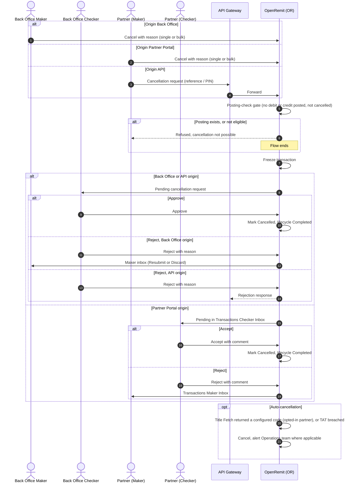

import { Hero, Capabilities } from '@site/src/components/DocKit';

<Hero title="Transaction" accent="Cancellation" subtitle="Stop a transaction before any money moves: on request from the Back Office, Partner Portal or API, for unpaid cash payouts, or automatically on a Title Fetch failure or a breached turnaround time." />

<Capabilities tags={['Standard', 'Configurable']} />

## Overview

Cancellation is available for both cash (COC) and account (FT / IBFT) transactions. A **posting-check gate** runs first: a transaction can be cancelled only while no debit or credit has been posted for it on the partner / agent account. Once a posting exists, cancellation is not possible, and cancellation never generates reversal entries.

Requests can come from three origins, and the origin decides who approves:

| Origin | Approved by |
|---|---|
| Back Office | Back Office Checker |
| API | Back Office Checker |
| Partner Portal | Partner Checker |

While a request is pending, the transaction is frozen. Rejected requests are routed back according to their origin. Two automatic mechanisms complement manual cancellation: **Title Fetch auto-cancellation** and **TAT-based auto-cancellation**.

## Significance

- **Stops unwanted payouts**: transactions that should not be paid are stopped safely before any posting.
- **Safe by design**: the posting-check gate means the ledger never needs a cancellation reversal.
- **Four-eyes control**: a different checker approves every manual cancellation.
- **Partner self-service**: partners cancel their own transactions, approved by their own checker.
- **Retention compliance**: unpaid or stuck transactions are cleared automatically according to each partner's policy.
- **Full audit**: origin, requester, timestamps, checker decision and reason are logged for every cycle.

## Usage

### Who uses it

| Role | Portal and menu | What they do |
|---|---|---|
| Back Office Maker | Back Office → **Failed Transactions** → Cancel, Bulk Cancel, COC Cancel | Raises cancellation requests |
| Back Office Checker | Back Office → Checker inbox | Approves or rejects Back Office and API requests |
| Partner (maker) | Partner Portal → **Failed Transactions** → Cancel (individually or in bulk), or the **Cancellation** screen | Raises a cancellation request |
| Partner (checker) | Partner Portal → **Transactions Checker Inbox** | Approves or rejects Partner Portal requests |
| Partner | API Gateway → cancellation request | Raises a cancellation against an unpaid reference / PIN |
| Operations team | Back Office → auto-cancellation configuration | Sets TATs and opts partners into Title Fetch auto-cancellation |

### Manual cancellation

1. The requester selects the transaction (or several, for bulk cancel) and enters a mandatory reason.
2. OpenRemit runs the posting-check gate. If a posting exists, the request is refused.
3. The request goes to the checker for its origin, and the transaction is **frozen**: no payout, credit posting or amendment can happen until the checker decides.
4. **Approve**: the transaction is marked *Cancelled* and its lifecycle *Completed*.
5. **Reject**: the request is routed back by origin:
   - **Back Office**: to the Back Office Maker inbox, to **Resubmit** or **Discard** (moves to Failed Transactions).
   - **Partner Portal**: to the Partner Maker Inbox, for correction and resubmission.
   - **API**: terminal; the transaction stays in Failed Transactions and the partner receives the rejection.

### COC Cancel (push partners)

- Lists cash payouts from push partners that have **not moved to Fund Transfer** and **not been paid**, for example where the beneficiary never came to collect.
- A Back Office Maker raises the request; a **different** Back Office Checker approves or rejects it.
- Only one pending request is allowed per transaction. If the transaction is paid or moves to Fund Transfer while the request is pending, it is not cancelled on approval.

### Auto-cancellation

| Rule | Behaviour |
|---|---|
| Title Fetch auto-cancellation | LFT and IBFT transactions are cancelled automatically when Title Fetch returns one of the configured response codes. Opt-in per partner. |
| Stage TAT | A transaction that stays failed at a stage beyond the partner's TAT for that stage is cancelled automatically. |
| Retention TAT | A scheduler scans unpaid cash payouts (*Available for Payout*) and pending direct deposits with no financial impact. Breaches are cancelled and the Operations team is alerted; a warning alert fires before the TAT is reached. |

TATs count working days from the [Holiday Calendar](../non-financial/holiday-calendar.md).

### APIs involved

| Interface | API | Used for |
|---|---|---|
| API Gateway | Cancellation request | Partner cancels an unpaid reference / PIN |

## Configuration

| Parameter | Description | Default |
|---|---|---|
| Title Fetch auto-cancellation | Per partner: opt in, and the Title Fetch response codes that trigger it | default: off |
| Stage TAT (per partner, per stage) | Time a transaction may stay failed at a stage before it is auto-cancelled | default: configurable |
| Retention TAT (per partner) | Time an unpaid cash payout or pending direct deposit is kept; partners can be updated in bulk | default: configurable |
| Pre-TAT warning | Alert to the Operations team before the TAT is reached | default: enabled |

## Sequence Diagram

## Outcomes & Edge Cases

| Stage | Condition | Outcome |
|---|---|---|
| Gate | No posting yet, not cancelled | Request accepted for approval |
| Gate | Debit or credit already posted | Refused; stays in Failed Transactions; no reversal generated |
| Gate | Already cancelled | Cancel option not available |
| Request | Submitted without a reason | Validation error |
| Security | Forced cancellation through API or URL manipulation | Rejected; attempt logged; transaction unchanged |
| Pending | Any processing attempted while frozen | Blocked until the checker decides |
| Approval | Approved by the checker for its origin | *Cancelled*; lifecycle *Completed* |
| Rejection | Back Office origin | Back Office Maker inbox: Resubmit or Discard |
| Rejection | Partner Portal origin | Partner Maker Inbox |
| Rejection | API origin | Terminal; partner receives the rejection |
| COC Cancel | Paid or moved to Fund Transfer while pending | Not cancelled on approval |
| Auto-cancel | Configured Title Fetch code, partner opted in | Cancelled automatically |
| Auto-cancel | TAT breached | Cancelled; Operations team alerted |
| Audit | Every cycle | Origin, requester, timestamps, checker decision and reason logged |

## Related

- [Back Office: Failed Transactions](../../back-office/failed-transactions.md)
- [Partner Portal: Failed Transactions](../../partner-portal/failed-transactions.md)
- [Partner Portal: Cancellation](../../partner-portal/cancellation.md)
- [Partner Portal: Checker Inbox](../../partner-portal/checker-inbox.md)
- [COC Amendment](./coc-amendment.md)
- [Account Credit Amendment](../non-financial/account-credit-amendment.md)
- [Holiday Calendar](../non-financial/holiday-calendar.md)
