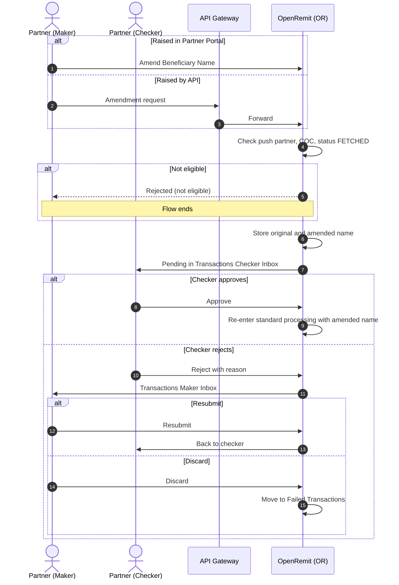

import { Hero, Capabilities } from '@site/src/components/DocKit';

<Hero title="COC" accent="Amendment" subtitle="A push partner corrects the beneficiary name on a cash-over-counter transaction before it is paid, with partner checker approval." />

<Capabilities tags={['Standard']} />

## Overview

A COC Amendment changes the **Beneficiary Name** on a push partner's cash-over-counter transaction that is still in *FETCHED* status, i.e. not yet processed by a Branch Maker. Only the name can be changed, and no Title Fetch is involved. The amendment is raised from the Partner Portal or the Partner API and is always approved by the **partner checker** in the Partner Portal. Pull partners correct the record on their own system instead.

## Significance

- **Correct payee**: the cash is paid to the person the remitter intended, because the payout is matched against the beneficiary's identity at the branch.
- **No re-issue**: the transaction is corrected in place instead of being cancelled and resent.
- **Four-eyes control**: no change is applied without partner checker approval.
- **Audit trail**: the original and amended names are always kept side by side.

## Usage

### Who uses it

| Role | Portal and menu | What they do |
|---|---|---|
| Partner (maker) | Partner Portal, or Partner API | Raises the beneficiary-name amendment |
| Partner (checker) | Partner Portal → **Transactions Checker Inbox** | Approves or rejects it |
| Partner (maker) | Partner Portal → **Transactions Maker Inbox** | Resubmits or discards a rejected amendment |

### Steps

1. The partner maker raises the amendment for an eligible transaction (push partner, cash-over-counter, *FETCHED*), entering only the new Beneficiary Name.
2. The request goes to the partner checker, whichever origin it came from.
3. **Approve**: the transaction re-enters standard processing with the amended name.
4. **Reject**: the request goes to the Partner Maker Inbox. The maker can **Resubmit** (back to the checker) or **Discard** (the transaction moves to Failed Transactions).

### APIs involved

| Interface | API | Used for |
|---|---|---|
| API Gateway (push) | Partner amendment request | Raise the beneficiary-name amendment programmatically |

## Sequence Diagram

## Outcomes & Edge Cases

| Stage | Condition | Outcome |
|---|---|---|
| Eligibility | Push partner, cash-over-counter, status *FETCHED* | Amendment can be raised |
| Eligibility | Pull partner | Not allowed; the partner corrects its own system |
| Eligibility | Already processed by a Branch Maker | Not allowed |
| Scope | Any field other than Beneficiary Name | Not editable |
| Checker | Approves | Re-enters processing with the amended name |
| Checker | Rejects | Maker Inbox: Resubmit or Discard |
| Maker | Discards | Transaction moves to Failed Transactions |
| Audit | Any outcome | Original and amended values kept for audit and inquiry |

## Related

- [Partner Portal: Checker Inbox](../../partner-portal/checker-inbox.md)
- [Partner Portal: Failed Transactions](../../partner-portal/failed-transactions.md)
- [COC / OTC Cash Payout](./coc-otc-cash-payout.md)
- [Cancellation](./cancellation.md)
- [Account Credit Amendment](../non-financial/account-credit-amendment.md)
