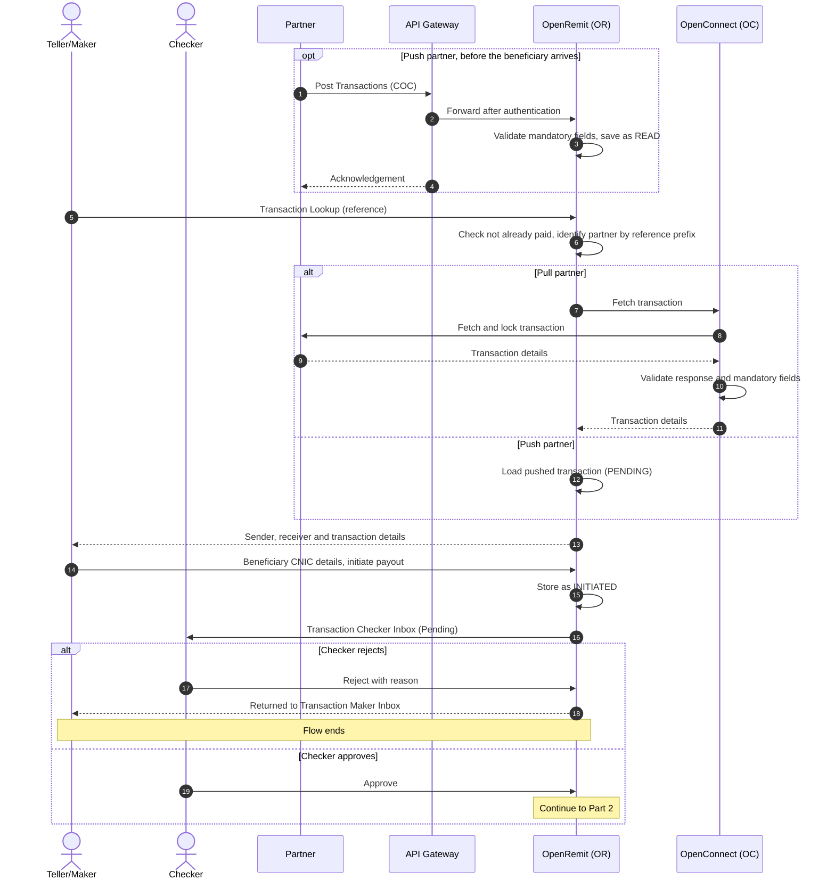
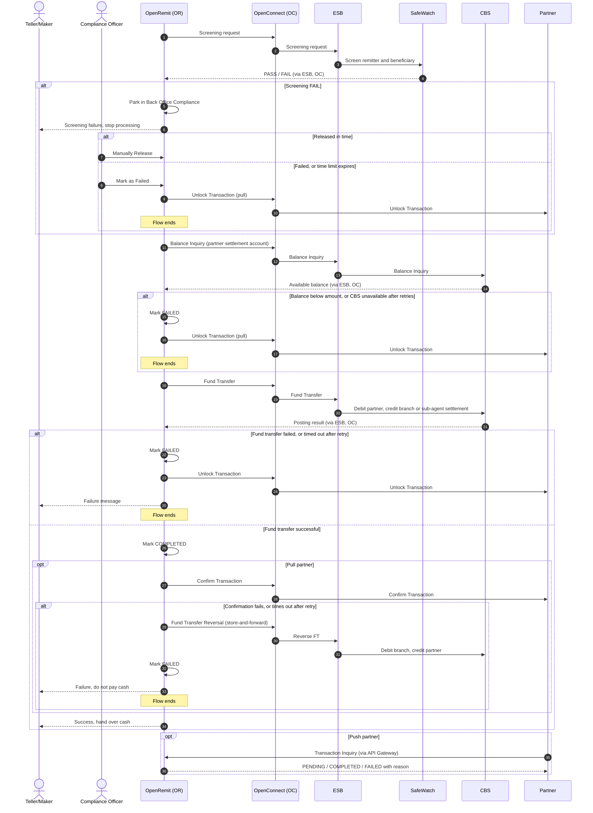

import { Hero } from '@site/src/components/DocKit';

<Hero title="COC / OTC" accent="Cash Payout" subtitle="The beneficiary collects a partner remittance in cash at a BankIslami branch or sub-agent. Pull and push partners, branch and sub-agent payout." />

:::tip[Live]
Available today in the Branch Portal (Transaction Lookup, Checker Inbox, Transaction History) and the Back Office (Compliance).
:::

## Overview

A beneficiary walks into a branch with a transaction reference. A teller (maker) looks the transaction up, captures the beneficiary's identity details, and a branch checker approves it. OpenRemit then screens the transaction, checks the partner's balance, debits the partner's settlement account and credits the branch's (or sub-agent's) settlement account on CBS. Cash is handed over only after the partner has confirmed the transaction.

## Significance

- **AML/CFT compliance**: screening through SafeWatch is mandatory for every transaction. A screening hit stops the payout until a compliance officer releases or fails it.
- **No duplicate payout**: for pull partners, OpenRemit locks the transaction on the partner's system while it is being paid. A reference that is already paid or in progress cannot be looked up again.
- **Four-eyes control**: the teller who captures the payout cannot approve it. A branch checker (BM or CSM) must approve every payout before any money moves.
- **Partner funding control**: a balance inquiry on the partner's settlement account is made before posting, so a partner cannot be overdrawn.
- **Reconciliation**: every payout carries branch code, username and agent details for reporting. Sub-agent payouts are reconciled with the bank offline using OpenRemit reports.
- **Auditability**: every step, retry and reversal is logged against the transaction.

## Usage

### Who uses it

| Actor | Portal | Role |
|---|---|---|
| Teller / Maker (CSO, or sub-agent maker) | Branch Portal → **Transaction Lookup** | Finds the transaction and captures beneficiary details |
| Checker (BM / CSM, or sub-agent checker) | Branch Portal → **Transaction Checker Inbox** | Approves or rejects the payout |
| Compliance Officer | Back Office → **Compliance** | Manually releases or fails a transaction held at screening |
| Partner | Partner APIs / Partner Portal → **Transactions** | Supplies the transaction (pull or push) and receives the final status |

### Steps

1. **Teller** opens *Transaction Lookup* and searches by Transaction ID / Reference Code.
2. OpenRemit checks the reference is not already paid and identifies the partner from the reference prefix.
   - **Pull partner**: OpenRemit fetches and locks the transaction on the partner's system through OpenConnect.
   - **Push partner**: the transaction was already pushed by the partner and is read from OpenRemit.
3. The teller checks the beneficiary's physical CNIC, enters the beneficiary details (name, date of birth, CNIC expiry, address) and initiates the payout.
4. **Checker** reviews it in the *Transaction Checker Inbox* and approves or rejects it. Rejected payouts return to the *Transaction Maker Inbox*.
5. OpenRemit screens the transaction (SafeWatch), runs a balance inquiry on the partner account, and posts the fund transfer on CBS.
6. For pull partners, OpenRemit calls the partner's *Confirm Transaction* API. Cash is handed over **only after** confirmation succeeds.
7. The completed payout appears in *Transaction History*, where the e-PRC and Bank Receipt can be generated.

### Branch vs sub-agent payout

| | Branch | Sub-agent |
|---|---|---|
| Users | Branch staff validated against Active Directory; roles CSO (maker) and BM / CSM (checker) | Defined in Back Office → SubAgents and assigned a maker or checker role |
| Account credited | Branch / teller settlement account | The sub-agent's single settlement account held at BankIslami |
| Reconciliation | Reports from OpenRemit | Offline between sub-agent and bank, using OpenRemit reports |

### APIs involved

| Interface | API | Used for |
|---|---|---|
| Partner (pull) | Fetch & lock / Confirm Transaction / Unlock Transaction | Retrieve and lock the transaction; confirm payout or release it |
| API Gateway (push) | Post Transactions / Transaction Inquiry | Partner pushes the transaction and later polls its status |
| Bank ESB | SafeWatch screening | AML/CFT and fraud screening |
| Bank ESB | Balance Inquiry | Partner settlement-account balance check |
| Bank ESB | Internal Fund Transfer / Fund Transfer Reversal | Debit partner, credit branch or sub-agent; reverse if partner confirmation fails |

:::note
The position of screening (before or after the fund transfer) and whether partner notification is used are configured per partner in the scheduler's processing steps. The flow below shows the standard order: screening before posting.
:::

## Sequence Diagram

### Part 1: Lookup, capture and approval

### Part 2: Screening, posting and confirmation

## Outcomes & Edge Cases

| Stage | Condition | Outcome |
|---|---|---|
| Lookup | No partner matches the reference prefix | Error shown: no transaction found |
| Lookup | Pull partner returns the transaction | Details shown, flow continues |
| Lookup | Pull partner returns a failure, or the transaction is not found | Error shown (partner's error, or no transaction found) |
| Lookup | Transaction already in progress | Error shown: transaction already in process |
| Lookup | Transaction previously failed | Re-fetched from the partner (pull) or reloaded from OpenRemit (push); details shown |
| Lookup | Transaction already paid | Error shown: transaction already paid |
| Screening | PASS | Flow continues |
| Screening | FAIL | Parked in Back Office Compliance; the compliance officer releases it or marks it failed |
| Screening | Timeout | Marked failed; partner notified or transaction released (pull) |
| Balance inquiry | Balance covers the amount | Flow continues |
| Balance inquiry | Balance below the amount, or inquiry failed | Marked failed; partner notified or transaction released |
| Balance inquiry | Timeout | Retried; if retries are exhausted, marked failed and partner notified or transaction released |
| Fund transfer | Success | Marked completed; partner notified |
| Fund transfer | Failed | Marked failed; partner notified or transaction released (pull) |
| Fund transfer | Timeout | Retried; if still timing out, marked failed with "FT timeout". If CBS did post, the branch reverses it on CBS during reconciliation |
| Partner confirmation (pull) | Success | Completed; cash is handed over |
| Partner confirmation (pull) | Failed | Marked failed; FT reversed via store-and-forward (debit branch GL, credit partner) |
| Partner confirmation (pull) | Timeout | Retried; if retries are exhausted, FT reversed via store-and-forward and marked failed with "Notify partner timeout". The bank informs the partner daily of such cases |

:::caution[TBD]
The specification leaves these values open:
- The number of balance-inquiry retries before a transaction fails.
- The time a compliance officer has to release a screened-out COC transaction before it fails automatically.
- Whether sub-agent users sign in to the Branch Portal the same way as branch users. Branch users are validated against Active Directory; sub-agent users are managed in the Back Office.
:::

## Related

- [Branch Portal: Transaction Lookup](../../branch-portal/transaction-lookup.md)
- [Branch Portal: Transaction Approval](../../branch-portal/transaction-approval.md)
- [Branch Portal: Transaction History](../../branch-portal/transaction-history.md)
- [Back Office: Compliance](../../back-office/compliance.md)
- [Back Office: Failed Transactions](../../back-office/failed-transactions.md)
- [Back Office: SubAgents](../../back-office/subagents.md)
- [Back Office: Branch Records](../../back-office/branch-records.md)
- [Partner Portal: Transactions](../../partner-portal/transactions.md)
