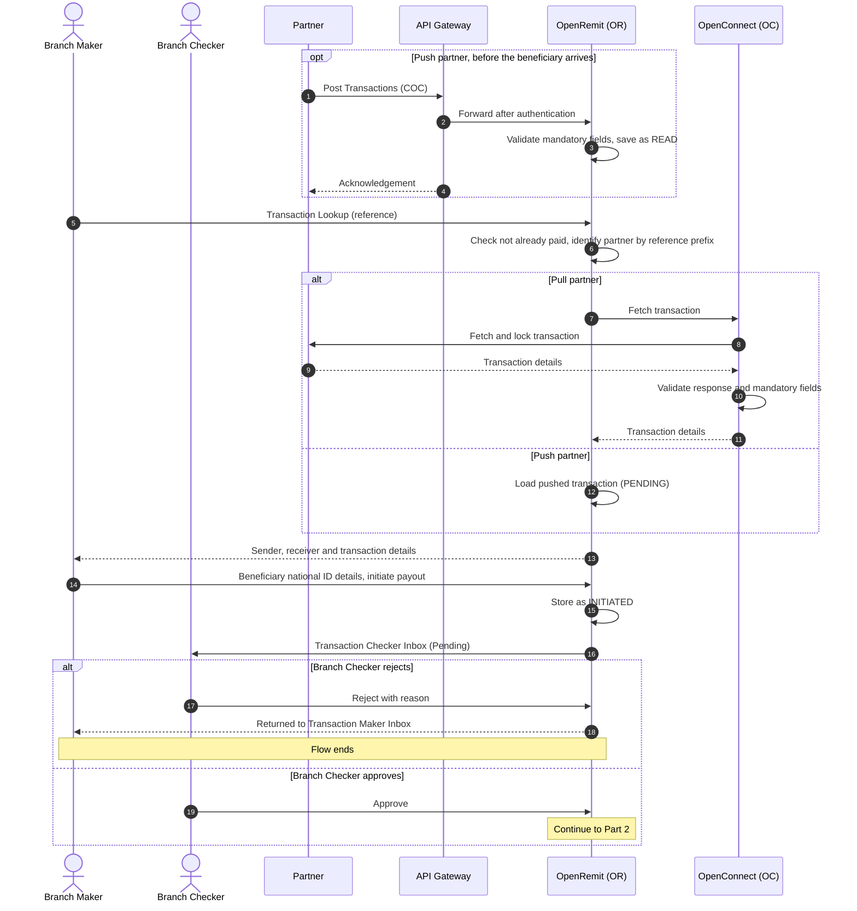
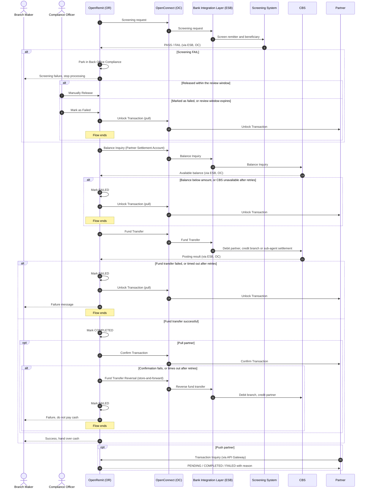

import { Hero, Capabilities } from '@site/src/components/DocKit';

<Hero title="COC / OTC" accent="Cash Payout" subtitle="The beneficiary collects a partner remittance in cash at a branch or sub-agent of the Bank. Pull and push partners, branch and sub-agent payout." />

<Capabilities tags={['Standard', 'Configurable', 'Requires Bank Integration']} />

## Overview

A beneficiary visits a branch or sub-agent with a transaction reference. A Branch Maker looks the transaction up and captures the beneficiary's identity details, and a Branch Checker approves it. OpenRemit then screens the transaction, checks the partner's balance, debits the Partner Settlement Account (GL) and credits the branch's or sub-agent's settlement account on CBS. For pull partners, cash is handed over only after the partner has confirmed the transaction.

## Significance

- **AML/CFT compliance**: every payout is screened by the Screening System before funds move. A screening hit stops the payout until a Compliance Officer releases or fails it.
- **No duplicate payout**: for pull partners, OpenRemit locks the transaction on the partner's system while it is being paid. A reference that is already paid or in progress cannot be paid again.
- **Four-eyes control**: the Branch Maker who captures a payout cannot approve it. A Branch Checker must approve every payout before any money moves.
- **Partner funding control**: a balance inquiry on the Partner Settlement Account (GL) runs before posting, so a partner cannot be overdrawn.
- **Reconciliation**: every payout records the branch code, user and agent for reporting. Sub-agent payouts are reconciled with the Bank offline using OpenRemit reports.
- **Auditability**: every step, retry and reversal is logged against the transaction.

## Usage

### Who uses it

| Role | Portal and menu | What they do |
|---|---|---|
| Branch Maker (branch or sub-agent) | Branch Portal → **Transaction Lookup** | Finds the transaction, verifies the beneficiary's national ID and captures their details |
| Branch Checker (branch or sub-agent) | Branch Portal → **Transaction Checker Inbox** | Approves or rejects the payout |
| Compliance Officer | Back Office → **Compliance** | Manually releases or fails a transaction held by screening |
| Partner | Partner APIs, or Partner Portal → **Transactions** | Supplies the transaction (pull or push) and receives its final status |

### Steps

1. The **Branch Maker** opens *Transaction Lookup* and searches by Transaction ID or Reference Code.
2. OpenRemit checks the reference has not already been paid and identifies the partner from the reference prefix.
   - **Pull partner**: OpenRemit fetches the transaction from the partner's system through OpenConnect and locks it there.
   - **Push partner**: the partner pushed the transaction earlier, so it is read from OpenRemit.
3. The Branch Maker checks the beneficiary's physical national ID (e.g. CNIC in Pakistan), enters the beneficiary's details (name, date of birth, ID expiry, address) and initiates the payout.
4. The **Branch Checker** reviews it in the *Transaction Checker Inbox* and approves or rejects it. Rejected payouts return to the *Transaction Maker Inbox*.
5. OpenRemit screens the transaction, runs a balance inquiry on the Partner Settlement Account (GL), and posts the fund transfer on CBS.
6. For pull partners, OpenRemit calls the partner's *Confirm Transaction* API. Cash is handed over **only after** confirmation succeeds.
7. The completed payout appears in *Transaction History*, where the regulatory remittance certificate (e.g. SBP e-PRC) and Bank Receipt can be generated.

### Branch vs sub-agent payout

| | Branch | Sub-agent |
|---|---|---|
| Users | Branch users, validated against the Bank Identity Provider (e.g. Active Directory) | Sub-agent users, created in Back Office → **SubAgents** with a maker or checker role |
| Account credited | Branch / teller settlement account | The sub-agent's settlement account, held at the Bank |
| Reconciliation | OpenRemit reports | Offline between the sub-agent and the Bank, using OpenRemit reports |

### APIs involved

| Interface | API | Used for |
|---|---|---|
| Partner system (pull) | Fetch & lock, Confirm Transaction, Unlock Transaction | Retrieve and lock the transaction, then confirm the payout or release it |
| API Gateway (push) | Post Transactions | Partner pushes the transaction |
| API Gateway (push) | Transaction Inquiry | Partner polls the transaction's status |
| Bank Integration Layer (ESB) | Screening | AML/CFT and sanctions screening |
| Bank Integration Layer (ESB) | Balance Inquiry | Partner Settlement Account (GL) balance check |
| Bank Integration Layer (ESB) | Internal Fund Transfer, Fund Transfer Reversal | Debit the partner and credit the branch or sub-agent; reverse if partner confirmation fails |

## Configuration

Processing is driven by a per-partner scheduler configuration.

| Parameter | Description | Default |
|---|---|---|
| Scheduler interval | How often OpenRemit polls a pull partner for transactions | default: every 5 minutes |
| Fetch count | Transactions fetched per scheduler run | default: 50 |
| Processing steps | Ordered steps run for each transaction. Title Fetch does not apply to cash payout | default: Screening → Balance Inquiry → Fund Transfer → Partner Notify |
| Screening position | Run screening before the fund transfer (PRE) or after it (POST) | default: PRE |
| Screening by transaction type | Screening can be switched off per transaction type; the Bank then carries the liability | default: enabled |
| Balance inquiry | Pre-transfer balance check on the Partner Settlement Account (GL). Disabling it requires risk approval | default: enabled |
| Partner notify | Confirm / Unlock calls to the partner. Mandatory for pull partners' cash payouts; push partners can rely on Transaction Inquiry or webhooks instead | default: enabled |
| Unlock on rejection | Release a rejected cash transaction back to the partner | default: enabled |
| Retry attempts | Retries per step on timeout or transient failure before the transaction fails | default: 3 |
| Compliance review window | Time a Compliance Officer has to act on a screening hit before the payout fails | default: TBD |

Changes to the scheduler take effect on its next run. Transactions already in progress finish with the configuration they started with.

## Sequence Diagram

### Part 1: Lookup, capture and approval

### Part 2: Screening, posting and confirmation

## Outcomes & Edge Cases

| Stage | Condition | Outcome |
|---|---|---|
| Lookup | No partner matches the reference prefix | Error shown: no transaction found |
| Lookup | Pull partner returns the transaction | Details shown, flow continues |
| Lookup | Pull partner returns a failure, or the transaction is not found | Error shown (partner's error, or no transaction found) |
| Lookup | Transaction already in progress | Error shown: transaction already in process |
| Lookup | Transaction previously failed | Re-fetched from the partner (pull) or reloaded from OpenRemit (push); details shown |
| Lookup | Transaction already paid | Error shown: transaction already paid |
| Screening | PASS | Flow continues |
| Screening | FAIL | Held in Back Office Compliance; the Compliance Officer releases it or marks it failed |
| Screening | Timeout | Marked failed; partner notified, or transaction released (pull) |
| Balance inquiry | Balance covers the amount | Flow continues |
| Balance inquiry | Balance below the amount, or inquiry failed | Marked failed; partner notified, or transaction released |
| Balance inquiry | Timeout | Retried up to the configured attempts; then marked failed and the partner notified, or transaction released |
| Fund transfer | Success | Marked completed; partner notified |
| Fund transfer | Failed | Marked failed; partner notified, or transaction released (pull) |
| Fund transfer | Timeout | Retried; if still timing out, marked failed with reason "FT timeout" and the partner notified, or transaction released |
| Partner confirmation (pull) | Success | Completed; cash is handed over |
| Partner confirmation (pull) | Failed | Marked failed; the fund transfer is reversed through store-and-forward (debit branch, credit partner) |
| Partner confirmation (pull) | Timeout | Retried; if retries run out, the fund transfer is reversed through store-and-forward and the transaction marked failed with reason "Notify partner timeout" |

:::caution[TBD]
The source specification leaves these points open:
- The default compliance review window for a cash payout held by screening.
- Whether sub-agent users sign in to the Branch Portal the same way as branch users. Branch users are validated against the Bank Identity Provider; sub-agent users are managed in the Back Office.
:::

## Related

- [Branch Portal: Transaction Lookup](../../branch-portal/transaction-lookup.md)
- [Branch Portal: Transaction Approval](../../branch-portal/transaction-approval.md)
- [Branch Portal: Transaction History](../../branch-portal/transaction-history.md)
- [Back Office: Compliance](../../back-office/compliance.md)
- [Back Office: Failed Transactions](../../back-office/failed-transactions.md)
- [Back Office: SubAgents](../../back-office/subagents.md)
- [Back Office: Branch Records](../../back-office/branch-records.md)
- [Partner Portal: Transactions](../../partner-portal/transactions.md)
