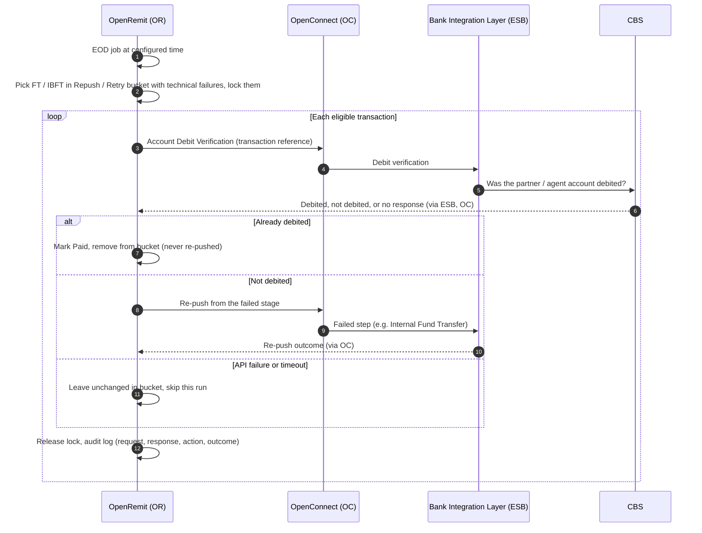

import { Hero, Capabilities } from '@site/src/components/DocKit';

<Hero title="EOD Auto Repush with" accent="Debit Verification" subtitle="Every day, OpenRemit checks transactions that failed on a technical timeout: those already debited are marked paid, the rest are re-pushed automatically." />

<Capabilities tags={['Configurable', 'Requires Bank Integration']} />

:::info[Bank dependency]
Available only where the bank provides a transaction inquiry / **Account Debit Verification API**. Without it, neither EOD Auto Repush nor [Reconciliation Tally](../non-financial/reconciliation-tally.md) can be offered.
:::

## Overview

When a fund transfer times out (for example, no response from the Bank Integration Layer or CBS), OpenRemit cannot tell whether the partner was debited, so the transaction is parked in the **Repush / Retry** bucket of Failed Transactions. Once a day, at a configured time, an end-of-day job picks these transactions and asks the bank, through its Account Debit Verification API, whether each amount was debited from the partner / agent account:

- **Already debited**: the transaction is marked **Paid** and removed from the bucket. It is never re-pushed.
- **Not debited**: the transaction is re-pushed automatically from the stage where it failed, exactly like a manual re-push.

## Significance

- **No double payment**: a transaction confirmed as debited is never re-pushed.
- **Less manual work**: technical timeouts are cleared every day without an operator checking each one.
- **Faster delivery**: transactions that were never debited are retried the same day.
- **Traceability**: every run, API call and action is audit logged.

## Usage

### Scope

| Included | Excluded |
|---|---|
| FT and IBFT transactions in the Repush / Retry bucket that failed on a system timeout or similar technical failure (e.g. no response from the Bank Integration Layer or CBS) | Business failures: invalid account, title mismatch, insufficient balance, screening or compliance rejection |

### Who uses it

| Role | Portal and menu | What they do |
|---|---|---|
| (system) | — | Runs the job daily and records the outcome |
| Back Office user | Back Office → **Failed Transactions**, **Audit Logs** | Sees transactions leave the bucket, and reviews each run |

### Steps

1. At the configured time, the job picks every eligible transaction in the Repush / Retry bucket and locks it.
2. For each transaction, OpenRemit calls the Account Debit Verification API with the transaction reference.
3. **Already debited**: marked Paid and removed from the bucket.
4. **Not debited**: re-pushed from the failed stage, following the manual re-push flow. No extra beneficiary validation is needed first.
5. **API failure or timeout**: the transaction stays in the bucket unchanged and is not re-pushed in this run.
6. The lock is released once the outcome is recorded, and the run is audit logged.

### APIs involved

| Interface | API | Used for |
|---|---|---|
| Bank Integration Layer (ESB) | Account Debit Verification (transaction inquiry) | Confirm whether the amount was debited from the partner / agent account |
| Bank Integration Layer (ESB) | The failed step's API (e.g. Internal Fund Transfer, rail payment) | Automatic re-push |

## Configuration

| Parameter | Description | Default |
|---|---|---|
| Enabled | Run the EOD job (requires the debit verification API) | default: disabled until the API is available |
| Run time | When the daily job runs | default: configured per deployment |
| Eligible failure codes | Technical failures that put a transaction in scope | default: system timeouts and no-response errors |

## Sequence Diagram

## Outcomes & Edge Cases

| Stage | Condition | Outcome |
|---|---|---|
| Selection | Technical failure (timeout, no response) in the Repush / Retry bucket | Picked by the job |
| Selection | Business failure (invalid account, title mismatch, insufficient balance, screening) | Not picked |
| Verification | Amount already debited | Marked **Paid**; removed from the bucket; never re-pushed |
| Verification | Amount not debited | Re-pushed automatically from the failed stage |
| Verification | API failure or timeout | Left unchanged in the bucket; not re-pushed in this run |
| Locking | Manual re-push attempted while the job holds the transaction | Blocked until the outcome is recorded |
| Re-push | Fails again | Back in Failed Transactions with the new reason |
| Audit | Every run | Logged with the transactions picked, API request / response, action taken (Marked Paid / Auto-Repushed / Skipped) and re-push outcome |

## Related

- [Retry / Re-push](./retry-repush.md)
- [Reconciliation Tally](../non-financial/reconciliation-tally.md)
- [Back Office: Failed Transactions](../../back-office/failed-transactions.md)
- [Local Funds Transfer (LFT)](./local-funds-transfer.md)
- [Interbank Transfer (IBFT) with Rail Fallback](./ibft-rail-fallback.md)
