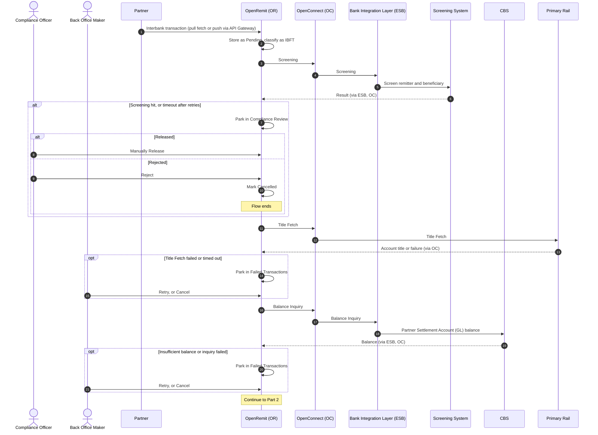
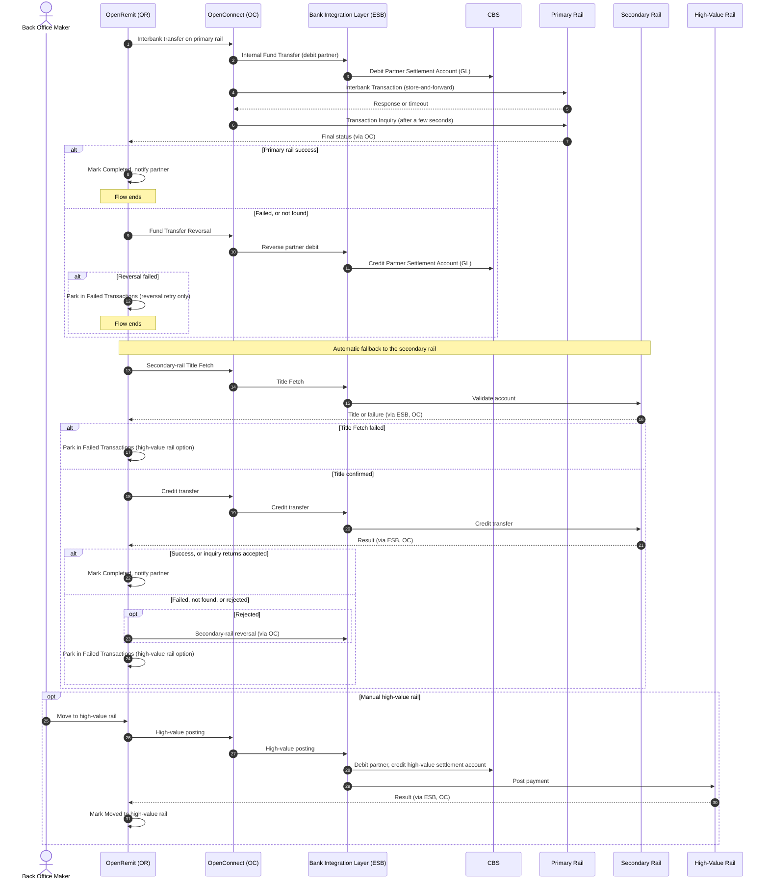

import { Hero, Capabilities } from '@site/src/components/DocKit';

<Hero title="Interbank Transfer with" accent="Rail Fallback" subtitle="A partner remittance is credited to an account at another bank. OpenRemit tries the primary domestic rail first, falls back to a secondary rail automatically, and offers a high-value rail as a manual last resort." />

<Capabilities tags={['Standard', 'Configurable', 'Requires Bank Integration']} />

## Overview

An Interbank Fund Transfer (IBFT / P2P) credits a beneficiary account at another bank in the same country. After screening and a partner balance check, OpenRemit routes the payment over the **primary rail**. If the primary rail fails, it reverses the partner debit and retries automatically on the **secondary rail**. If the secondary rail also fails, a Back Office user can move the transaction to the **high-value rail** manually. The rails and their order are configured per deployment.

:::info[Pakistan example]
Primary rail **1LINK**, secondary rail **RAAST**, high-value rail **RTGS**.
:::

## Significance

- **Higher success rate**: an automatic second rail means a single scheme outage does not stop remittances.
- **No double payment**: every failed rail attempt is confirmed by an inquiry and, where needed, reversed before the next rail is tried.
- **AML/CFT compliance**: every transaction is screened before any rail is used.
- **Full traceability**: each rail attempt, inquiry, reversal and manual action is logged with timestamps and API responses, for reconciliation and regulatory reporting.

## Usage

### Who uses it

| Role | Portal and menu | What they do |
|---|---|---|
| Partner | Partner APIs / Partner Portal → **Transactions** | Sends the transaction (pull or push) and tracks its status |
| Compliance Officer | Back Office → **Compliance Review** | Releases or rejects transactions held by screening |
| Back Office Maker | Back Office → **Failed Transactions** | Retries a step, cancels, or moves the transaction to the high-value rail |
| Back Office Checker | Back Office → Checker inbox | Approves cancellation requests |

### Steps

1. **Receive and classify**: the transaction arrives by pull or push and is classified as interbank from the account number, IBAN or bank identifier.
2. **Screen**: the Screening System checks the transaction. Hits are held in Compliance Review.
3. **Title Fetch on the primary rail**: the primary rail validates the beneficiary account and returns its title.
4. **Balance Inquiry**: CBS returns the Partner Settlement Account (GL) balance.
5. **Primary rail**: the partner is debited on CBS and the payment is sent to the primary rail. A transaction inquiry a few seconds later confirms the outcome.
6. **Secondary rail**: if the primary rail fails, the partner debit is reversed and OpenRemit runs a Title Fetch and credit transfer on the secondary rail. A timeout is resolved by a transaction inquiry returning an accepted or rejected status (ISO 20022 ACSP / RJCT where the rail uses them).
7. **High-value rail (manual)**: if the secondary rail also fails, the transaction is parked in Failed Transactions, where a Back Office user can move it to the high-value rail. See [Move to High-Value Rail](./move-to-high-value-rail.md).

:::note
Once a transaction has failed on both the primary and the secondary rail, it cannot be re-pushed. Only the high-value rail or cancellation remain.
:::

### APIs involved

| Interface | API | Used for |
|---|---|---|
| API Gateway (push) | Post Transactions, Transaction Inquiry | Partner pushes the transaction and polls its status |
| API Gateway (push) | Title Fetch, Balance Inquiry, Bank List | Partner verifies the account, checks its balance, looks up bank codes |
| Partner system (pull) | Get outstanding transactions, Confirm Transaction | Fetch pending transactions; confirm completion |
| OpenConnect → primary rail | Title Fetch, Interbank Transaction, Transaction Inquiry | Primary rail |
| Bank Integration Layer (ESB) | Screening | AML/CFT and sanctions screening |
| Bank Integration Layer (ESB) | Balance Inquiry, Internal Fund Transfer, Fund Transfer Reversal | Partner balance, partner debit for the primary rail, reversal before fallback |
| Bank Integration Layer (ESB) → secondary rail | Title Fetch, Credit Transfer, Transaction Inquiry | Secondary rail |

## Configuration

| Parameter | Description | Default |
|---|---|---|
| Rail order | Primary, secondary and high-value rails for interbank transfers | default: primary → secondary (automatic) → high-value (manual) |
| Primary-rail inquiry delay | Wait before the primary-rail transaction inquiry | default: a few seconds (TBD) |
| Retry attempts | Automatic retries per step on timeout or transient failure | default: 3 |
| Processing steps | Ordered steps run for each transaction | default: Screening → Title Fetch → Balance Inquiry → Fund Transfer → Partner Notify |
| Screening position | Screening before (PRE) or after (POST) the fund transfer | default: PRE |

## Sequence Diagram

### Part 1: Screening, Title Fetch and balance

### Part 2: Primary rail, secondary-rail fallback and high-value rail

Pakistan example: Primary Rail = 1LINK, Secondary Rail = RAAST, High-Value Rail = RTGS.

## Outcomes & Edge Cases

Rows are listed in rail order: primary, then secondary, then high-value.

| Stage | Condition | Outcome |
|---|---|---|
| Screening | Pass | Flow continues on the primary rail |
| Screening | Hit | Held in Compliance Review; released (flow continues) or rejected (Cancelled) |
| Screening | Timeout | Retried; if retries run out, held in Compliance Review |
| Balance inquiry | Balance covers the amount | Flow continues |
| Balance inquiry | Balance below the amount, or inquiry failed | Parked in Failed Transactions for retry or cancellation |
| Balance inquiry | Timeout | Retried; if retries run out, parked in Failed Transactions |
| Title Fetch (primary) | Success | Flow continues to balance inquiry |
| Title Fetch (primary) | Failed | Parked in Failed Transactions for retry or cancellation |
| Title Fetch (primary) | Timeout | Retried; if retries run out, parked in Failed Transactions |
| Partner debit (primary) | Success | Payment sent to the primary rail |
| Partner debit (primary) | Failed | Parked; retry with the same parameters (duplicate-checked) or cancel after checking CBS |
| Partner debit (primary) | Timeout | Retried; then parked for retry or cancellation after checking CBS |
| Payment (primary) | Success | Primary-rail transaction inquiry |
| Payment (primary) | Failed | Partner debit reversed, then automatic fallback to the secondary rail |
| Payment (primary) | Timeout | Primary-rail transaction inquiry |
| Inquiry (primary) | Found, successful | Completed; partner notified |
| Inquiry (primary) | Found, failed | Partner debit reversed, then fallback to the secondary rail |
| Inquiry (primary) | Not found | Partner debit reversed, then fallback to the secondary rail |
| Inquiry (primary) | Error response | Parked in Failed Transactions; inquiry retried manually |
| Inquiry (primary) | Timeout | Retried; then parked for a manual inquiry retry |
| Reversal (primary) | Success | Fallback to the secondary rail |
| Reversal (primary) | Failed | Parked in Failed Transactions; only the reversal can be retried (no fallback) |
| Reversal (primary) | Timeout | Retried; then parked for a manual reversal retry |
| Title Fetch (secondary) | Success | Secondary-rail payment |
| Title Fetch (secondary) | Failed | Parked in Failed Transactions; retry, cancel or move to the high-value rail |
| Title Fetch (secondary) | Timeout | Retried; then parked with the same options |
| Payment (secondary) | Success | Completed |
| Payment (secondary) | Failed | Parked for a manual move to the high-value rail |
| Payment (secondary) | Timeout | Secondary-rail transaction inquiry |
| Inquiry (secondary) | Accepted (e.g. ACSP) | Completed |
| Inquiry (secondary) | Rejected (e.g. RJCT) | Secondary-rail reversal |
| Inquiry (secondary) | Not found | Parked for a manual move to the high-value rail |
| Inquiry (secondary) | Error response | Parked; inquiry retried manually |
| Inquiry (secondary) | Timeout | Retried; then parked for a manual inquiry retry |
| Reversal (secondary) | Success | Parked for a manual move to the high-value rail |
| Reversal (secondary) | Failed | Parked; only the reversal can be retried (manual settlement) |
| Reversal (secondary) | Timeout | Retried; then parked for a manual reversal retry |
| High-value rail | Any outcome | See [Move to High-Value Rail](./move-to-high-value-rail.md) |

:::caution[TBD]
The source specification does not state the exact delay before the primary-rail transaction inquiry ("a few seconds").
:::

## Related

- [Back Office: Failed Transactions](../../back-office/failed-transactions.md)
- [Back Office: Transactions](../../back-office/transactions.md)
- [Partner Portal: Transactions](../../partner-portal/transactions.md)
- [Partner Portal: IMD List](../../partner-portal/imd-list.md)
- [Move to High-Value Rail](./move-to-high-value-rail.md)
- [Automatic FT Reversal](./automatic-ft-reversal.md)
- [Retry / Re-push](./retry-repush.md)
