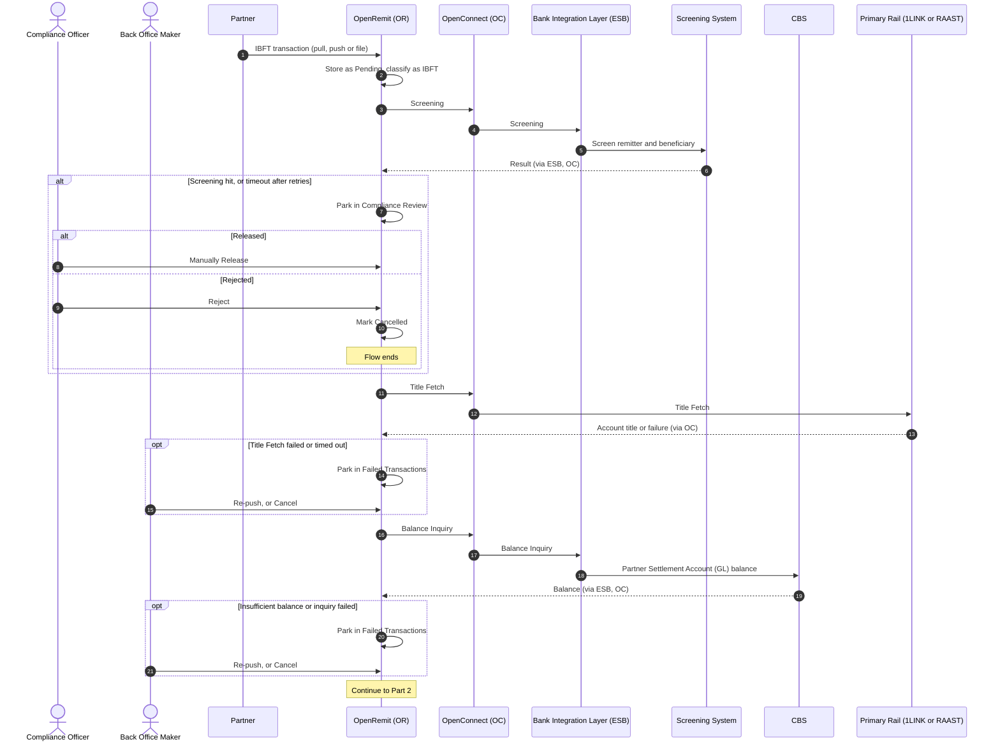
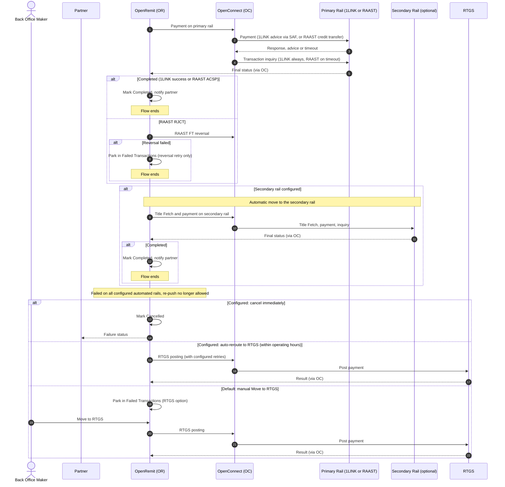

import { Hero, Capabilities } from '@site/src/components/DocKit';

<Hero title="Interbank Transfer with" accent="Rail Fallback" subtitle="A partner remittance is credited to an account at another bank. The client chooses the primary rail, an optional secondary rail takes over automatically, and RTGS is always available as the third rail." />

<Capabilities tags={['Standard', 'Configurable', 'Requires Bank Integration']} />

## Overview

An Interbank Fund Transfer (IBFT / P2P) credits a beneficiary account at another bank. After screening, Title Fetch and a partner balance check, OpenRemit sends the payment over the **primary rail** the client has selected. If the primary rail fails or times out, OpenRemit moves the transaction automatically to the **secondary rail**, if one is configured. **RTGS** is always the third rail.

| Rail position | Supported rails | Configuration |
|---|---|---|
| Primary | 1LINK or RAAST | Selected by the client |
| Secondary | The other of the two, or none | Optional; a deployment can run with no secondary rail |
| Third | RTGS | Always third, with a configurable number of retries |

Retry attempts are configurable independently for each rail.

## Significance

- **Higher success rate**: an automatic second rail means a single scheme outage does not stop remittances.
- **Fits each bank's setup**: the bank picks the rail order that matches its scheme memberships, or runs a single automated rail.
- **No double payment**: a rail attempt is confirmed by an inquiry and, where needed, reversed before the transaction moves on.
- **AML/CFT compliance**: every transaction is screened before any rail is used.
- **Full traceability**: each rail attempt, inquiry, reversal, re-push and RTGS move is logged for reconciliation and regulatory reporting.

## Usage

### Who uses it

| Role | Portal and menu | What they do |
|---|---|---|
| Partner | Partner APIs / Partner Portal → **Transactions** | Sends the transaction (pull, push or file) and tracks its status |
| Compliance Officer | Back Office → **Compliance Review** | Releases or rejects transactions held by screening |
| Back Office Maker | Back Office → **Failed Transactions** | Re-pushes a failed step, cancels, or moves the transaction to RTGS |
| Back Office Checker | Back Office → Checker inbox | Approves cancellation requests |

### Steps

1. **Receive and classify**: the transaction arrives and is classified as IBFT from the account number, IBAN or bank identifier.
2. **Screen**: the Screening System checks the transaction. Hits are held in Compliance Review.
3. **Title Fetch**: the beneficiary account is validated and its title returned.
4. **Balance Inquiry**: CBS returns the Partner Settlement Account (GL) balance.
5. **Primary rail**: the payment is sent over the client's primary rail.
   - **1LINK** works on an advice basis, not a synchronous accept / reject. The partner is debited on CBS, the advice is sent through store-and-forward, and a 1LINK transaction inquiry confirms the outcome before the transaction is marked completed or moved on.
   - **RAAST** returns a result directly. A timeout is resolved by a RAAST transaction inquiry: ACSP (accepted) completes the transaction; RJCT (rejected) triggers a RAAST FT reversal.
6. **Secondary rail (optional)**: if the primary rail fails or times out and a secondary rail is configured, the transaction is retried on it automatically.
7. **After the last automated rail**: a transaction that has failed on all configured automated rails can no longer be re-pushed. What happens next is configured by the bank (see Configuration):
   - parked in **Failed Transactions** for a manual **Move to RTGS**;
   - **auto-rerouted to RTGS** within RTGS operating hours; or
   - **cancelled immediately**, with a failure status returned to the partner.

See [Move to RTGS](./move-to-rtgs.md) for what happens once a transaction is on RTGS.

### 1LINK SAF handling

Where 1LINK is a configured rail, a 1LINK transaction can get stuck on a duplicate timeout in the store-and-forward (SAF) queue. A manual settlement path lets a Back Office Maker settle it, and a Back Office Checker must approve the settlement.

### APIs involved

| Interface | API | Used for |
|---|---|---|
| API Gateway (push) | Post Transactions, Transaction Inquiry | Partner pushes the transaction and polls its status |
| API Gateway (push) | Title Fetch, Balance Inquiry, Bank List | Partner verifies the account, checks its balance, looks up bank codes |
| Partner system (pull) | Get outstanding transactions, Confirm Transaction | Fetch pending transactions; confirm completion |
| Bank Integration Layer (ESB) | Screening, Balance Inquiry, Internal Fund Transfer, Fund Transfer Reversal | Screening, partner balance, partner debit, reversals |
| OpenConnect → 1LINK | Title Fetch, IBFT advice (SAF), Transaction Inquiry | 1LINK as primary or secondary rail |
| Bank Integration Layer (ESB) → RAAST | Title Fetch, P2P credit transfer, Transaction Inquiry, FT Reversal | RAAST as primary or secondary rail |
| Bank Integration Layer (ESB) | RTGS posting | Third rail |

## Configuration

| Parameter | Description | Default |
|---|---|---|
| Primary rail | 1LINK or RAAST | default: selected per deployment |
| Secondary rail | The other rail, or none | default: none |
| Retry attempts per rail | Automatic retries on each rail, configured separately | default: configurable per rail |
| RTGS retries | Retries on RTGS as the third rail | default: configurable |
| After all automated rails fail | Manual Move to RTGS; auto-reroute to RTGS within operating hours; or cancel immediately and return a failure to the partner | default: manual Move to RTGS |
| Processing steps | Ordered steps run for each transaction | default: Screening → Title Fetch → Balance Inquiry → Fund Transfer → Partner Notify |
| Screening position | Screening before (PRE) or after (POST) the fund transfer | default: PRE |

## Sequence Diagram

### Part 1: Screening, Title Fetch and balance

### Part 2: Primary rail, optional secondary rail and RTGS

## Outcomes & Edge Cases

"Next configured rail" means the secondary rail if one is configured; otherwise the last-rail handling in step 7 applies.

| Stage | Condition | Outcome |
|---|---|---|
| Screening | Pass | Flow continues on the primary rail |
| Screening | Hit | Held in Compliance Review; released (flow continues) or rejected (Cancelled) |
| Screening | Timeout | Retried; if retries run out, held in Compliance Review |
| Title Fetch | Success | Flow continues to balance inquiry |
| Title Fetch | Failed, or timeout after retries | Parked in Failed Transactions for re-push or cancellation (auto-cancelled where the partner has opted into [Title Fetch auto-cancellation](./cancellation.md)) |
| Balance inquiry | Balance covers the amount | Flow continues |
| Balance inquiry | Balance below the amount, failed, or timeout after retries | Parked in Failed Transactions for re-push or cancellation |
| Partner debit (1LINK) | Success | 1LINK advice sent through store-and-forward |
| Partner debit (1LINK) | Failed, or timeout after retries | Parked; re-push with the same parameters (duplicate-checked) or cancel after checking CBS |
| Payment (1LINK) | Advice sent | 1LINK transaction inquiry |
| Payment (1LINK) | Failed or timeout | Next configured rail |
| Inquiry (1LINK) | Found, successful | Completed; partner notified |
| Inquiry (1LINK) | Found failed, or not found | Next configured rail |
| Inquiry (1LINK) | Error response, or timeout after retries | Parked in Failed Transactions; inquiry retried manually |
| Payment (RAAST) | Success | Completed |
| Payment (RAAST) | Failed | Next configured rail |
| Payment (RAAST) | Timeout | RAAST transaction inquiry |
| Inquiry (RAAST) | ACSP (accepted) | Completed |
| Inquiry (RAAST) | RJCT (rejected) | RAAST FT reversal |
| Inquiry (RAAST) | Not found | Next configured rail |
| Inquiry (RAAST) | Error response, or timeout after retries | Parked; inquiry retried manually |
| Reversal (RAAST) | Success | Next configured rail |
| Reversal (RAAST) | Failed | Parked; only the reversal can be retried, with no further fallback (to avoid a double correction) |
| Last automated rail | Failed | Re-push no longer allowed; manual Move to RTGS, auto-reroute to RTGS, or immediate cancellation, as configured |
| RTGS | Any outcome | See [Move to RTGS](./move-to-rtgs.md) |

## Related

- [Back Office: Failed Transactions](../../back-office/failed-transactions.md)
- [Back Office: Transactions](../../back-office/transactions.md)
- [Partner Portal: Transactions](../../partner-portal/transactions.md)
- [Move to RTGS](./move-to-rtgs.md)
- [Retry / Re-push](./retry-repush.md)
- [EOD Auto Repush with Debit Verification](./eod-auto-repush.md)
- [Automatic FT Reversal](./automatic-ft-reversal.md)
