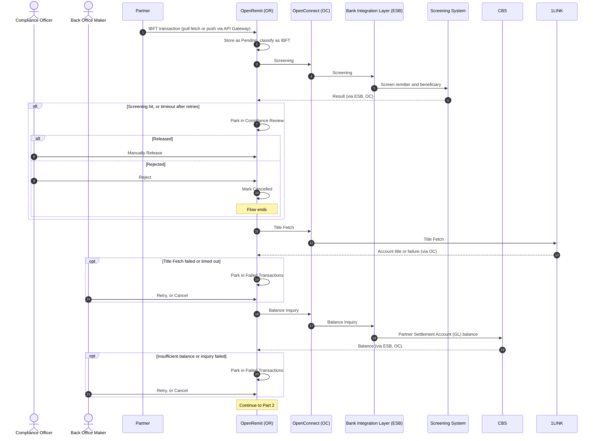
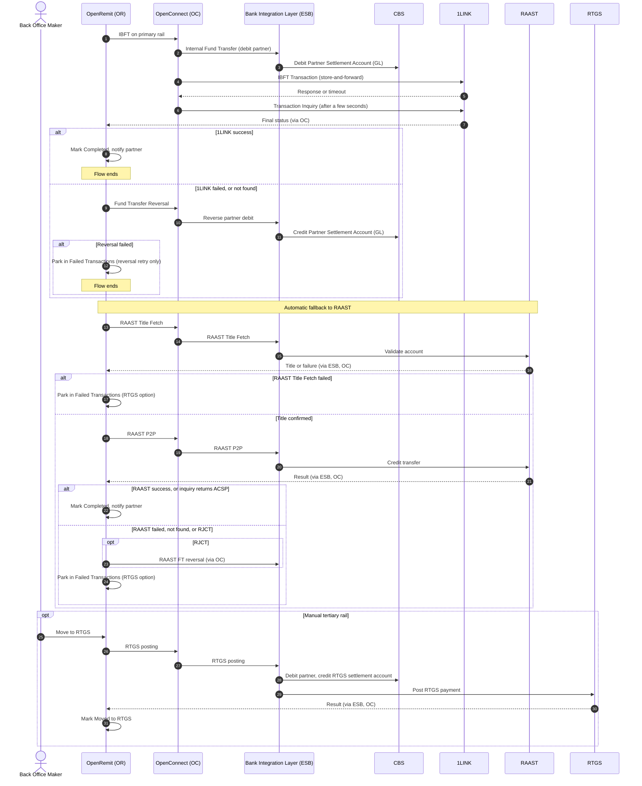

import { Hero, Capabilities } from '@site/src/components/DocKit';

<Hero title="IBFT / P2P with" accent="Rail Fallback" subtitle="A partner remittance is credited to an account at another bank. OpenRemit tries 1LINK first, falls back to RAAST automatically, and offers RTGS as a manual last resort." />

<Capabilities tags={['Standard', 'Configurable', 'Requires Bank Integration']} />

## Overview

An Interbank Fund Transfer (IBFT / P2P) credits a beneficiary account at another bank in Pakistan. After screening and a partner balance check, OpenRemit routes the payment over the **primary rail (1LINK)**. If 1LINK fails, it reverses the partner debit and retries automatically on the **secondary rail (RAAST)**. If RAAST also fails, a Back Office user can move the transaction to **RTGS** manually. The rail order is configurable per deployment.

## Significance

- **Higher success rate**: an automatic second rail means a single scheme outage does not stop remittances.
- **No double payment**: every failed rail attempt is confirmed by an inquiry and, where needed, reversed before the next rail is tried.
- **AML/CFT compliance**: every transaction is screened before any rail is used.
- **Full traceability**: each rail attempt, inquiry, reversal and manual action is logged with timestamps and API responses, for reconciliation and regulatory reporting.

## Usage

### Who uses it

| Role | Portal and menu | What they do |
|---|---|---|
| Partner | Partner APIs / Partner Portal → **Transactions** | Sends the transaction (pull or push) and tracks its status |
| Compliance Officer | Back Office → **Compliance Review** | Releases or rejects transactions held by screening |
| Back Office Maker | Back Office → **Failed Transactions** | Retries a step, cancels, or moves the transaction to RTGS |
| Back Office Checker | Back Office → Checker inbox | Approves cancellation requests |

### Steps

1. **Receive and classify**: the transaction arrives by pull or push and is classified as IBFT from the account number, IBAN or bank identification code.
2. **Screen**: the Screening System checks the transaction. Hits are held in Compliance Review.
3. **Title Fetch on the primary rail**: 1LINK validates the beneficiary account and returns its title.
4. **Balance Inquiry**: CBS returns the Partner Settlement Account (GL) balance.
5. **Primary rail (1LINK)**: the partner is debited on CBS and the payment is sent to 1LINK. A 1LINK inquiry a few seconds later confirms the outcome.
6. **Secondary rail (RAAST)**: if 1LINK fails, the partner debit is reversed and OpenRemit runs a RAAST Title Fetch and RAAST P2P payment. A RAAST timeout is resolved by a RAAST inquiry (ACSP = accepted, RJCT = rejected).
7. **Tertiary rail (RTGS, manual)**: if RAAST also fails, the transaction is parked in Failed Transactions, where a Back Office user can **Move to RTGS**. See [Move to RTGS](./move-to-rtgs.md).

:::note
Once a transaction has failed on both 1LINK and RAAST, it cannot be re-pushed. Only Move to RTGS or cancellation remain.
:::

### APIs involved

| Interface | API | Used for |
|---|---|---|
| API Gateway (push) | Post Transactions, Transaction Inquiry | Partner pushes the transaction and polls its status |
| API Gateway (push) | Title Fetch, Balance Inquiry, Bank List | Partner verifies the account, checks its balance, looks up bank codes |
| Partner system (pull) | Get outstanding transactions, Confirm Transaction | Fetch pending transactions; confirm completion |
| OpenConnect → 1LINK | Title Fetch, IBFT Transaction, Transaction Inquiry | Primary rail |
| Bank Integration Layer (ESB) | Screening | AML/CFT and sanctions screening |
| Bank Integration Layer (ESB) | Balance Inquiry, Internal Fund Transfer, Fund Transfer Reversal | Partner balance, partner debit for 1LINK, reversal before fallback |
| Bank Integration Layer (ESB) → RAAST | RAAST Title Fetch, RAAST P2P, RAAST Transaction Inquiry | Secondary rail |

## Configuration

| Parameter | Description | Default |
|---|---|---|
| Rail order | Primary, secondary and tertiary rails for IBFT | default: 1LINK → RAAST (automatic) → RTGS (manual) |
| 1LINK inquiry delay | Wait before the 1LINK transaction inquiry | default: a few seconds (TBD) |
| Retry attempts | Automatic retries per step on timeout or transient failure | default: 3 |
| Processing steps | Ordered steps run for each transaction | default: Screening → Title Fetch → Balance Inquiry → Fund Transfer → Partner Notify |
| Screening position | Screening before (PRE) or after (POST) the fund transfer | default: PRE |

## Sequence Diagram

### Part 1: Screening, Title Fetch and balance

### Part 2: 1LINK, RAAST fallback and RTGS

## Outcomes & Edge Cases

Rows are listed in rail order: 1LINK, then RAAST, then RTGS.

| Stage | Condition | Outcome |
|---|---|---|
| Screening | Pass | Flow continues on the primary rail (1LINK) |
| Screening | Hit | Held in Compliance Review; released (flow continues) or rejected (Cancelled) |
| Screening | Timeout | Retried; if retries run out, held in Compliance Review |
| Balance inquiry | Balance covers the amount | Flow continues |
| Balance inquiry | Balance below the amount, or inquiry failed | Parked in Failed Transactions for retry or cancellation |
| Balance inquiry | Timeout | Retried; if retries run out, parked in Failed Transactions |
| Title Fetch (1LINK) | Success | Flow continues to balance inquiry |
| Title Fetch (1LINK) | Failed | Parked in Failed Transactions for retry or cancellation |
| Title Fetch (1LINK) | Timeout | Retried; if retries run out, parked in Failed Transactions |
| Partner debit (1LINK) | Success | Payment sent to 1LINK |
| Partner debit (1LINK) | Failed | Parked; retry with the same parameters (duplicate-checked) or cancel after checking CBS |
| Partner debit (1LINK) | Timeout | Retried; then parked for retry or cancellation after checking CBS |
| Payment (1LINK) | Success | 1LINK transaction inquiry |
| Payment (1LINK) | Failed | Partner debit reversed, then automatic fallback to RAAST |
| Payment (1LINK) | Timeout | 1LINK transaction inquiry |
| Inquiry (1LINK) | Found, successful | Completed; partner notified |
| Inquiry (1LINK) | Found, failed | Partner debit reversed, then fallback to RAAST |
| Inquiry (1LINK) | Not found | Partner debit reversed, then fallback to RAAST |
| Inquiry (1LINK) | Error response | Parked in Failed Transactions; inquiry retried manually |
| Inquiry (1LINK) | Timeout | Retried; then parked for a manual inquiry retry |
| Reversal (1LINK) | Success | Fallback to RAAST |
| Reversal (1LINK) | Failed | Parked in Failed Transactions; only the reversal can be retried (no fallback) |
| Reversal (1LINK) | Timeout | Retried; then parked for a manual reversal retry |
| Title Fetch (RAAST) | Success | RAAST payment |
| Title Fetch (RAAST) | Failed | Parked in Failed Transactions; retry, cancel or Move to RTGS |
| Title Fetch (RAAST) | Timeout | Retried; then parked with the same options |
| Payment (RAAST) | Success | Completed |
| Payment (RAAST) | Failed | Parked in Failed Transactions for manual Move to RTGS |
| Payment (RAAST) | Timeout | RAAST transaction inquiry |
| Inquiry (RAAST) | ACSP (accepted) | Completed |
| Inquiry (RAAST) | RJCT (rejected) | RAAST FT reversal |
| Inquiry (RAAST) | Not found | Parked for manual Move to RTGS |
| Inquiry (RAAST) | Error response | Parked; inquiry retried manually |
| Inquiry (RAAST) | Timeout | Retried; then parked for a manual inquiry retry |
| Reversal (RAAST) | Success | Parked for manual Move to RTGS |
| Reversal (RAAST) | Failed | Parked; only the reversal can be retried (manual settlement) |
| Reversal (RAAST) | Timeout | Retried; then parked for a manual reversal retry |
| RTGS | Any outcome | See [Move to RTGS](./move-to-rtgs.md) |

:::caution[TBD]
The source specification does not state the exact delay before the 1LINK transaction inquiry ("a few seconds").
:::

## Related

- [Back Office: Failed Transactions](../../back-office/failed-transactions.md)
- [Back Office: Transactions](../../back-office/transactions.md)
- [Partner Portal: Transactions](../../partner-portal/transactions.md)
- [Partner Portal: IMD List](../../partner-portal/imd-list.md)
- [Move to RTGS](./move-to-rtgs.md)
- [Automatic FT Reversal](./automatic-ft-reversal.md)
- [Retry / Re-push](./retry-repush.md)
