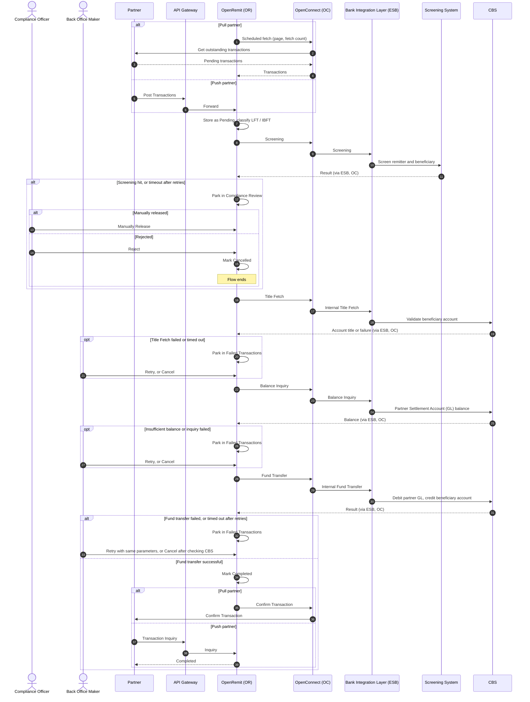

import { Hero, Capabilities } from '@site/src/components/DocKit';

<Hero title="Local Funds" accent="Transfer (LFT)" subtitle="A partner remittance is credited to a beneficiary account held at the Bank: screened, title-verified and posted on CBS without manual intervention." />

<Capabilities tags={['Standard', 'Configurable', 'Requires Bank Integration']} />

## Overview

An LFT credits a beneficiary account held at the Bank. OpenRemit receives the transaction from a pull or push partner, screens it, verifies the beneficiary account title on CBS, checks the Partner Settlement Account (GL) balance, and posts an internal fund transfer that debits the partner and credits the beneficiary. Every failed stage is parked in the Back Office for a manual retry or cancellation.

## Significance

- **Straight-through credit**: the beneficiary is credited without branch involvement, end to end.
- **AML/CFT compliance**: the Screening System screens every transaction before funds move.
- **Right account, right person**: Title Fetch confirms the account exists and returns its title before any posting.
- **Partner funding control**: the balance inquiry stops a partner from being overdrawn.
- **No silent failures**: every failure lands on a Back Office screen with a clear stage and reason, ready for retry or cancellation.
- **Duplicate-safe retries**: a retried fund transfer reuses the same parameters, and the Bank Integration Layer rejects duplicates.

## Usage

### Who uses it

| Role | Portal and menu | What they do |
|---|---|---|
| Partner | Partner APIs / Partner Portal → **Transactions** | Sends the transaction (pull or push) and tracks its status |
| Compliance Officer | Back Office → **Compliance Review** | Manually releases, or rejects, transactions held by screening |
| Back Office Maker | Back Office → **Failed Transactions** | Retries or cancels transactions parked at Title Fetch, Balance Inquiry or Fund Transfer |
| Back Office Checker | Back Office → Checker inbox | Approves cancellation requests |

### Steps

1. **Receive**: the scheduler pulls transactions from a pull partner at the configured interval, or a push partner posts them through the API Gateway. OpenRemit stores each one as *Pending*.
2. **Classify**: OpenRemit separates LFT from IBFT using the account number, IBAN or bank identification code.
3. **Screen**: the Screening System checks the transaction. A hit parks it in Compliance Review. A timeout is retried, then parked.
4. **Title Fetch**: CBS validates the beneficiary account and returns its title. A failure or timeout parks the transaction in Failed Transactions.
5. **Balance Inquiry**: CBS returns the Partner Settlement Account (GL) balance. Insufficient balance or a failure parks the transaction.
6. **Fund Transfer**: CBS debits the Partner Settlement Account (GL) and credits the beneficiary account.
7. **Notify**: the transaction is marked *Completed*. Pull partners receive Confirm Transaction; push partners see the status through Transaction Inquiry.

### APIs involved

| Interface | API | Used for |
|---|---|---|
| Partner system (pull) | Get outstanding transactions, Confirm Transaction | Fetch pending transactions; confirm completion |
| API Gateway (push) | Post Transactions | Partner pushes one or more transactions |
| API Gateway (push) | Title Fetch | Partner verifies the beneficiary account title before sending |
| API Gateway (push) | Balance Inquiry | Partner checks its settlement balance |
| API Gateway (push) | Transaction Inquiry | Partner polls the transaction's status |
| API Gateway (push) | Bank List | Partner retrieves banks with their BIC and IMD codes |
| Bank Integration Layer (ESB) | Screening | AML/CFT and sanctions screening |
| Bank Integration Layer (ESB) | Internal Title Fetch | Beneficiary account validation on CBS |
| Bank Integration Layer (ESB) | Balance Inquiry | Partner Settlement Account (GL) balance |
| Bank Integration Layer (ESB) | Internal Fund Transfer | Debit the partner, credit the beneficiary |

## Configuration

| Parameter | Description | Default |
|---|---|---|
| Scheduler interval | How often a pull partner is polled | default: every 5 minutes |
| Fetch count | Transactions fetched per scheduler run | default: 50 |
| Processing steps | Ordered steps run for each transaction | default: Screening → Title Fetch → Balance Inquiry → Fund Transfer → Partner Notify |
| Screening position | Screening before (PRE) or after (POST) the fund transfer | default: PRE |
| Title Fetch | Can be skipped only for pre-validated partners whose titles are confirmed at source | default: enabled |
| Balance inquiry | Disabling it requires risk approval | default: enabled |
| Retry attempts | Automatic retries per step on timeout or transient failure | default: 3 |

## Sequence Diagram

## Outcomes & Edge Cases

| Stage | Condition | Outcome |
|---|---|---|
| Screening | Pass | Flow continues to Title Fetch |
| Screening | Hit | Held in Compliance Review; the Compliance Officer releases it (flow continues) or rejects it (Cancelled) |
| Screening | Timeout | Retried; if retries run out, held in Compliance Review |
| Title Fetch | Success | Account title stored, flow continues |
| Title Fetch | Failed | Parked in Failed Transactions for retry or cancellation |
| Title Fetch | Timeout | Retried; if retries run out, parked in Failed Transactions |
| Balance inquiry | Balance covers the amount | Flow continues |
| Balance inquiry | Balance below the amount, or inquiry failed | Parked in Failed Transactions for retry or cancellation |
| Balance inquiry | Timeout | Retried; if retries run out, parked in Failed Transactions |
| Fund transfer | Success | Completed; partner notified |
| Fund transfer | Failed | Parked in Failed Transactions for retry or cancellation |
| Fund transfer | Timeout | Retried; if retries run out, parked. Before cancelling, check that CBS did not credit the beneficiary |
| Fund transfer | Retry returns a duplicate-transaction error | Treated as success; flow continues |
| Partner notification | Delivered through store-and-forward | Completed |
| Partner notification | Store-and-forward delivery fails | Re-pushed from the Back Office store-and-forward screen |

## Related

- [Back Office: Transactions](../../back-office/transactions.md)
- [Back Office: Compliance](../../back-office/compliance.md)
- [Back Office: Failed Transactions](../../back-office/failed-transactions.md)
- [Partner Portal: Transactions](../../partner-portal/transactions.md)
- [Partner Portal: Failed Transactions](../../partner-portal/failed-transactions.md)
- [Retry / Re-push](./retry-repush.md)
- [Cancellation](./cancellation.md)
- [Screening & Compliance Review](../non-financial/screening-compliance-review.md)
