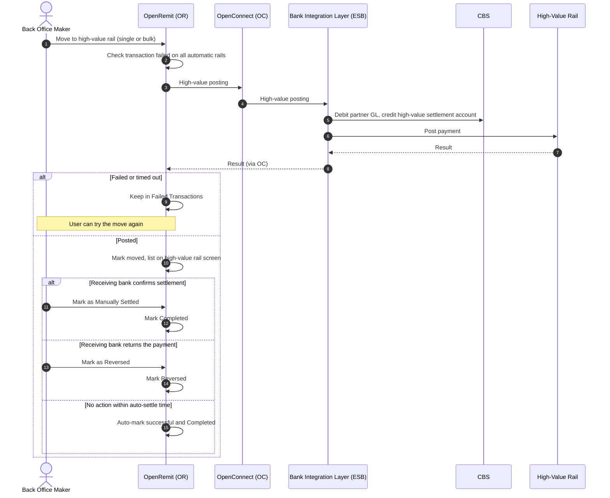

import { Hero, Capabilities } from '@site/src/components/DocKit';

<Hero title="Move to" accent="High-Value Rail" subtitle="When an interbank transaction has failed on every automatic rail, a Back Office user can post it over the high-value rail, then settle or reverse it." />

<Capabilities tags={['Configurable', 'Requires Bank Integration']} />

## Overview

The high-value rail is the optional third rail for interbank transfers. From the Failed Transactions screen, a Back Office user sends a transaction that failed on the primary and secondary rails to the Bank's high-value posting API. The Bank debits the Partner Settlement Account (GL), credits the high-value rail's settlement account and posts the payment. The transaction then waits on its own screen, where it is marked *Manually Settled* or *Reversed*, or settles automatically once the configured turnaround time passes.

:::info[Pakistan example]
The high-value rail is **RTGS**, and the Back Office labels the action **Move to RTGS** and the screen **RTGS Transactions**.
:::

## Significance

- **Last-resort delivery**: funds still reach the beneficiary when both automatic rails are unavailable.
- **Controlled settlement**: high-value outcomes are confirmed by the receiving bank outside OpenRemit, so a Back Office user records the outcome, or the transaction settles automatically after the turnaround time.
- **Reconciliation**: the transaction is clearly separated on its own screen until it is settled or reversed.

## Usage

### Who uses it

| Role | Portal and menu | What they do |
|---|---|---|
| Back Office Maker | Back Office → **Failed Transactions** | Moves eligible transactions to the high-value rail, individually or in bulk |
| Back Office Maker | Back Office → high-value rail transactions screen | Marks transactions Manually Settled or Reversed, individually or in bulk |

### Steps

1. Open **Failed Transactions** and select one or more transactions that failed across all automatic rails.
2. Click the move-to-high-value-rail action, or open a transaction (**Action → View Details**) and use the same action there.
3. OpenRemit calls the Bank's high-value posting API. On success the transaction is marked *moved* and appears on the high-value rail transactions screen.
4. When the receiving bank confirms the outcome, use **Mark as Manually Settled** (completed successfully) or **Mark as Reversed** (returned by the receiving bank).
5. Any transaction not marked within the auto-settle turnaround time is automatically marked successful and completed.

:::note
The move is not offered for a transaction whose status is still on the primary or secondary rail. Those can only be re-pushed. It is also blocked for transactions already marked reversed by a [reversal file upload](./reversal-file-upload.md).
:::

### APIs involved

| Interface | API | Used for |
|---|---|---|
| Bank Integration Layer (ESB) | High-value posting | Debit the partner, credit the high-value settlement account, post the payment |

## Configuration

| Parameter | Description | Default |
|---|---|---|
| Auto-settle turnaround time | Time after which an unmarked high-value transaction is marked successful and completed | default: 3 working days (weekends excluded) |
| Rail order | Whether a high-value rail is offered as the third rail | default: enabled, manual |

## Sequence Diagram

Pakistan example: High-Value Rail = RTGS.

## Outcomes & Edge Cases

| Stage | Condition | Outcome |
|---|---|---|
| High-value posting | Success | Marked moved; listed on the high-value rail screen |
| High-value posting | Failed | Stays in Failed Transactions for another attempt |
| High-value posting | Timeout | Stays in Failed Transactions for another attempt |
| Settlement | Marked Manually Settled within the turnaround time | Completed successfully |
| Settlement | Marked as Reversed within the turnaround time | Marked reversed |
| Settlement | No action within the turnaround time | Automatically marked successful and completed |

:::caution[TBD]
The source documents do not state whether **Mark as Reversed** posts a reversal on CBS (credit back to the Partner Settlement Account) or only changes the status.
:::

## Related

- [Back Office: Failed Transactions](../../back-office/failed-transactions.md)
- [Interbank Transfer (IBFT) with Rail Fallback](./ibft-rail-fallback.md)
- [Reversal File Upload](./reversal-file-upload.md)
- [Alerts](../non-financial/alerts.md)
