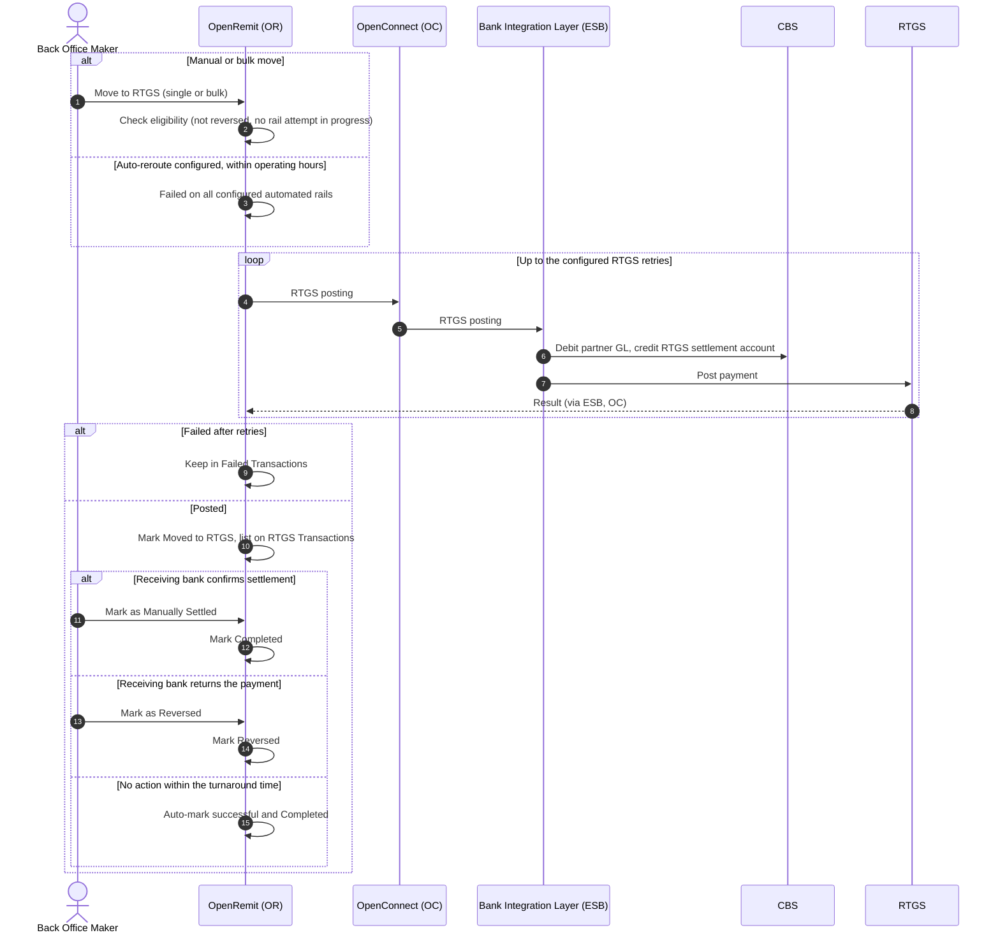

import { Hero, Capabilities } from '@site/src/components/DocKit';

<Hero title="Move to" accent="RTGS" subtitle="RTGS is always the third rail. Failed transactions move to it manually, in bulk, or automatically if the bank chooses, and are then settled, reversed or auto-settled." />

<Capabilities tags={['Standard', 'Configurable', 'Requires Bank Integration']} />

## Overview

RTGS is always the third rail for interbank transfers, after the client's primary rail and the optional secondary rail. A transaction reaches RTGS in one of three ways:

- **Manual move**: a Back Office user moves it from **Failed Transactions**, individually or in bulk.
- **Auto-reroute**: if the bank has chosen this option, a transaction that fails on all configured automated rails is rerouted to RTGS automatically, within RTGS operating hours.
- **Other failed transactions**: any failed transaction can be moved to RTGS from the Back Office, except while a 1LINK or RAAST attempt is still in progress (those can only be re-pushed).

The Bank debits the Partner Settlement Account (GL), credits the RTGS settlement account and posts the payment, with a configurable number of retries. The transaction then waits on **RTGS Transactions** until a user marks it *Manually Settled* or *Reversed*, or it settles automatically after the configured turnaround time.

## Significance

- **Last-resort delivery**: funds still reach the beneficiary when the automated rails are unavailable.
- **Bank choice**: each bank decides whether RTGS is used automatically, manually, or not at all (immediate cancellation).
- **Controlled settlement**: the receiving bank confirms RTGS outcomes outside OpenRemit, so a user records the outcome, or the transaction settles automatically after the turnaround time.
- **Reconciliation**: RTGS transactions are kept on their own screen until they are settled or reversed.

## Usage

### Who uses it

| Role | Portal and menu | What they do |
|---|---|---|
| Back Office Maker | Back Office → **Failed Transactions** | Moves transactions to RTGS, individually (Action → View Details) or with **Bulk Move to RTGS** |
| Back Office Maker | Back Office → **RTGS Transactions** | Marks transactions Manually Settled or Reversed, individually or in bulk |

### Steps

1. Open **Failed Transactions** and select one or more eligible transactions.
2. Click **Move to RTGS**, or **Bulk Move to RTGS** for several.
3. OpenRemit calls the Bank's RTGS posting API, with the configured retries. On success the transaction is marked *Moved to RTGS* and appears on **RTGS Transactions**.
4. When the receiving bank confirms the outcome, use **Mark as Manually Settled** (completed) or **Mark as Reversed** (returned).
5. A transaction not marked within the auto-settle turnaround time is automatically marked successful and completed. The manual buttons and the timer coexist: the buttons resolve it sooner, the timer is the fallback.

:::note
Move to RTGS is blocked for transactions already marked reversed by a [reversal file upload](./reversal-file-upload.md).
:::

### APIs involved

| Interface | API | Used for |
|---|---|---|
| Bank Integration Layer (ESB) | RTGS posting | Debit the partner, credit the RTGS settlement account, post the payment |

## Configuration

| Parameter | Description | Default |
|---|---|---|
| After all automated rails fail | Manual Move to RTGS; auto-reroute to RTGS within operating hours; or cancel immediately and return a failure to the partner | default: manual Move to RTGS |
| RTGS retries | Retries on the RTGS posting | default: configurable |
| RTGS operating hours | Window in which auto-reroute is allowed | default: per the bank's RTGS hours |
| Auto-settle turnaround time | Time after which an unmarked RTGS transaction is marked successful and completed | default: 3 working days (weekends and [holidays](../non-financial/holiday-calendar.md) excluded) |

## Sequence Diagram

## Outcomes & Edge Cases

| Stage | Condition | Outcome |
|---|---|---|
| Eligibility | 1LINK or RAAST attempt still in progress | Only re-push is available |
| Eligibility | Transaction reversed by a reversal file | Move to RTGS not available |
| RTGS posting | Success | Marked *Moved to RTGS*; listed on RTGS Transactions |
| RTGS posting | Failed or timeout after the configured retries | Stays in Failed Transactions for another attempt |
| Settlement | Marked Manually Settled | Completed successfully |
| Settlement | Marked as Reversed | Marked reversed |
| Settlement | No action within the turnaround time | Automatically marked successful and completed |

## Related

- [Back Office: Failed Transactions](../../back-office/failed-transactions.md)
- [Interbank Transfer (IBFT) with Rail Fallback](./ibft-rail-fallback.md)
- [Reversal File Upload](./reversal-file-upload.md)
- [Holiday Calendar](../non-financial/holiday-calendar.md)
