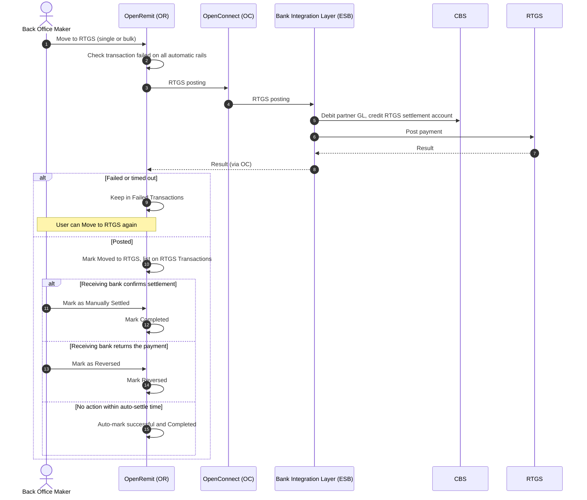

import { Hero, Capabilities } from '@site/src/components/DocKit';

<Hero title="Move to" accent="RTGS" subtitle="When an IBFT transaction has failed on every automatic rail, a Back Office user can post it through RTGS, then settle or reverse it." />

<Capabilities tags={['Configurable', 'Requires Bank Integration']} />

## Overview

Move to RTGS is the optional third rail for IBFT. From the Failed Transactions screen, a Back Office user sends a transaction that failed on 1LINK and RAAST to the Bank's RTGS posting API. The Bank debits the Partner Settlement Account (GL), credits the RTGS settlement account and posts the payment on RTGS. The transaction then waits on the RTGS Transactions screen, where it is marked *Manually Settled* or *Reversed*, or settles automatically once the configured turnaround time passes.

## Significance

- **Last-resort delivery**: funds still reach the beneficiary when both automatic rails are unavailable.
- **Controlled settlement**: RTGS outcomes are confirmed by the receiving bank outside OpenRemit, so a Back Office user records the outcome, or the transaction settles automatically after the turnaround time.
- **Reconciliation**: the transaction is clearly separated on its own screen until it is settled or reversed.

## Usage

### Who uses it

| Role | Portal and menu | What they do |
|---|---|---|
| Back Office Maker | Back Office → **Failed Transactions** | Moves eligible transactions to RTGS, individually or in bulk |
| Back Office Maker | Back Office → **RTGS Transactions** | Marks transactions Manually Settled or Reversed, individually or in bulk |

### Steps

1. Open **Failed Transactions** and select one or more transactions that failed across all rails.
2. Click **Move to RTGS**, or open a transaction (**Action → View Details**) and click **Move to RTGS**.
3. OpenRemit calls the Bank's RTGS posting API. On success the transaction is marked *Moved to RTGS* and appears on **RTGS Transactions**.
4. When the receiving bank confirms the outcome, use **Mark as Manually Settled** (completed successfully) or **Mark as Reversed** (returned by the receiving bank).
5. Any transaction not marked within the auto-settle turnaround time is automatically marked successful and completed.

:::note
Move to RTGS is not offered for a transaction whose status is still on 1LINK or RAAST. Those can only be re-pushed. It is also blocked for transactions already marked reversed by a [reversal file upload](./reversal-file-upload.md).
:::

### APIs involved

| Interface | API | Used for |
|---|---|---|
| Bank Integration Layer (ESB) | RTGS Posting | Debit the partner, credit the RTGS settlement account, post on RTGS |

## Configuration

| Parameter | Description | Default |
|---|---|---|
| Auto-settle turnaround time | Time after which an unmarked RTGS transaction is marked successful and completed | default: 3 working days (weekends excluded) |
| Rail order | Whether RTGS is offered as the tertiary rail | default: enabled, manual |

## Sequence Diagram

## Outcomes & Edge Cases

| Stage | Condition | Outcome |
|---|---|---|
| RTGS posting | Success | Marked *Moved to RTGS*; listed on RTGS Transactions |
| RTGS posting | Failed | Stays in Failed Transactions for another Move to RTGS attempt |
| RTGS posting | Timeout | Stays in Failed Transactions for another Move to RTGS attempt |
| RTGS Transactions | Marked Manually Settled within the turnaround time | Completed successfully |
| RTGS Transactions | Marked as Reversed within the turnaround time | Marked reversed |
| RTGS Transactions | No action within the turnaround time | Automatically marked successful and completed |

:::caution[TBD]
The source documents do not state whether **Mark as Reversed** posts a reversal on CBS (credit back to the Partner Settlement Account) or only changes the status.
:::

## Related

- [Back Office: Failed Transactions](../../back-office/failed-transactions.md)
- [IBFT / P2P with Rail Fallback](./ibft-rail-fallback.md)
- [Reversal File Upload](./reversal-file-upload.md)
- [Alerts](../non-financial/alerts.md)
