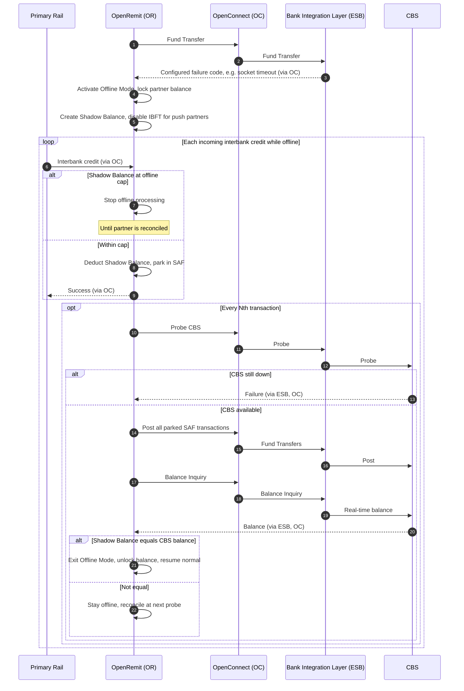

import { Hero, Capabilities } from '@site/src/components/DocKit';

<Hero title="Offline Transaction" accent="Mechanism" subtitle="Keep interbank credits flowing during a CBS outage: process against a shadow balance, park postings in store-and-forward, and reconcile when CBS returns." />

<Capabilities tags={['Configurable', 'Requires Bank Integration']} />

## Overview

When CBS or the Bank Integration Layer is down or slow, OpenRemit can switch a partner into **Offline Mode**. It locks the partner's local-currency balance, creates a **Shadow Balance** from the current available balance, and keeps processing incoming interbank credits against it, parking each posting in the store-and-forward (SAF) table. At a regular interval OpenRemit probes CBS. When CBS is back, it posts every parked transaction and compares the shadow balance with the real CBS balance before returning to normal processing.

## Significance

- **Service continuity**: inward credits are not interrupted by a core-banking outage.
- **Controlled exposure**: an offline cap limits how much can be processed without CBS confirmation.
- **Reconciled exit**: normal processing resumes only when the shadow balance equals the real CBS balance.

## Usage

### Who uses it

| Role | Portal and menu | What they do |
|---|---|---|
| (system) | — | Activates Offline Mode automatically on a configured failure code |
| Operations team | Back Office | Activates Offline Mode manually |

### Activation sequence

1. Activate Offline Mode, either automatically when the Fund Transfer API returns a configured failure code (e.g. a socket timeout), or manually by the Operations team.
2. Lock the partner's local-currency balance.
3. Create the Shadow Balance from the current available balance.
4. Disable IBFT for push-API partners.
5. Start offline processing.

### While offline

- Each incoming interbank credit is deducted from the Shadow Balance, parked in the SAF table, and acknowledged to the primary rail as successful.
- Every Nth transaction, OpenRemit probes CBS.
  - **CBS still down**: Offline Mode continues.
  - **CBS available**: all parked SAF transactions are posted. Then the Shadow Balance is compared with the real-time CBS balance. If they are equal, Offline Mode ends, the partner balance is unlocked and normal processing resumes. If not, the partner stays offline and reconciliation continues at the next probe.
- If the Shadow Balance reaches the offline cap, offline processing stops until the partner is reconciled.

### APIs involved

| Interface | API | Used for |
|---|---|---|
| Bank Integration Layer (ESB) | Internal Fund Transfer | Detects the failure code; later posts parked transactions |
| Bank Integration Layer (ESB) | Balance Inquiry | Probes CBS and reads the real balance for reconciliation |
| Primary rail | Interbank response | Receives the success acknowledgement for each offline credit |

## Configuration

| Parameter | Description | Default |
|---|---|---|
| Activation trigger | CBS / Bank Integration Layer failure codes that switch on Offline Mode automatically | default: socket timeout error |
| Manual activation | Operations team can activate Offline Mode | default: enabled |
| Probe frequency | Probe CBS after every N offline transactions | default: every 10th transaction |
| Offline cap | Shadow-balance threshold at which offline processing stops | default: 2,000,000 (local currency) |

## Sequence Diagram

## Outcomes & Edge Cases

| Stage | Condition | Outcome |
|---|---|---|
| Activation | Fund Transfer returns a configured failure code | Offline Mode activated automatically |
| Activation | Operations team triggers it | Offline Mode activated manually |
| Offline credit | Within the offline cap | Deducted from the Shadow Balance, parked in SAF, success returned to the primary rail |
| Offline credit | Offline cap reached | Offline processing stops until the partner is reconciled |
| Probe | CBS still unavailable | Offline Mode continues |
| Probe | CBS available, balances equal after posting | Offline Mode ends; partner balance unlocked; normal processing resumes |
| Probe | CBS available, balances differ | Partner stays offline; reconciliation continues at the next probe |

:::caution[TBD]
The source specification does not define:
- How a parked SAF transaction that fails when posted to CBS is handled.
- The Back Office screen used for manual activation.
- Whether cash payouts and LFT are also covered by Offline Mode.
:::

## Related

- [Interbank Transfer (IBFT) with Rail Fallback](./ibft-rail-fallback.md)
- [Partner Balance, Bank Directory & Dashboards](../non-financial/balance-imd-dashboards.md)
- [Alerts](../non-financial/alerts.md)
- [Back Office: Transactions](../../back-office/transactions.md)
