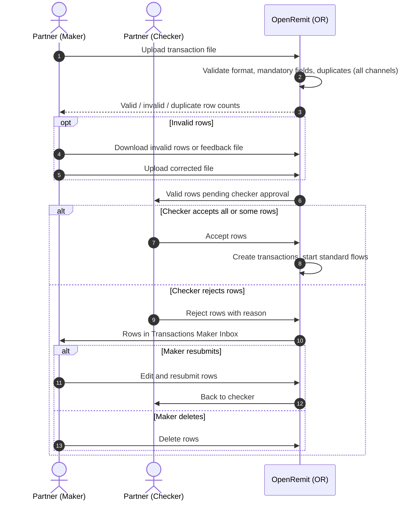

import { Hero, Capabilities } from '@site/src/components/DocKit';

<Hero title="Partner Bulk" accent="File Upload" subtitle="Partners initiate many transactions at once from a file in the Partner Portal. Every row is validated, and nothing is processed without checker approval." />

<Capabilities tags={['Standard']} />

## Overview

Instead of sending transactions one by one, a partner user (maker) uploads a transaction file in the Partner Portal. OpenRemit validates every row and rejects duplicates. The valid rows go to the partner checker, who can accept the file, accept it partially, or reject rows back to the maker. Accepted rows enter the standard processing flows for cash payout, LFT and IBFT.

## Significance

- **Operational efficiency**: high volumes are initiated in a single action.
- **Data quality**: every row is validated, and invalid rows come back with an exact error message and a feedback file.
- **Duplicate control**: a reference / PIN already received from any channel (pull, push or file) for the same partner is rejected.
- **Four-eyes control**: a partner checker must approve before any transaction is processed.

## Usage

### Who uses it

| Role | Portal and menu | What they do |
|---|---|---|
| Partner (maker) | Partner Portal → **File Upload** | Downloads the template, uploads files, corrects invalid rows |
| Partner (checker) | Partner Portal → **Transactions Checker Inbox** → Transaction Files | Accepts or rejects the file's rows |
| Partner (maker) | Partner Portal → **Transactions Maker Inbox** → Transaction Files | Edits and resubmits, or deletes, rejected rows |

### Steps

1. Click **Download Template File** and prepare the file (`.xlsx`, `.xls` or `.csv`), using the [IMD List](../../partner-portal/imd-list.md) for bank codes.
2. Click **Upload File**. OpenRemit validates each row and sets the file status (UPLOADED → VALIDATING → VALIDATED).
3. Review invalid rows in **Uploaded File Details**, and download **Invalid Txns** or the **Feedback File** to correct them.
4. Valid rows go to the checker (PENDING_CHECKER). The checker accepts them into processing, or rejects rows with a reason.
5. Accepted rows are processed (PROCESSING → PARTIALLY_PROCESSED / COMPLETED). Rejected rows return to the maker inbox for edit and resubmit, or deletion.

### APIs involved

No partner API is called; the upload happens in the Partner Portal. Accepted rows follow the standard flows and their Bank Integration Layer, 1LINK and RAAST calls.

## Sequence Diagram

## Outcomes & Edge Cases

| Stage | Condition | Outcome |
|---|---|---|
| Validation | Row passes | Counted as valid; sent to the checker |
| Validation | Row fails (e.g. unrecognised relationship value) | Listed under Invalid Transactions with a status message |
| Validation | Reference / PIN already received from any channel for this partner | Rejected as a duplicate |
| Checker | Accepts the file | Valid rows processed; file reaches COMPLETED |
| Checker | Accepts part of the file | Only accepted rows proceed; the rest are marked invalid for correction and re-upload |
| Checker | Rejects rows | Rows return to the Maker Inbox for edit and resubmit, or deletion |
| File | Cannot be processed | File status FAILED |

## Related

- [Partner Portal: File Upload](../../partner-portal/file-upload.md)
- [Partner Portal: Checker Inbox](../../partner-portal/checker-inbox.md)
- [Partner Portal: IMD List](../../partner-portal/imd-list.md)
- [Partner Integration Modes](../non-financial/partner-integration-modes.md)
- [COC / OTC Cash Payout](./coc-otc-cash-payout.md)
- [Local Funds Transfer (LFT)](./local-funds-transfer.md)
- [IBFT / P2P with Rail Fallback](./ibft-rail-fallback.md)
