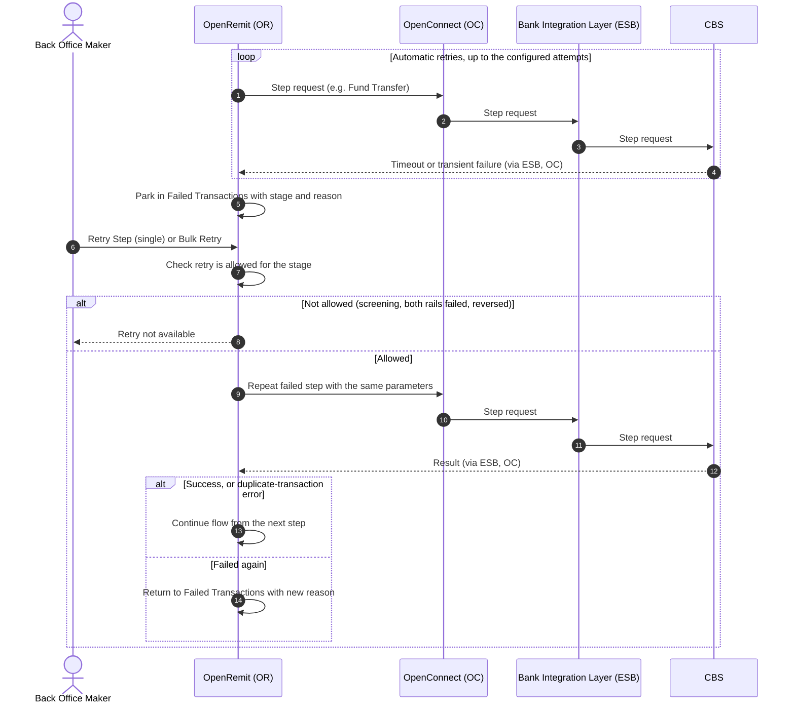

import { Hero, Capabilities } from '@site/src/components/DocKit';

<Hero title="Retry /" accent="Re-push" subtitle="Resume a failed transaction from the exact stage where it failed, one at a time or in bulk, without re-entering it." />

<Capabilities tags={['Standard', 'Configurable']} />

## Overview

Every processing step is retried automatically on a timeout or transient failure. When automatic retries run out, the transaction is parked in **Failed Transactions** with its failing stage and reason. A Back Office user can then re-push it from that same stage, either individually (**Retry Step**) or for many transactions at once (**Bulk Retry**). A retried fund transfer reuses the original parameters, so the Bank can detect and reject a duplicate posting.

## Significance

- **Fast recovery**: transactions held up by a temporary outage (CBS, Bank Integration Layer, a rail) are resumed without re-entry or partner involvement.
- **No double posting**: retries reuse the same parameters, and the Bank Integration Layer / CBS rejects duplicates. A duplicate response is treated as success.
- **Operational control**: a user decides when to retry, so retries can be timed after an outage is resolved.
- **Clear failure reasons**: each failed transaction shows its latest failure code mapped to a readable label, e.g. *Duplicate Transaction* or *No Http Response Exception*.

## Usage

### Who uses it

| Role | Portal and menu | What they do |
|---|---|---|
| Back Office Maker | Back Office → **Failed Transactions** | Retries one or many failed transactions |

### Steps

1. Open **Failed Transactions**. Each row shows the type, current stage (e.g. Title Fetch, Balance Inquiry, Payment) and the failure reason.
2. To retry one transaction, open **Action → View Details** and click **Retry Step**.
3. To retry several, select them and click **Bulk Retry**.
4. OpenRemit resumes each transaction at its failed stage. A transaction that fails again returns to Failed Transactions with the new reason.

### When retry is not allowed

| Situation | Why |
|---|---|
| Transaction failed at screening | Screening holds are resolved in [Compliance Review](../non-financial/screening-compliance-review.md), not by retry |
| IBFT failed on both 1LINK and RAAST | Only [Move to RTGS](./move-to-rtgs.md) or [cancellation](./cancellation.md) remain |
| Transaction marked reversed by a reversal file | Reversed transactions cannot be re-pushed or moved to RTGS |
| A rail reversal failed | Only the reversal step can be retried, with no fallback |

### APIs involved

Retry calls the same API as the original failed step: Title Fetch, Balance Inquiry, Internal Fund Transfer, 1LINK or RAAST payment, transaction inquiry, or Fund Transfer Reversal.

## Configuration

| Parameter | Description | Default |
|---|---|---|
| Retry attempts | Automatic retries per step before the transaction is parked | default: 3 |

## Sequence Diagram

## Outcomes & Edge Cases

| Stage | Condition | Outcome |
|---|---|---|
| Any step | Timeout or transient failure | Retried automatically up to the configured attempts, then parked |
| Retry | Step succeeds | Flow continues from the next step |
| Retry | Fund transfer returns a duplicate-transaction error | Treated as success; flow continues |
| Retry | Step fails again | Back in Failed Transactions with the new failure reason |
| Bulk Retry | Selection includes screening failures | Screening failures are excluded from bulk retry |
| Retry | IBFT failed on both rails | Not allowed; Move to RTGS or cancel instead |
| Retry | Transaction marked reversed | Not allowed |
| Partner notification | Store-and-forward delivery failed | Re-pushed from the Back Office store-and-forward screen |

## Related

- [Back Office: Failed Transactions](../../back-office/failed-transactions.md)
- [Partner Portal: Failed Transactions](../../partner-portal/failed-transactions.md)
- [Local Funds Transfer (LFT)](./local-funds-transfer.md)
- [IBFT / P2P with Rail Fallback](./ibft-rail-fallback.md)
- [Move to RTGS](./move-to-rtgs.md)
- [Cancellation](./cancellation.md)
