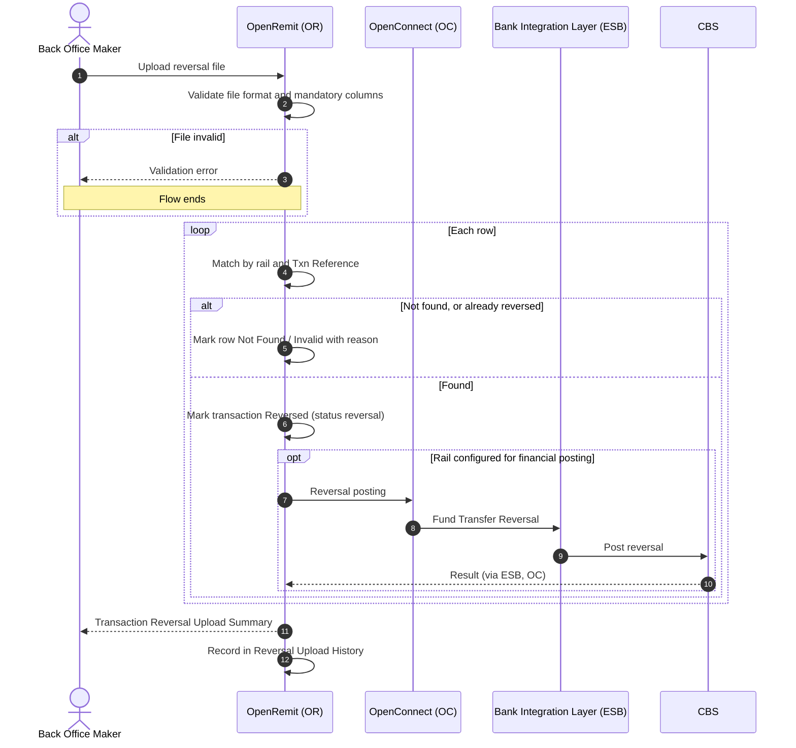

import { Hero, Capabilities } from '@site/src/components/DocKit';

<Hero title="Reversal" accent="File Upload" subtitle="Bring scheme reversals from 1LINK, RAAST and RTGS into OpenRemit in bulk, by uploading a file, with a full upload history." />

<Capabilities tags={['Standard', 'Configurable']} />

## Overview

Payment schemes sometimes reverse transactions that OpenRemit had already marked successful. The **Transaction Reversal Page** lets a Back Office user upload a file of these reversed transactions. OpenRemit validates each row, matches it to the original transaction by rail and unique reference, and applies the configured reversal: a status change only, or a status change plus a financial posting. Every upload is kept in **Reversal Upload History** with its validation results.

## Significance

- **Accurate status**: transactions reversed by a scheme no longer show as successful in OpenRemit.
- **Reconciliation**: OpenRemit stays in line with scheme settlement reports and CBS.
- **Prevents double action**: a reversed transaction cannot be re-pushed or moved to RTGS afterwards.
- **Auditability**: each upload records who uploaded it, when, and how many rows were valid and invalid.

## Usage

### Who uses it

| Role | Portal and menu | What they do |
|---|---|---|
| Back Office Maker | Back Office → **Transaction Reversal** | Downloads the sample file and uploads reversal files |
| Back Office Maker | Back Office → **Reversal Upload History** | Reviews past uploads and their summaries |

### Steps

1. Open **Transaction Reversal** and click **Download Sample File** for the required format.
2. Fill in one row per reversed transaction (see the columns below).
3. Click **Upload Reversal File**. OpenRemit validates the file, separates the rows by rail, checks each transaction exists and has not already been reversed, and applies the configured reversal type.
4. A **Transaction Reversal Upload Summary** shows each row's result, with a message for any row that was not reversed.
5. Open **Reversal Upload History** to see every upload: Upload ID, File Name, Uploaded By, Upload Date, Total / Valid / Invalid records, and its summary.

### File columns

| Column | Required | Description |
|---|---|---|
| Original Txn Date | Yes | Date of the original transaction (YYYY-MM-DD) |
| Txn Rail | Yes | 1LINK, RAAST or RTGS |
| Txn Amount | Yes | Transaction amount |
| Txn Reference | Yes | STAN for 1LINK, MessageId for RAAST, unique ID for RTGS |
| Partner | No | Partner / MTO name |
| CBS Reference | No | CBS posting reference |
| Receiver IBAN | No | Receiver IBAN |
| Receiver Name | No | Receiver name |

## Configuration

| Parameter | Description | Default |
|---|---|---|
| Reversal type per rail | For 1LINK, RAAST and RTGS separately: status reversal only, or status reversal plus financial posting | default: TBD |

## Sequence Diagram

## Outcomes & Edge Cases

| Stage | Condition | Outcome |
|---|---|---|
| File validation | File fails validation | Error shown; nothing processed |
| Row matching | Transaction not found | Row marked *Not Found* with a message |
| Row matching | Mandatory field missing | Row marked *Invalid* with the missing field named |
| Row matching | Transaction found at the payment stage, in any status | Marked reversed; it can no longer be re-pushed or moved to RTGS |
| History | Any upload | Listed in Reversal Upload History with Total / Valid / Invalid counts |

:::caution[TBD]
The source documents do not state the default reversal type per rail, or which accounts the financial reversal posting debits and credits.
:::

## Related

- [Back Office: Transaction Reversals](../../back-office/transaction-reversals.md)
- [Back Office: Failed Transactions](../../back-office/failed-transactions.md)
- [Automatic FT Reversal](./automatic-ft-reversal.md)
- [Move to RTGS](./move-to-rtgs.md)
- [Retry / Re-push](./retry-repush.md)
