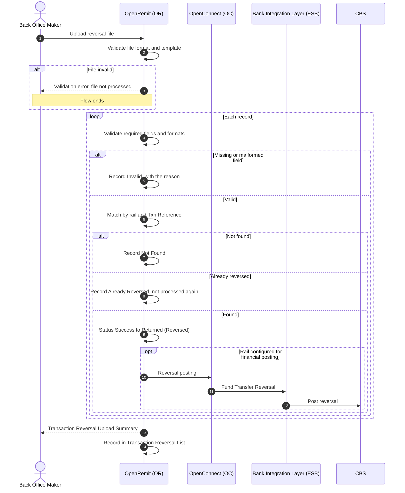

import { Hero, Capabilities } from '@site/src/components/DocKit';

<Hero title="Reversal" accent="File Upload" subtitle="Bring rail reversals into OpenRemit in bulk by uploading a file in the Back Office, with a per-record outcome and a full upload history." />

<Capabilities tags={['Standard', 'Configurable']} />

## Overview

Payment rails sometimes reverse transactions that OpenRemit had already marked successful. Reversal is a **Back Office-only** capability: a Back Office user uploads a file of these transactions on the **Transaction Reversal** screen. OpenRemit validates each record, matches it to the original transaction, and applies the reversal type configured for that rail:

- **Status reversal**: the status changes only.
- **Financial posting**: the status changes and a reversal is posted.

In both cases the transaction status reverts from **Success** to **Returned**, and a reversed transaction can no longer be re-pushed or moved to RTGS. Every upload is kept in **Reversal Upload History**.

## Significance

- **Accurate status**: transactions reversed by a rail no longer show as successful.
- **Reconciliation**: OpenRemit stays in line with rail settlement reports and CBS.
- **Prevents double action**: a reversed transaction cannot be re-pushed or moved to RTGS afterwards.
- **Auditability**: each upload records who uploaded it (a user or the system), when, and how many records were valid and invalid.

## Usage

### Who uses it

| Role | Portal and menu | What they do |
|---|---|---|
| Back Office Maker | Back Office → **Transaction Reversal** | Downloads the sample file and uploads reversal files |
| Back Office Maker | Back Office → **Transaction Reversal List** | Reviews past uploads and their summaries |

### Steps

1. Open **Transaction Reversal** and download the sample file.
2. Fill in one row per reversed transaction (see the columns below).
3. Upload the file. OpenRemit validates the file and every record, matches each record to its transaction, and applies the configured reversal type.
4. A **Transaction Reversal Upload Summary** shows each record's outcome, with a message for any record that was not reversed.
5. **Transaction Reversal List** shows every upload: Upload ID, File Name, Uploaded By (user or system), Upload Date & Time, Total Records, Valid, Invalid and View Summary.

### File columns

| Column | Required | Description |
|---|---|---|
| Original Txn Date | Yes | Date of the original transaction (YYYY-MM-DD) |
| Txn Rail | Yes | 1LINK, RAAST or RTGS |
| Txn Amount | Yes | Transaction amount (numeric) |
| Txn Reference | Yes | The rail's reference: STAN for 1LINK, MessageId for RAAST, unique ID for RTGS |
| Partner Reference | Yes | The partner's reference for the transaction |
| Reason | Yes | Reversal reason, 3 to 200 characters |
| Partner Name | No | Partner / MTO name |
| CBS Reference | No | CBS posting reference |
| Receiver IBAN | No | Receiver IBAN |
| Receiver Name | No | Receiver name |

Reference and IBAN formats are validated against the rail's and the country's rules, for example a 6-digit STAN for 1LINK or a 3–35 character MessageId for RAAST.

## Configuration

| Parameter | Description | Default |
|---|---|---|
| Reversal type per rail | For 1LINK, RAAST and RTGS separately: status reversal, or status reversal plus financial posting | default: configured per deployment |

## Sequence Diagram

## Outcomes & Edge Cases

| Stage | Condition | Outcome |
|---|---|---|
| File validation | Invalid format or template | Validation error; the file is not processed |
| Record validation | Required field missing | **Invalid**: "Missing required field: &lt;field name&gt;" |
| Record validation | Txn Reference format wrong for the rail | **Invalid**, with the error |
| Record validation | Receiver IBAN format invalid | **Invalid**, with the error |
| Record validation | Reason shorter than 3 or longer than 200 characters | **Invalid**, with the error |
| Matching | Transaction not found | **Not Found**: "No TXN found against this data" |
| Matching | Transaction already reversed | **Already Reversed**; not processed again |
| Matching | Transaction found at the payment stage, in any status | **Reversed**: status Success → Returned; it can no longer be re-pushed or moved to RTGS |
| History | Any upload | Listed with Total / Valid / Invalid counts and a summary |

## Related

- [Back Office: Transaction Reversals](../../back-office/transaction-reversals.md)
- [Back Office: Failed Transactions](../../back-office/failed-transactions.md)
- [Automatic FT Reversal](./automatic-ft-reversal.md)
- [Move to RTGS](./move-to-rtgs.md)
- [Retry / Re-push](./retry-repush.md)
