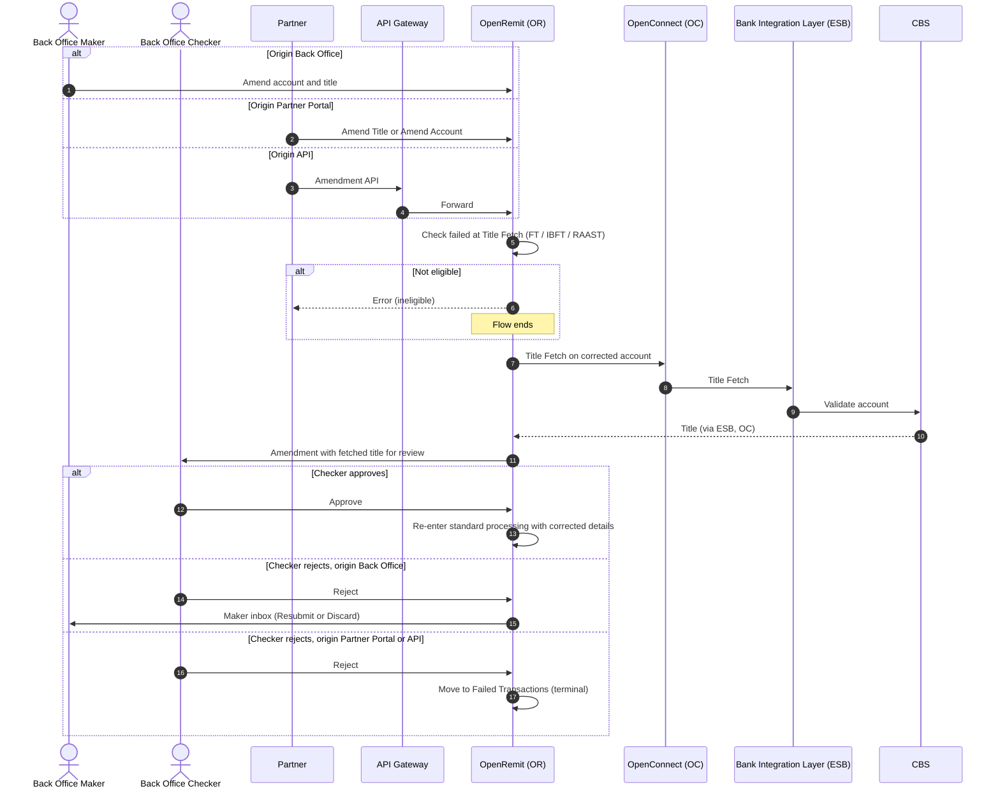

import { Hero, Capabilities } from '@site/src/components/DocKit';

<Hero title="Account Credit" accent="Amendment" subtitle="Fix a wrong beneficiary account on an FT or IBFT transaction that failed at Title Fetch, without losing the original transaction." />

<Capabilities tags={['Standard', 'Requires Bank Integration']} />

## Overview

When an FT, IBFT or RAAST transaction fails at **Title Fetch** because the beneficiary account is wrong, it can be amended with a corrected account number and title. The request can come from the Back Office Maker, the Partner Portal or the Partner API. Every request goes directly to the **Back Office Checker**. OpenRemit re-runs Title Fetch on the corrected account so the checker can see the fetched title before deciding. On approval, the transaction re-enters standard processing.

## Significance

- **Recovers failed credits**: transactions with a wrong account number are paid instead of being cancelled and re-sent.
- **Verified correction**: the checker sees the title fetched for the new account before approving.
- **Four-eyes control**: no amendment takes effect without Back Office Checker approval.
- **Audit trail**: the original and amended account number and title are kept for every cycle.

## Usage

### Who uses it

| Role | Portal and menu | What they do |
|---|---|---|
| Back Office Maker | Back Office → **Failed Transactions** | Raises an amendment; resubmits or discards rejected ones |
| Partner (maker) | Partner Portal → **Failed Transactions** → Amend Transaction | Raises an amendment (Amend Title or Amend Account) |
| Partner | API Gateway → Amendment API | Raises an amendment programmatically |
| Back Office Checker | Back Office → Checker inbox | Approves or rejects every amendment |

### Steps

1. Select a transaction that failed at Title Fetch and choose to amend it.
   - **Amend Title**: enter the IBAN and click **Fetch Account Title**, then submit a reason.
   - **Amend Account**: enter the new account number, then submit a reason.
2. The request goes to the Back Office Checker, and OpenRemit re-runs Title Fetch on the corrected account for the checker's review.
3. **Approve**: the transaction re-enters standard processing (screening, Title Fetch and onward) with the corrected details.
4. **Reject**, origin Back Office: the request returns to the Back Office Maker inbox to **Resubmit** (re-runs Title Fetch, back to the checker) or **Discard** (moves to Failed Transactions).
5. **Reject**, origin Partner Portal or API: terminal. The transaction goes to Failed Transactions.

### APIs involved

| Interface | API | Used for |
|---|---|---|
| API Gateway | Amendment API (`POST /api/v1/amendment`): Transaction Reference Number, Original Date, Amended Account Number | Partner raises an amendment; the API validates eligibility and returns an error if ineligible or if Title Fetch fails |
| Bank Integration Layer (ESB) / 1LINK / RAAST | Title Fetch | Validate the corrected account |

## Sequence Diagram

## Outcomes & Edge Cases

| Stage | Condition | Outcome |
|---|---|---|
| Eligibility | FT / IBFT / RAAST transaction failed at Title Fetch | Amendment can be raised |
| Eligibility | Any other stage or type | Rejected; API returns an ineligibility error |
| Review | Title Fetch on the corrected account | Fetched title shown to the checker |
| Checker | Approves | Re-enters processing; if Title Fetch fails again, it stays at the failed Title Fetch stage |
| Checker | Rejects, Back Office origin | Maker inbox: Resubmit (Title Fetch re-runs) or Discard (Failed Transactions) |
| Checker | Rejects, Partner Portal or API origin | Terminal; moved to Failed Transactions |
| Audit | Every cycle | Original and amended account number and title kept; user, timestamp, decision and reason logged |

## Related

- [Partner Portal: Failed Transactions](../../partner-portal/failed-transactions.md)
- [Back Office: Failed Transactions](../../back-office/failed-transactions.md)
- [Local Funds Transfer (LFT)](../financial/local-funds-transfer.md)
- [IBFT / P2P with Rail Fallback](../financial/ibft-rail-fallback.md)
- [COC Amendment](../financial/coc-amendment.md)
- [Cancellation](../financial/cancellation.md)
