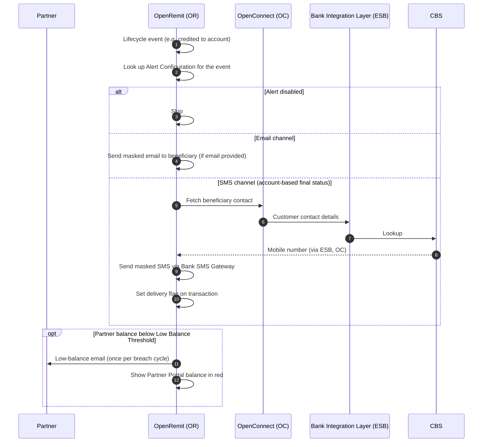

import { Hero, Capabilities } from '@site/src/components/DocKit';

<Hero title="Notifications &" accent="Alerts" subtitle="Keep beneficiaries and partners informed by email and SMS: status updates, final credit or cancellation, low partner balance and where to collect cash." />

<Capabilities tags={['Configurable', 'Requires Bank Integration']} />

## Overview

OpenRemit sends alerts at key points in a transaction's lifecycle, and one centralised **Alert Configuration** module controls them all. It covers four events: **Personal Messaging**, **Transaction Status**, **Funding Near Consumption** (partner low balance) and **Sub-agent Disbursement**. For each event, authorised users edit the template, recipients, transaction types, trigger stage and channel (Email and SMS, independently). SMS requires the **Bank SMS Gateway**.

## Significance

- **Beneficiary confidence**: beneficiaries know when funds are ready, collected, credited or cancelled.
- **Partner funding**: partners are warned before their balance runs out, avoiding failed transactions.
- **Wider cash reach**: beneficiaries are told they can collect from sub-agent branches as well as the Bank's branches.
- **Privacy**: account numbers and CNICs are masked in every outbound message.
- **Never blocks payment**: alerts are non-blocking and idempotent; financial flows never wait for delivery, and duplicates are suppressed.

## Usage

### Alert events

| Event | Trigger | Channel / recipient |
|---|---|---|
| Transaction status | Cash available for payout; cash collected; credited to account; sent to beneficiary bank (RTGS only); cancelled and refunded; under compliance check | Email to the beneficiary, if the partner provided an email |
| Final status (account-based) | Final credit to the beneficiary account, or cancellation | SMS to the account holder; contact details fetched through the Bank Integration Layer at send time |
| Funding near consumption | Partner balance falls below the Low Balance Threshold | Email to the partner; the Partner Portal balance display turns from blue to red |
| Sub-agent disbursement | A cash payout from a partner with configured sub-agents is available for payout but not yet paid | SMS to the beneficiary naming the Bank's branches and the sub-agent's branches |
| Personal messaging | As configured | As configured |

### Who uses it

| Role | Portal and menu | What they do |
|---|---|---|
| Back Office admin | Back Office → Alert Configuration | Edits templates, recipients, types, trigger stage and channels; enables or disables alerts |
| Partner | Partner Portal → **Partner Balance** | Sees the low-balance state; receives low-balance emails |

### APIs involved

| Interface | API | Used for |
|---|---|---|
| Bank Integration Layer (ESB) | Customer contact details | Fetch the account holder's mobile number for final-status SMS |
| Bank SMS Gateway | Send SMS | SMS delivery |
| Email service | Send email | Email delivery |

## Configuration

| Parameter | Description | Default |
|---|---|---|
| Templates | Message text per event | default: standard templates |
| Trigger stage | Lifecycle point at which each alert fires | default: as listed above |
| Channels | Email and SMS toggles per event | default: Email on; SMS on where the Bank SMS Gateway is connected |
| Enable / disable | Turn each alert on or off independently | default: enabled |
| Low Balance Threshold | Partner balance that triggers Funding Near Consumption | default: TBD |
| Sub-agent disbursement SMS | Global switch; when off, no such SMS is sent even if a partner configures a new sub-agent | default: enabled |
| Retries per event | Send retries per alert event | default: TBD |

Changes take effect immediately on save and are audit logged.

## Sequence Diagram

## Outcomes & Edge Cases

| Stage | Condition | Outcome |
|---|---|---|
| Delivery | Duplicate trigger for the same event | Suppressed |
| Delivery | Notification fails or is slow | Financial processing is not affected |
| SMS | Delivered | Delivery flag set on the transaction |
| SMS | Contact missing or invalid | Flag not set; the beneficiary appears in the partner-level report so the partner can correct contact data |
| Low balance | Balance falls below the threshold | One alert; no repeat until the balance recovers above the threshold and breaches again |
| Sub-agent SMS | Global switch off | No sub-agent disbursement SMS is sent |
| Content | Any message | Account numbers and CNICs masked |

## Related

- [Partner Portal: Partner Balance](../../partner-portal/partner-balance.md)
- [Partner Balance, IMD List & Dashboards](./balance-imd-dashboards.md)
- [Automated RFI](./automated-rfi.md)
- [e-PRC, Bank Receipt & COC Slip](./eprc-receipts.md)
- [COC / OTC Cash Payout](../financial/coc-otc-cash-payout.md)
