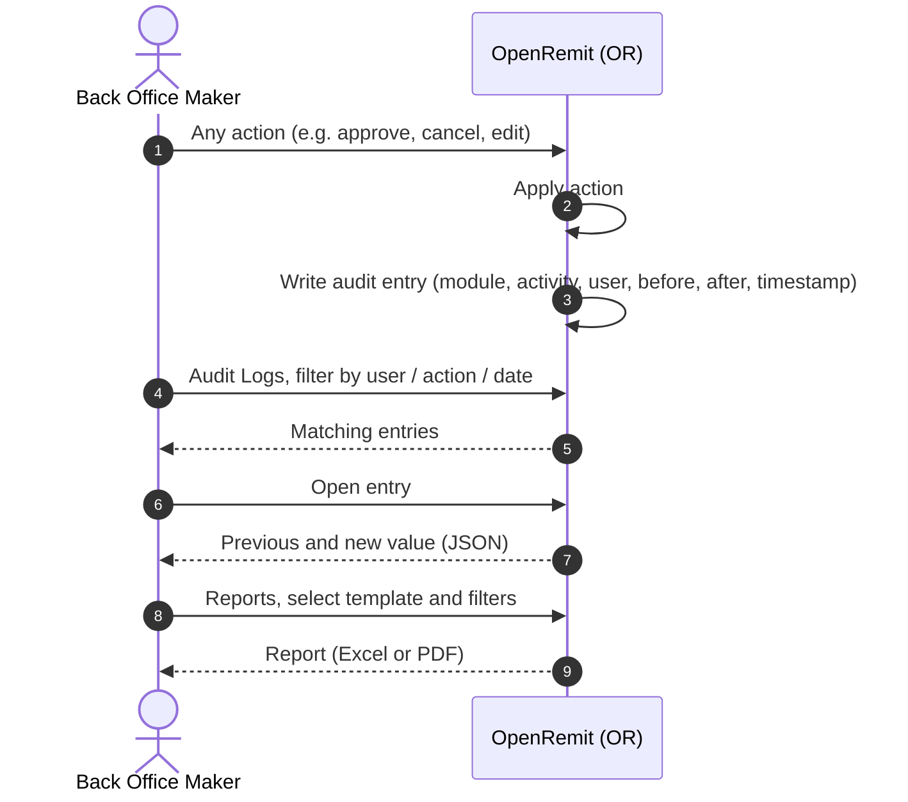

import { Hero, Capabilities } from '@site/src/components/DocKit';

<Hero title="Audit Logs &" accent="Reports" subtitle="Who did what, when and to which record, plus full transaction timelines and exportable reports for operations and regulators." />

<Capabilities tags={['Standard']} />

## Overview

OpenRemit records an audit entry for every user action and every significant system event: user and role changes, approvals, cancellations, amendments, compliance decisions, scheduler runs, rule changes, API inquiries and more. **Audit Logs** in the Back Office and Partner Portal make these searchable and exportable. **Transaction Monitoring** gives a full timeline for every transaction, and **Reports** provide transaction, partner and user reports, including regulatory formats, as Excel or PDF.

## Significance

- **Regulatory evidence**: every decision affecting a remittance can be traced to a user and a time.
- **Troubleshooting**: before and after values show exactly what changed.
- **Reconciliation**: transaction timelines show each API call, fallback, reversal and manual action.
- **Reporting**: standard and regulatory reports without manual compilation.

## Usage

### Who uses it

| Role | Portal and menu | What they do |
|---|---|---|
| Back Office user | Back Office → Audit Logs | Filters by action type, user or date range; exports logs |
| Back Office user | Back Office → **Transactions** | Opens the transaction detail view and timeline |
| Back Office user | Back Office → Reports | Generates transaction, partner and user reports; exports Excel or PDF |
| Partner | Partner Portal → **Audit Logs** | Searches by ID, activity, username, method and date; opens before / after JSON |

### What is captured

| Area | Captured details |
|---|---|
| Audit entry | Module / screen, activity, performed by (user or SYSTEM), method, previous value, new value, timestamp, comment |
| Transaction timeline | Every stage with timestamp and status, API request / response codes from OpenConnect, the Bank Integration Layer, RAAST and 1LINK, fallbacks and reversals |
| Failure reasons | Latest failure code mapped to a readable label, e.g. *Duplicate Transaction* or *Balance Inquiry Failed* |
| Scheduler runs | Partner, run time, transactions fetched, per-step outcomes, errors |

### Reports

| Report | Notes |
|---|---|
| Transaction reports | Filter by date range, transaction type, status or partner |
| Partner reports | Partner-specific metrics, including beneficiaries whose SMS contact details were missing or invalid |
| User reports | Partners, branches and sub-agents |
| Regulatory reports | Pre-defined SBP bank-wise templates, using the stored beneficiary IBAN |

## Sequence Diagram

## Outcomes & Edge Cases

| Stage | Condition | Outcome |
|---|---|---|
| Logging | Any user action | Audit entry with user, time, entity and before / after values |
| Logging | System action (scheduler, auto-cancellation, alert) | Logged as SYSTEM |
| Security | Forced or unauthorised action attempt | Rejected and logged |
| Search | Filters applied | Matching entries; exportable |
| Reports | Any template | Exported as Excel or PDF |

## Related

- [Partner Portal: Audit Logs](../../partner-portal/audit-logs.md)
- [Back Office: Transactions](../../back-office/transactions.md)
- [Role & User Management](./roles-user-management.md)
- [IBAN Fetch & Storage](./iban-fetch.md)
- [Cancellation](../financial/cancellation.md)
