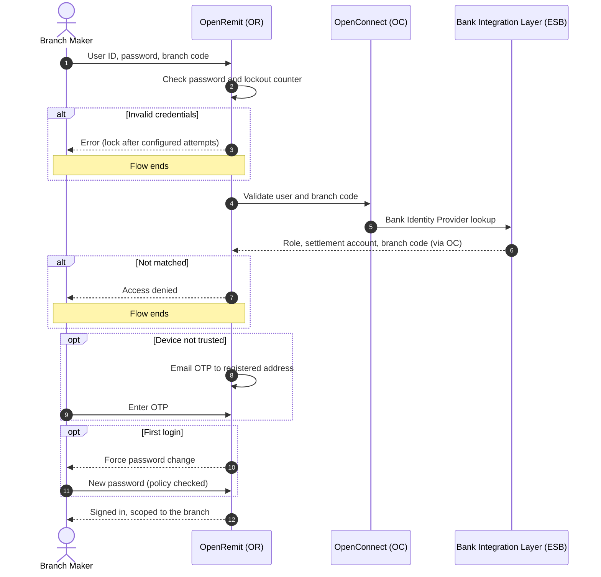

import { Hero, Capabilities } from '@site/src/components/DocKit';

<Hero title="Authentication &" accent="Access" subtitle="Password plus email OTP sign-in for every portal, an enforced password policy, and branch users validated against the Bank Identity Provider." />

<Capabilities tags={['Standard', 'Configurable', 'Requires Bank Integration']} />

## Overview

Users of the Back Office, Branch Portal and Partner Portal sign in with a username and password, followed by an **email OTP** (two-factor authentication). Optionally, they can trust their device so later sign-ins skip the OTP. New users receive a temporary password by email and must set their own on first login. Branch users also enter their branch code, and are validated against the **Bank Identity Provider** (e.g. Active Directory), which confirms their role, branch and settlement account.

## Significance

- **Account security**: two factors protect access to payment operations.
- **Strong credentials**: password complexity, history and lockout rules are enforced.
- **Single source of truth for branches**: branch users and roles come from the Bank's identity provider.
- **Data scoping**: branch users see only their branch's data; partner users see only their partner's data.

## Usage

### Who uses it

| Role | Portal | Sign-in fields |
|---|---|---|
| Back Office users | Back Office | Username, password, OTP |
| Branch and sub-agent users (Branch Maker / Branch Checker) | Branch Portal (one portal for both) | User ID, password, branch code, OTP |
| Partner users | Partner Portal | Username, password, OTP |

### Steps

1. Enter the credentials and click **Sign In**.
2. Enter the OTP sent to the registered email. Optionally tick **Trust this device**, then click **Verify Code**.
3. On first login, set a new password that meets the policy.
4. To recover a forgotten password, click **Forgot password?**.

### APIs involved

| Interface | API | Used for |
|---|---|---|
| Bank Integration Layer (ESB) → Bank Identity Provider | Branch user validation | Confirms user and branch code match; returns role (Branch Maker / Branch Checker), settlement account and branch code |
| Email service | OTP and temporary password delivery | Second factor and onboarding |

## Configuration

| Parameter | Description | Default |
|---|---|---|
| OTP | Code sent to the registered email | default: 6 digits |
| Trust this device | Skip the OTP on a trusted device | default: available |
| Password length | Minimum and maximum characters | default: 8 to 20 characters |
| Password complexity | At least one letter, one number, one capital, one small letter and one special character; allowed characters 0-9, a-z, A-Z and !@#$%^&* | default: enforced |
| Password history | New password must differ from recent passwords | default: enforced |
| Lockout | Invalid attempts before the account locks | default: 3 |

## Sequence Diagram

## Outcomes & Edge Cases

| Stage | Condition | Outcome |
|---|---|---|
| Password | Wrong password | Error; account locks after the configured attempts |
| Branch | User and branch code do not match the identity provider | Access denied |
| OTP | Wrong or expired OTP | Sign-in not completed |
| OTP | Device trusted | OTP skipped |
| First login | Temporary password used | Password change required |
| New password | Fails complexity or history rules | Rejected |
| Scope | Branch user | Sees only their branch's data unless configured otherwise |

:::caution[TBD]
The source specification does not state the OTP expiry time, how long a device stays trusted, or the number of previous passwords checked by the history rule.
:::

## Related

- [Back Office: Logging in and Changing Password](../../back-office/logging-in-and-changing-password.md)
- [Branch Portal: Logging in and Changing Password](../../branch-portal/logging-in-and-changing-password.md)
- [Partner Portal: Logging in and Changing Password](../../partner-portal/logging-in-and-changing-password.md)
- [Role & User Management](./roles-user-management.md)
