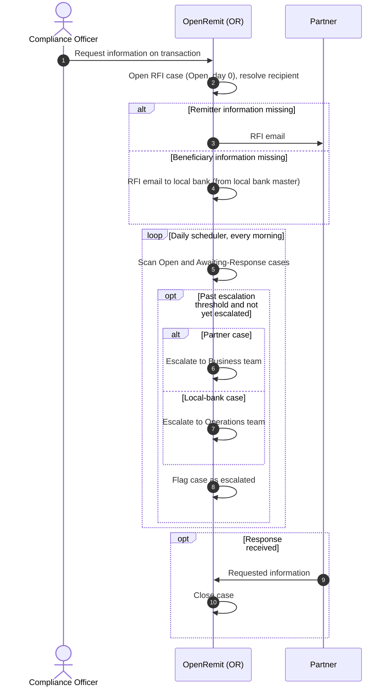

import { Hero, Capabilities } from '@site/src/components/DocKit';

<Hero title="Automated" accent="RFI" subtitle="When Compliance needs more information, OpenRemit emails the right party automatically and escalates unanswered cases after a set number of working days." />

<Capabilities tags={['Configurable']} />

## Overview

When Compliance needs additional information to screen a transaction, OpenRemit opens a **Request for Information (RFI)** case and emails the relevant external party:

- the **Partner**, for missing remitter information (contact taken from partner onboarding), or
- the **local bank**, for missing beneficiary information (contact taken from the local bank master).

The case opens with its SLA clock at day 0. A daily scheduler escalates any case left unanswered beyond the configured number of working days.

## Significance

- **Faster compliance decisions**: requests go out immediately and to the right party, without manual emails.
- **SLA enforcement**: overdue cases are escalated automatically to the right internal team.
- **Holiday-aware**: escalation counts working days using the holiday calendar.
- **Reliable**: the escalation scheduler is idempotent, so a case is never escalated twice.

## Usage

### Who uses it

| Role | Portal and menu | What they do |
|---|---|---|
| Compliance Officer | Back Office → **Compliance Review** | Triggers the RFI by requesting information |
| Partner / local bank | Email | Receives the RFI and responds |
| Business team | Email | Receives escalations for partner cases |
| Operations team | Email | Receives escalations for local-bank cases |

### Steps

1. Compliance requests information on a transaction. OpenRemit opens an RFI case (status *Open*, day 0) and emails the partner or the local bank.
2. Every morning a scheduler scans *Open* and *Awaiting-Response* cases.
3. A case past the escalation threshold is escalated: partner cases to the Business team, local-bank cases to the Operations team.
4. When the requested information arrives, OpenRemit closes the case.

## Configuration

| Parameter | Description | Default |
|---|---|---|
| Escalation threshold | Working days without a response before escalation (holiday-calendar aware) | default: 5 working days |
| Partner-case recipients | Who receives partner-case escalations | default: Business team |
| Local-bank-case recipients | Who receives local-bank-case escalations | default: Operations team |
| RFI-Compliance retries | Send retries for the initial RFI email (Alert Configuration) | default: 1 |
| RFI-Escalation retries | Send retries for the escalation email (Alert Configuration) | default: 3 |
| Scheduler time | When the daily escalation scan runs | default: every morning |

## Sequence Diagram

## Outcomes & Edge Cases

| Stage | Condition | Outcome |
|---|---|---|
| Open | Remitter information missing | RFI email to the partner |
| Open | Beneficiary information missing | RFI email to the local bank |
| Scheduler | Case past the threshold, not escalated | Escalated to the configured team |
| Scheduler | Case already escalated | Not escalated again |
| Scheduler | Non-working days | Not counted toward the threshold |
| Response | Information received at any time | Case closed |

## Related

- [Back Office: Compliance](../../back-office/compliance.md)
- [Suspicious Activity Controls](./suspicious-activity-controls.md)
- [Screening & Compliance Review](./screening-compliance-review.md)
- [Alerts](./alerts.md)
