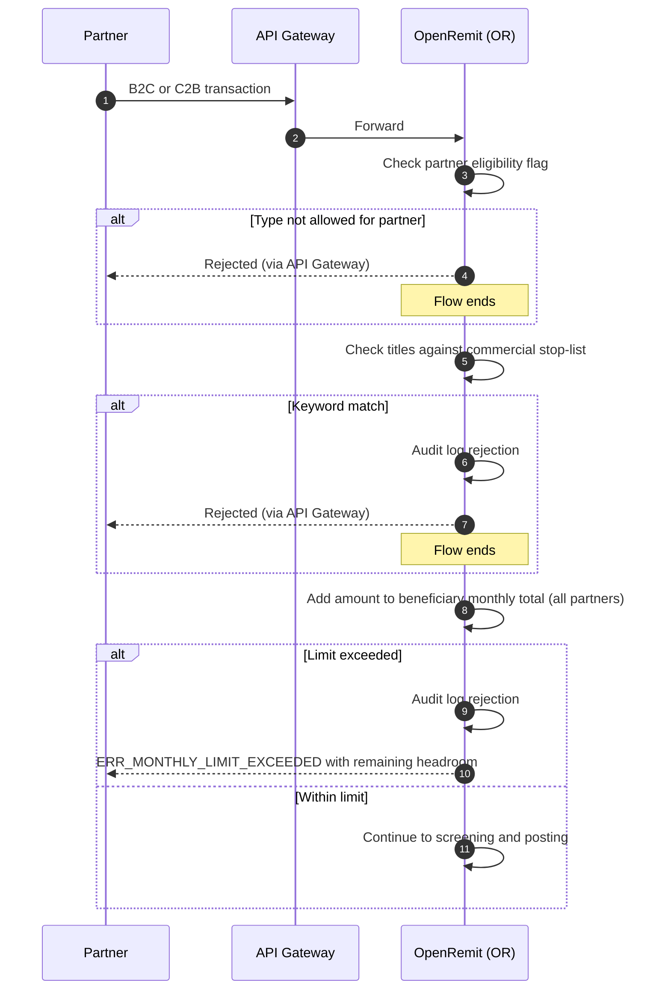

import { Hero, Capabilities } from '@site/src/components/DocKit';

<Hero title="B2C / C2B Limits &" accent="Keyword Block" subtitle="Enforce the regulator's monthly limits per beneficiary and block commercial entities on B2C and C2B inward remittances, before any credit is posted." />

<Capabilities tags={['Configurable']} />

## Overview

Some regulators cap how much a beneficiary can receive each month under business-to-consumer (B2C) and consumer-to-business (C2B) remittance purpose codes. For transactions with those purpose codes, OpenRemit applies three checks at validation, strictly before any credit posting:

1. **Partner eligibility**: is this partner allowed this remittance type?
2. **Commercial keyword screening**: does the remitter or beneficiary title match the commercial stop-list?
3. **Monthly limit**: would the beneficiary's cumulative inward total for the calendar month exceed the limit?

Any breach is rejected outright with a machine-readable error code. Person-to-person (P2P) remittances and outward remittances are out of scope.

:::info[Regulatory requirement: SBP (Pakistan)]
Under the State Bank of Pakistan's Schedule J-O-3, the limit for purpose codes 9186, 9249, 9478 and 9479 is USD 25,000 per beneficiary per calendar month, and for purpose code 9477 (pension) PKR 250,000 per beneficiary per calendar month. In other markets, the limits and purpose codes follow the local regulator.
:::

## Significance

- **Local regulatory compliance**: enforces the regulator's monthly caps for the configured purpose codes.
- **Bank-wide view**: the limit is tracked per beneficiary across **all partners combined**, so it cannot be bypassed by splitting across MTOs.
- **Stops misuse**: commercial entities cannot receive funds under personal remittance channels.
- **Clear feedback**: rejections carry an error code and the remaining headroom.

## Usage

### Who uses it

| Role | Portal and menu | What they do |
|---|---|---|
| Back Office admin | Back Office → **Partners** | Sets B2C / C2B / B2B Allowed flags per partner |
| Back Office admin | Back Office → Commercial keyword stop-list | Maintains the stop-list |
| Back Office admin | Back Office → Monthly limit configuration | Sets limits per purpose code |
| Partner | Partner APIs | Receives the rejection code and headroom |

### Checks

| Check | Rule |
|---|---|
| Partner eligibility | A transaction of a type flagged *N* for the partner is rejected before any other validation |
| Commercial keyword | The remitter or beneficiary title is checked against the stop-list; a match is rejected, independent of the limit |
| Monthly limit | Cumulative inward total per beneficiary (identified by title) per calendar month, across all partners, in the limit's currency |

### APIs involved

Rejections are returned on the partner's transaction submission (Post Transactions, or the pull fetch result), with a machine-readable code such as `ERR_MONTHLY_LIMIT_EXCEEDED` plus the remaining headroom.

## Configuration

| Parameter | Description | Default |
|---|---|---|
| B2C Allowed / C2B Allowed / B2B Allowed | Per-partner eligibility flags | default: N |
| Limited purpose codes | Which regulatory purpose codes the limit applies to | default: none (set to the regulator's codes, e.g. SBP 9186, 9249, 9477, 9478, 9479) |
| Monthly limit per purpose code | Per beneficiary per calendar month, with its currency | default: none (e.g. SBP: USD 25,000; PKR 250,000 for pension) |
| Commercial keyword stop-list | Words that mark a title as a commercial entity | default: admin-managed list |

Limit changes apply without a deployment and are not retroactive to transactions already processed.

## Sequence Diagram

## Outcomes & Edge Cases

| Stage | Condition | Outcome |
|---|---|---|
| Eligibility | Partner flag is N for the type | Rejected before any other validation |
| Keyword | Title matches the stop-list | Rejected, regardless of limit headroom |
| Limit | Cumulative total would exceed the limit | Rejected with `ERR_MONTHLY_LIMIT_EXCEEDED` and headroom |
| Limit | Within the limit | Continues processing |
| Routing | Any breach | Rejected outright; no manual review or compliance queue |
| Scope | P2P or outward remittance | Not checked |
| Configuration | Limit changed | Applies to new transactions only |
| Audit | Any rejection | Logged with beneficiary title, partner ID, amount, cumulative total, timestamp and reason code |

## Related

- [Back Office: Partners](../../back-office/partners.md)
- [System Restriction](./system-restriction.md)
- [Screening & Compliance Review](./screening-compliance-review.md)
- [Audit Logs & Reports](./audit-logs-reports.md)
