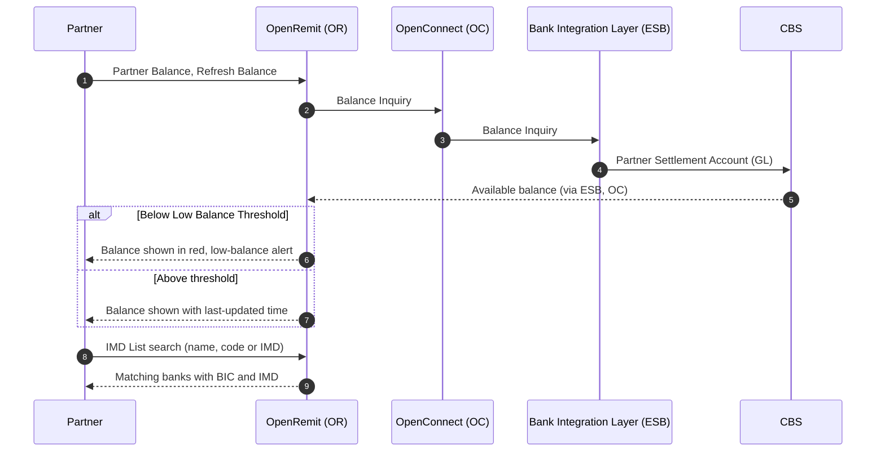

import { Hero, Capabilities } from '@site/src/components/DocKit';

<Hero title="Balance, IMD List &" accent="Dashboards" subtitle="Real-time partner balance, the bank code reference list, and an at-a-glance dashboard in each portal." />

<Capabilities tags={['Standard', 'Configurable']} />

## Overview

Three operational views support day-to-day remittance operations:

- **Partner Balance** shows a partner its available settlement balance in real time.
- **IMD List** is a searchable reference of Pakistani banks with their BIC code and IMD number.
- **Dashboards** in the Back Office, Branch Portal and Partner Portal summarise transactions by status and type.

## Significance

- **Funding visibility**: partners can top up before their balance runs short and transactions fail.
- **Fewer routing errors**: correct BIC / IMD codes for IBFT beneficiaries and transaction files.
- **Operational awareness**: each user sees pending, completed and failed volumes for their scope.

## Usage

### Who uses it

| Role | Portal and menu | What they see |
|---|---|---|
| Partner | Partner Portal → **Partner Balance** | Current available balance (PKR), last updated time, Refresh Balance |
| Partner | Partner Portal → **IMD List** | Participant name, BIC code and IMD, with copy buttons |
| Partner | Partner Portal → **Dashboard** | Real-time view (today) and Performance view (date range, MTD / YTD) |
| Back Office user | Back Office → Dashboard | Pending, completed and failed totals for IBFT, LFT and cash payout, plus partner and branch activity |
| Branch user | Branch Portal → Dashboard | Branch activity for cash payout (pending, completed, failed), filtered by date and partner |

### Dashboards

| Portal | Content |
|---|---|
| Partner Portal | Remittance Statistics (Received, Processed, Pending, Reversed); Payout Breakdown (Cash, FT, IBFT); Transaction Status and Amount Distribution charts; in Performance view, trend lines and Monthly Trends |
| Back Office | Transaction summary by status; widgets for IBFT, LFT and cash payout; partner and branch activity |
| Branch Portal | Cash payout activity by status; filters by date and partner |

### APIs involved

| Interface | API | Used for |
|---|---|---|
| API Gateway | Balance Inquiry | Partners query their Partner Settlement Account (GL) balance by API |
| API Gateway | Bank List | Partners fetch banks with BIC and IMD codes by API |
| Bank Integration Layer (ESB) | Balance Inquiry | Real-time balance from CBS |

## Configuration

| Parameter | Description | Default |
|---|---|---|
| Low Balance Threshold | Below this, the Partner Portal balance turns red and an alert is sent (see [Alerts](./alerts.md)) | default: TBD |

## Sequence Diagram

## Outcomes & Edge Cases

| Stage | Condition | Outcome |
|---|---|---|
| Balance | Refresh clicked | Latest balance fetched with its timestamp |
| Balance | Below the threshold | Display turns red; one alert per breach cycle |
| IMD List | Search | Filtered by name, BIC code or IMD; values copyable |
| Dashboard | Performance view, date range selected | Cumulative totals, trends and monthly charts for the range |

## Related

- [Partner Portal: Partner Balance](../../partner-portal/partner-balance.md)
- [Partner Portal: IMD List](../../partner-portal/imd-list.md)
- [Partner Portal: Dashboard](../../partner-portal/dashboard.md)
- [Alerts](./alerts.md)
