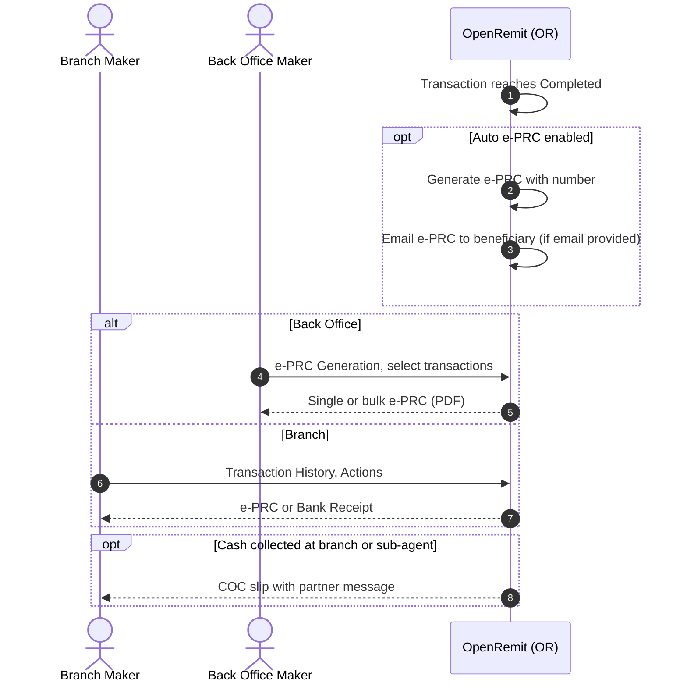

import { Hero, Capabilities } from '@site/src/components/DocKit';

<Hero title="e-PRC, Bank Receipt &" accent="COC Slip" subtitle="Generate and deliver SBP Proceeds Realization Certificates, bank receipts and cash payout slips, one at a time, in bulk or automatically." />

<Capabilities tags={['Standard']} />

## Overview

For every completed remittance, OpenRemit can produce:

- the **e-PRC** (electronic Proceeds Realization Certificate), in the SBP format: generated manually, in bulk, or automatically and emailed to the beneficiary when the transaction completes;
- a **Bank Receipt** for the completed transaction;
- a **COC payout slip**, printed when a beneficiary collects cash, including any message from the remitting partner.

## Significance

- **SBP regulatory evidence**: the e-PRC certifies that foreign remittance proceeds were realised in favour of the beneficiary.
- **Beneficiary service**: beneficiaries receive their e-PRC automatically, without visiting a branch.
- **Operational efficiency**: bulk e-PRC generation and download for many transactions at once.
- **Personal touch**: the partner's message to the beneficiary is printed on the cash payout slip.

## Usage

### Who uses it

| Role | Portal and menu | What they do |
|---|---|---|
| Back Office user | Back Office → **e-PRC Generation** | Searches completed transactions; downloads single or bulk e-PRCs |
| Branch Maker | Branch Portal → **Transaction History** → Actions | Generates the e-PRC or a Bank Receipt |
| Partner | Partner Portal → transaction details | Downloads the e-PRC |
| Branch / sub-agent | Branch Portal | Prints the COC slip on cash collection |

### Steps (Back Office)

1. Open **e-PRC Generation**. It lists completed transactions with Transaction ID, Remitting Institute, Remitter, Beneficiary, Amount (FCY), Amount (PKR), Type and e-PRC Number.
2. Filter, then click the download icon for a single e-PRC, or select several and use **Bulk e-PRC** to view and download them as PDF.

### e-PRC contents

The certificate follows the SBP Proceeds Realization Certificate format: e-PRC number and date; remitter details (name, ID, account / IBAN, remitting institution, country and country code); beneficiary details (name, ID, account / IBAN, bank); date of realisation; amounts received (FCY), retained in FCY and converted to PKR with the conversion rate; purpose of remittance and SBP purpose code; and the transaction reference.

## Configuration

| Parameter | Description | Default |
|---|---|---|
| Auto-generate and email e-PRC | Generate the e-PRC when a transaction reaches *Completed* and email it to the beneficiary | default: enabled |
| e-PRC template | Certificate layout and bank branding, within the SBP format | default: Bank-provided |

## Sequence Diagram

## Outcomes & Edge Cases

| Stage | Condition | Outcome |
|---|---|---|
| Completion | Auto e-PRC enabled and beneficiary email available | e-PRC generated and emailed |
| Completion | No beneficiary email | e-PRC available for manual download |
| Bulk | Several transactions selected | Viewed together and downloaded as PDF |
| COC slip | Partner included a beneficiary message | Message printed on the slip |
| Reporting | Beneficiary IBAN missing | IBAN field left blank; see [IBAN Fetch](./iban-fetch.md) |

## Related

- [Back Office: e-PRC](../../back-office/e-prc.md)
- [Branch Portal: Transaction History](../../branch-portal/transaction-history.md)
- [IBAN Fetch & Storage](./iban-fetch.md)
- [Alerts](./alerts.md)
- [COC / OTC Cash Payout](../financial/coc-otc-cash-payout.md)
