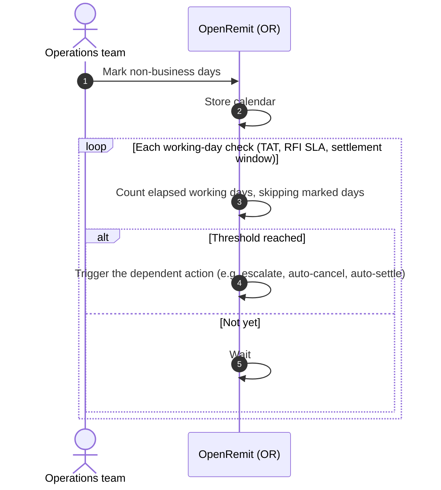

import { Hero, Capabilities } from '@site/src/components/DocKit';

<Hero title="Holiday" accent="Calendar" subtitle="One place to mark non-business days, so every working-day timer in OpenRemit counts the same way." />

<Capabilities tags={['Configurable']} />

## Overview

The Holiday Calendar lets the Operations team mark non-business days. Features that count **working days** read it, so a timer never expires on a public holiday:

- auto-cancellation turnaround times (TAT);
- the Automated RFI escalation SLA;
- business-day windows used by scheduled jobs, such as RTGS auto-settlement and Reconciliation Tally.

## Significance

- **Fair timers**: deadlines are not consumed by days on which nobody can act.
- **Local fit**: each deployment marks its own country's and bank's holidays.
- **One source**: every working-day calculation uses the same calendar.

## Usage

### Who uses it

| Role | Portal and menu | What they do |
|---|---|---|
| Operations team | Back Office → Holiday Calendar | Marks and maintains non-business days |
| (system) | — | Skips marked days in working-day calculations |

### Features that use it

| Feature | How the calendar applies |
|---|---|
| [Cancellation](../financial/cancellation.md) | Auto-cancellation TAT counts working days |
| [Automated RFI](./automated-rfi.md) | The escalation threshold counts working days |
| [Move to RTGS](../financial/move-to-rtgs.md) | The auto-settle turnaround time counts working days |
| [Reconciliation Tally](./reconciliation-tally.md) | "Previous business day" skips marked days |

## Configuration

| Parameter | Description | Default |
|---|---|---|
| Non-business days | Dates on which working-day timers do not count | default: weekends; holidays added by Operations |

## Sequence Diagram

## Outcomes & Edge Cases

| Stage | Condition | Outcome |
|---|---|---|
| Timer | A marked holiday falls within the window | That day is not counted |
| Timer | Calendar changed while a timer is running | The new calendar is used for the remaining days |

:::caution[TBD]
The source documents do not specify the screen layout, or whether calendar changes need maker-checker approval.
:::

## Related

- [Cancellation](../financial/cancellation.md)
- [Automated RFI](./automated-rfi.md)
- [Move to RTGS](../financial/move-to-rtgs.md)
- [Reconciliation Tally](./reconciliation-tally.md)
