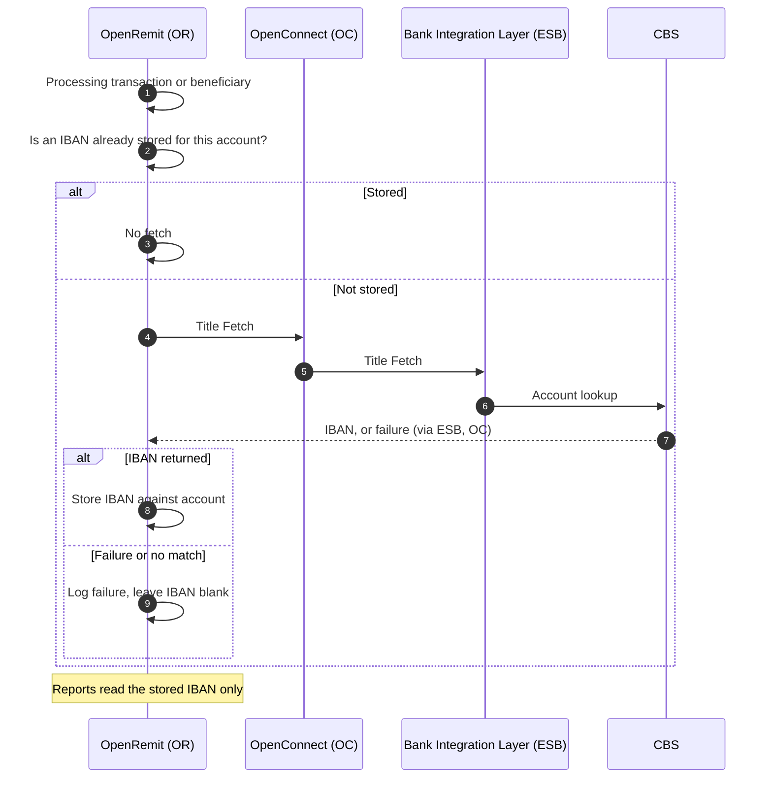

import { Hero, Capabilities } from '@site/src/components/DocKit';

<Hero title="IBAN Fetch &" accent="Storage" subtitle="Fetch each beneficiary account's IBAN from CBS once, store it, and use it in SBP bank-wise reports such as the e-PRC." />

<Capabilities tags={['Standard', 'Requires Bank Integration']} />

## Overview

SBP bank-wise reporting, such as the e-PRC, needs the beneficiary's IBAN. When OpenRemit processes a transaction or beneficiary whose account has no IBAN stored, it calls a Title Fetch API on CBS to fetch the IBAN and stores it against the account. Reports read the stored value; no live call is made at report time.

## Significance

- **SBP reporting**: the beneficiary IBAN field in bank-wise reports is populated.
- **Efficiency**: each account's IBAN is fetched only once.
- **Fast reports**: report generation never waits on CBS.
- **Non-blocking**: a missing IBAN never stops a transaction or a report.

## Usage

### Who uses it

| Role | Portal and menu | What they do |
|---|---|---|
| (system) | — | Fetches and stores IBANs during processing |
| Back Office user | Back Office → **e-PRC Generation** / reports | Sees the stored IBAN in reports |

### APIs involved

| Interface | API | Used for |
|---|---|---|
| Bank Integration Layer (ESB) | Title Fetch (with IBAN) | Fetch the account's IBAN from CBS |

## Sequence Diagram

## Outcomes & Edge Cases

| Stage | Condition | Outcome |
|---|---|---|
| Fetch | IBAN already stored | No duplicate fetch |
| Fetch | IBAN returned | Stored for reporting |
| Fetch | Failure or no match | Failure logged; IBAN left blank; transaction not blocked |
| Reporting | IBAN blank | Report generated with the field blank |

## Related

- [e-PRC, Bank Receipt & COC Slip](./eprc-receipts.md)
- [Audit Logs & Reports](./audit-logs-reports.md)
- [Back Office: e-PRC](../../back-office/e-prc.md)
