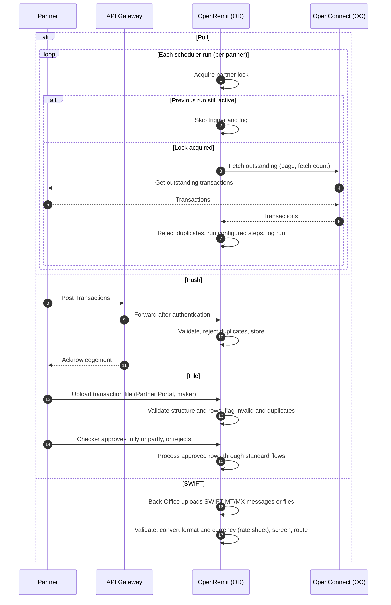

import { Hero, Capabilities } from '@site/src/components/DocKit';

<Hero title="Partner" accent="Integration Modes" subtitle="Partners connect by pull, push, file or SWIFT. Each partner gets its own scheduler, with its own interval, volume and processing steps." />

<Capabilities tags={['Standard', 'Configurable']} />

## Overview

OpenRemit receives remittances from partners (MTOs, exchange companies and other remittance originators) in four ways. They are not mutually exclusive: a partner can use more than one, and each is enabled per partner.

- **Pull**: OpenRemit fetches outstanding transactions from the partner's API.
- **Push**: the partner posts transactions to OpenRemit's APIs through the API Gateway.
- **File**: the partner's maker uploads a transaction file in the Partner Portal.
- **SWIFT**: transactions from correspondent banks arrive as SWIFT MT/MX messages or files uploaded in the Back Office.

Each partner has its own scheduler instance, driven by a configuration record that sets how often to run, how many transactions to fetch, which transaction types to handle and which processing steps to run.

## Significance

- **Fits any partner**: a partner can connect in whatever way its own systems support, without custom development.
- **Isolation**: one partner's volume, outage or misconfiguration does not affect another's scheduler.
- **Operational control**: a single partner can be enabled, paused or tuned without touching others.
- **Duplicate prevention**: a reference / PIN already received from any channel for the same partner is rejected.
- **Auditability**: every scheduler run is logged with its fetch count, per-step outcomes and errors.

## Usage

### Who uses it

| Role | Portal and menu | What they do |
|---|---|---|
| Back Office Maker | Back Office → **Partners** → Add New Partner | Creates the partner, its integration mode, allowed transaction types and screening options |
| Back Office Checker | Back Office → **Partners** → Partner Checker Inbox | Approves partner creation and updates |
| Partner | Partner APIs | Sends transactions by push, or exposes APIs for pull |

### Partner setup

When adding a partner, the Back Office Maker sets:

- Partner Name and **Integration Mode** (push, pull, or hybrid push / pull).
- **Partner Code** and **Partner Regex**.
- **Unlock Threshold Time**, and the **Confirmation** and **Unlock** toggles for pull cash payouts.
- **Transactions Allowed** (OTC, FT, IBFT), and for each type its Sender Screening, Receiver Screening and Title Match options.
- Country, Address, Point of Contact, Email and Contact Number.
- **Partner Settlement Account (GL)** and its Account Title, with a Fetch Title button.

### Integration modes

| Mode | How it works |
|---|---|
| Pull | OpenRemit calls the partner's API using filters such as page number, fetch count, date or status. Each transaction is processed individually. Cash payouts are fetched and locked at branch lookup, then confirmed or unlocked |
| Push | The partner calls OpenRemit's APIs. Pushed transactions follow the same screening and routing as pulled ones |
| File | The partner's maker uploads a file using the template in the Partner Portal. OpenRemit validates the structure and every row (Valid, Invalid or Duplicate). The partner's checker approves the file fully or partly, or rejects it. Approved rows go through screening, balance validation and routing; invalid rows can be downloaded with their errors, corrected and re-uploaded. See [Partner Bulk File Upload](../financial/partner-bulk-file-upload.md) |
| SWIFT | For correspondent-bank business, SWIFT MT/MX messages or files are uploaded in the Back Office, validated and converted to the internal format. Amounts are converted using the configured rate sheets, screened for compliance and AML, and routed for settlement through CBS and the relevant channels, through the same transaction engine as partner business |

### APIs involved

| Interface | API | Method | Used for |
|---|---|---|---|
| API Gateway (push) | Post Transactions | POST | Push one or more transactions with reference, customer details and type |
| API Gateway (push) | Transaction Inquiry | POST | Check a pushed transaction's status |
| API Gateway (push) | Title Fetch | POST | Verify a beneficiary account title before sending |
| API Gateway (push) | Balance Inquiry | POST | Check the Partner Settlement Account (GL) balance |
| API Gateway (push) | Bank List | GET | List domestic banks with BIC and bank codes |
| Partner system (pull) | Get outstanding transactions, Fetch by reference, Confirm Transaction, Unlock Transaction | — | Pull partner interface |

## Configuration

Each partner's scheduler has its own record:

| Parameter | Description | Default |
|---|---|---|
| Enabled | Turn the partner's scheduler on or off without deleting it | default: enabled |
| Interval (cron) | How often the scheduler runs | default: every 5 minutes |
| Fetch count | Transactions fetched per run, to throttle high-volume partners | default: 50 |
| Transaction types | OTC, LFT, IBFT or all | default: TBD |
| Processing steps | Ordered steps: SCREENING, TITLE_FETCH, BALANCE_INQUIRY, FUND_TRANSFER, PARTNER_NOTIFY | default: all applicable steps |
| Retry attempts | Retries per step on timeout or transient failure before parking in the Back Office | default: 3 |
| Consecutive-failure alert | Number of failed runs in a row before the Operations team is alerted | default: TBD |

### Step rules

| Step | Applies to | Behaviour |
|---|---|---|
| SCREENING | OTC, LFT, IBFT | AML/CFT screening; runs PRE (before Title Fetch / Balance / Transfer) or POST (after Fund Transfer) per the partner's risk profile |
| TITLE_FETCH | LFT, IBFT | Account validation on CBS (LFT) or the domestic rail (IBFT). Not applicable to OTC. May be omitted only for pre-validated partners |
| BALANCE_INQUIRY | OTC, LFT, IBFT | Partner balance check. Omitting it requires risk team approval |
| FUND_TRANSFER | OTC, LFT, IBFT | Financial posting; IBFT follows the configured rail order. Must be the last financial step |
| PARTNER_NOTIFY | OTC, LFT, IBFT | Confirm / unlock (pull) or status update (push). Mandatory for pull cash payouts; must follow FUND_TRANSFER |

- TITLE_FETCH must come before BALANCE_INQUIRY and FUND_TRANSFER.
- Configuration changes take effect on the next run. Transactions already in progress keep the configuration they started with.
- A distributed lock per partner prevents overlapping runs. A trigger that fires while a run is still in progress is skipped and logged.

### Example configurations

| Partner profile | Interval | Types | Steps |
|---|---|---|---|
| Standard MTO | Every 5 min | LFT, IBFT | Screening → Title Fetch → Balance Inquiry → Fund Transfer → Partner Notify |
| Pre-screened, titles confirmed at source | Every 1 min | LFT | Balance Inquiry → Fund Transfer → Partner Notify |
| Cash only, high volume | Every 2 min | OTC | Screening → Balance Inquiry → Fund Transfer → Partner Notify |

## Sequence Diagram

## Outcomes & Edge Cases

| Stage | Condition | Outcome |
|---|---|---|
| Scheduler | Previous run still in progress | New trigger skipped and logged |
| Scheduler | Fails for the configured number of runs in a row | Operations team alerted |
| Configuration | Changed mid-run | Applies from the next run; in-flight transactions are unaffected |
| Intake | Duplicate reference / PIN from any channel | Rejected |
| File | Structure or row validation failure | Row marked Invalid; downloadable with its error for correction |
| Push | Validation failure | Error returned to the partner |

:::caution[TBD]
The source specification describes a cron schedule per partner, but also notes that the interval is the same for all partners. Whether intervals can differ per partner is open.
:::

## Related

- [Back Office: Partners](../../back-office/partners.md)
- [Partner Portal: File Upload](../../partner-portal/file-upload.md)
- [COC / OTC Cash Payout](../financial/coc-otc-cash-payout.md)
- [Local Funds Transfer (LFT)](../financial/local-funds-transfer.md)
- [Interbank Transfer (IBFT) with Rail Fallback](../financial/ibft-rail-fallback.md)
- [Partner Bulk File Upload](../financial/partner-bulk-file-upload.md)
