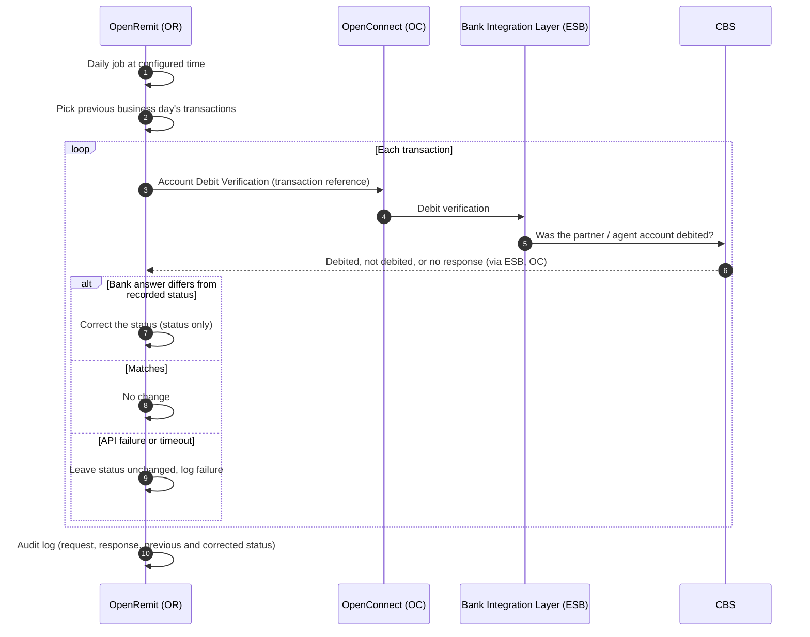

import { Hero, Capabilities } from '@site/src/components/DocKit';

<Hero title="Reconciliation" accent="Tally" subtitle="Every day, OpenRemit checks the previous business day's transactions against the bank and corrects any status that doesn't match. It never moves money." />

<Capabilities tags={['Configurable', 'Requires Bank Integration']} />

:::info[Bank dependency]
Available only where the bank provides a transaction inquiry / **Account Debit Verification API**. Without it, neither Reconciliation Tally nor [EOD Auto Repush](../financial/eod-auto-repush.md) can be offered.
:::

## Overview

Reconciliation Tally is a scheduled job that runs once a day, at end of day or the next morning, and corrects transaction statuses that do not match what actually happened on the bank's side. For each transaction from the previous business day, OpenRemit asks the bank's Account Debit Verification API whether the amount was debited from the partner / agent account. If the answer doesn't match the status in OpenRemit, the status is corrected.

It **only corrects the status**. It never starts a re-push, a reversal or a financial posting.

## Significance

- **Accurate records**: statuses match the bank's books every day, not only when someone notices a mismatch.
- **Reliable reporting**: partner reports, regulatory reports and dashboards rely on correct statuses.
- **Safe by design**: no money moves, so a correction cannot cause a double posting.
- **Traceability**: every change records the previous and the corrected status.

## Usage

### Who uses it

| Role | Portal and menu | What they do |
|---|---|---|
| (system) | — | Runs the job daily |
| Back Office user | Back Office → **Transactions**, **Audit Logs** | Sees corrected statuses and reviews each run |

### Steps

1. At the configured time, the job picks the transactions processed on the previous business day.
2. For each transaction, OpenRemit calls the Account Debit Verification API with the transaction reference.
3. If the bank's answer doesn't match the recorded status, the status is updated. If it matches, nothing changes.
4. If the API fails or times out, the status is left unchanged and the failure is logged.
5. The run is audit logged.

### APIs involved

| Interface | API | Used for |
|---|---|---|
| Bank Integration Layer (ESB) | Account Debit Verification (transaction inquiry) | Confirm whether the amount was debited from the partner / agent account |

## Configuration

| Parameter | Description | Default |
|---|---|---|
| Enabled | Run the daily job (requires the debit verification API) | default: disabled until the API is available |
| Run time | End of day, or the next morning | default: configured per deployment |
| Business days | Which day counts as "previous business day" | default: from the [Holiday Calendar](./holiday-calendar.md) |

## Sequence Diagram

## Outcomes & Edge Cases

| Stage | Condition | Outcome |
|---|---|---|
| Verification | Bank confirms a different outcome than recorded | Status corrected |
| Verification | Bank confirms the recorded outcome | No change |
| Verification | API failure or timeout | Status unchanged; failure logged |
| Scope | Any correction | Status only; no re-push, reversal or posting |
| Audit | Every run | Logged with the transactions picked, API request / response, and previous and corrected status |

## Related

- [EOD Auto Repush with Debit Verification](../financial/eod-auto-repush.md)
- [Audit Logs & Reports](./audit-logs-reports.md)
- [Holiday Calendar](./holiday-calendar.md)
- [Back Office: Transactions](../../back-office/transactions.md)
