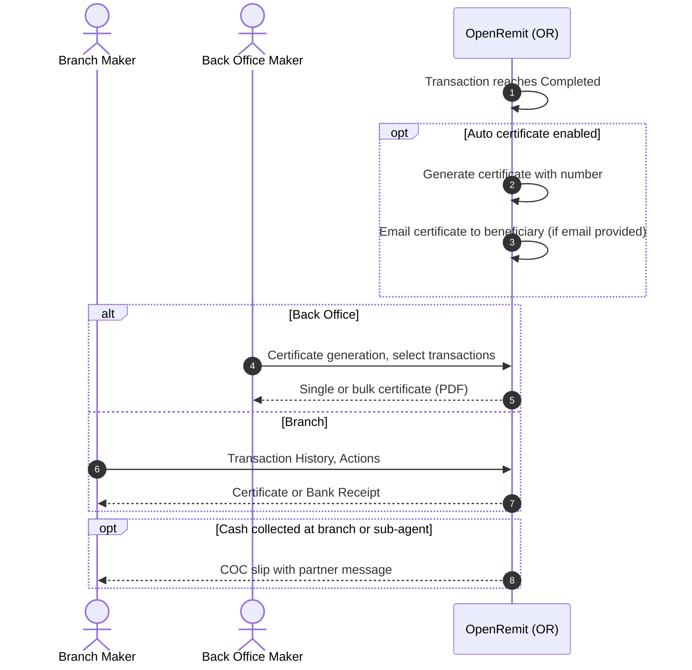

import { Hero, Capabilities } from '@site/src/components/DocKit';

<Hero title="Regulatory Certificate," accent="Receipt & COC Slip" subtitle="Generate and deliver regulatory remittance certificates, bank receipts and cash payout slips, one at a time, in bulk or automatically." />

<Capabilities tags={['Standard']} />

## Overview

For every completed remittance, OpenRemit can produce:

- the **regulatory remittance certificate**, in the format the local regulator prescribes (for example the SBP e-PRC in Pakistan): generated manually, in bulk, or automatically and emailed to the beneficiary when the transaction completes;
- a **Bank Receipt** for the completed transaction;
- a **COC payout slip**, printed when a beneficiary collects cash, including any message from the remitting partner.

## Significance

- **Local regulatory reporting**: the certificate evidences that foreign remittance proceeds were realised in favour of the beneficiary, as the regulator requires.
- **Beneficiary service**: beneficiaries receive their certificate automatically, without visiting a branch.
- **Operational efficiency**: bulk generation and download for many transactions at once.
- **Personal touch**: the partner's message to the beneficiary is printed on the cash payout slip.

## Usage

### Who uses it

| Role | Portal and menu | What they do |
|---|---|---|
| Back Office user | Back Office → certificate generation screen | Searches completed transactions; downloads single or bulk certificates |
| Branch Maker | Branch Portal → **Transaction History** → Actions | Generates the certificate or a Bank Receipt |
| Partner | Partner Portal → transaction details | Downloads the certificate |
| Branch / sub-agent | Branch Portal | Prints the COC slip on cash collection |

### Steps (Back Office)

1. Open the certificate generation screen. It lists completed transactions with Transaction ID, Remitting Institute, Remitter, Beneficiary, Amount (FCY), Amount (local currency), Type and certificate number.
2. Filter, then click the download icon for a single certificate, or select several and use the bulk option to view and download them as PDF.

### Certificate contents

The certificate follows the local regulator's format. For example, the SBP e-PRC in Pakistan contains:

- the certificate number and date;
- remitter details: name, ID, account / IBAN, remitting institution, country and country code;
- beneficiary details: name, ID, account / IBAN, bank;
- the date of realisation;
- the amounts received in foreign currency, retained in foreign currency, and converted to local currency, with the conversion rate;
- the purpose of the remittance with its regulatory purpose code;
- the transaction reference.

:::info[Pakistan example]
The certificate is the **SBP e-PRC** (Proceeds Realization Certificate), and the Back Office screen is **e-PRC Generation**.
:::

## Configuration

| Parameter | Description | Default |
|---|---|---|
| Auto-generate and email certificate | Generate the certificate when a transaction reaches *Completed* and email it to the beneficiary | default: enabled |
| Certificate template | Layout and bank branding, within the regulator's format | default: Bank-provided |

## Sequence Diagram

## Outcomes & Edge Cases

| Stage | Condition | Outcome |
|---|---|---|
| Completion | Auto certificate enabled and beneficiary email available | Certificate generated and emailed |
| Completion | No beneficiary email | Certificate available for manual download |
| Bulk | Several transactions selected | Viewed together and downloaded as PDF |
| COC slip | Partner included a beneficiary message | Message printed on the slip |
| Reporting | Beneficiary IBAN missing | IBAN field left blank; see [IBAN Fetch](./iban-fetch.md) |

## Related

- [Back Office: Certificate Generation (e-PRC)](../../back-office/e-prc.md)
- [Branch Portal: Transaction History](../../branch-portal/transaction-history.md)
- [IBAN Fetch & Storage](./iban-fetch.md)
- [Alerts](./alerts.md)
- [COC / OTC Cash Payout](../financial/coc-otc-cash-payout.md)
