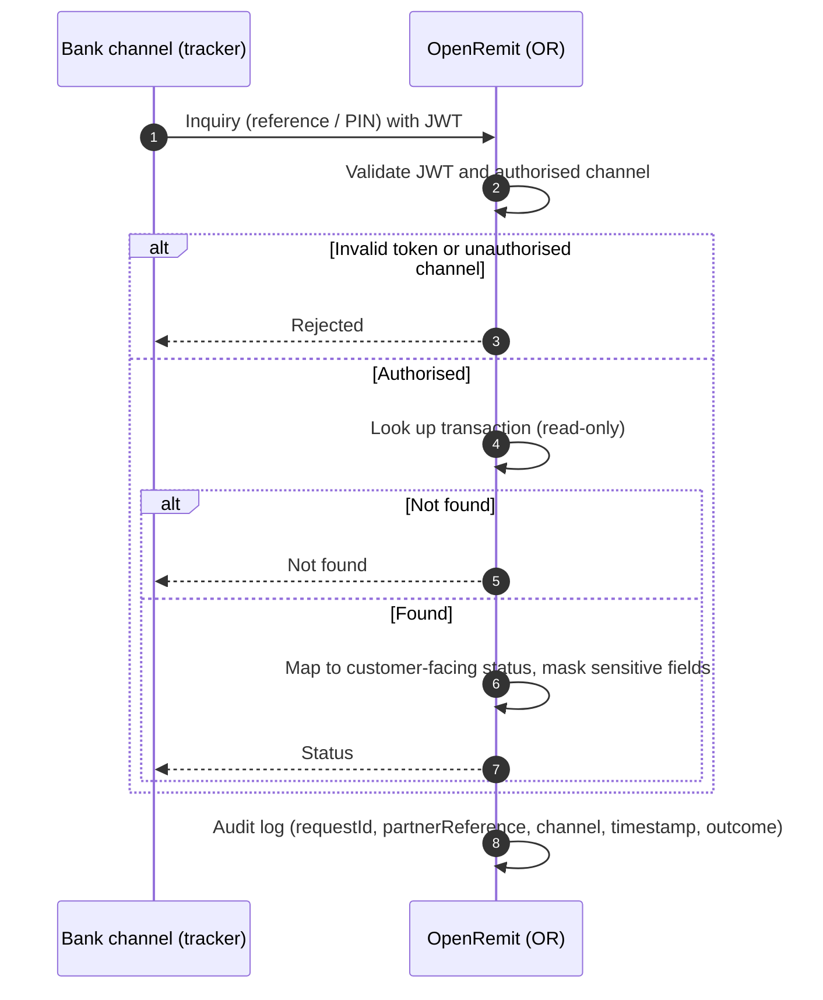

import { Hero, Capabilities } from '@site/src/components/DocKit';

<Hero title="Remittance Tracker" accent="Inquiry API" subtitle="A read-only, JWT-secured API behind the Bank's remittance tracker, so remitters and beneficiaries can check a transaction's status by reference or PIN." />

<Capabilities tags={['Standard']} />

## Overview

The Remittance Tracker Inquiry API backs a tracker on the Bank's own channels, such as its corporate website. A remitter or beneficiary enters a transaction reference / PIN and sees its current status in plain language. The API is authenticated with JWT, accepts calls only from the Bank's authorised channels, and is strictly **read-only**: it never changes transaction data or triggers any financial process.

## Significance

- **Customer self-service**: fewer status queries reach branches and contact centres.
- **Security**: JWT authentication and channel restriction prevent public enumeration.
- **Privacy**: account numbers and personal information are masked in responses.
- **Zero financial risk**: read-only by design.
- **Traceability**: every inquiry is logged.

## Usage

### Who uses it

| Role | Channel | What they do |
|---|---|---|
| Remitter / beneficiary | The Bank's remittance tracker (e.g. website) | Enters a reference / PIN and views the status |
| The Bank's channel | Remittance Tracker Inquiry API | Calls the API with a valid JWT |

### Visible statuses

| Status shown | Meaning |
|---|---|
| Available for Payout | Cash payout ready for collection |
| Collected by Beneficiary | Cash collected |
| Credited in customer account | Account credit completed |
| Sent to beneficiary bank | Sent through RTGS |
| Cancelled and refunded | Transaction cancelled |
| Under Compliance Check | Held by screening or compliance review |

### APIs involved

| Interface | API | Used for |
|---|---|---|
| The Bank's channel → OpenRemit | Remittance Tracker Inquiry (JWT) | Read-only status lookup by reference / PIN |

## Sequence Diagram

## Outcomes & Edge Cases

| Stage | Condition | Outcome |
|---|---|---|
| Authentication | Missing or invalid JWT, or unauthorised channel | Rejected |
| Lookup | Reference / PIN found | Customer-facing status returned, with sensitive fields masked |
| Lookup | Not found | Not-found response |
| Side effects | Any request | No data changed; no financial process triggered |
| Audit | Every inquiry | Logged with requestId, partnerReference, source / channel, timestamp and outcome |

:::caution[TBD]
The source specification does not define the response for a reference that is not found, or any rate limiting.
:::

## Related

- [Alerts](./alerts.md)
- [Audit Logs & Reports](./audit-logs-reports.md)
- [Back Office: Transactions](../../back-office/transactions.md)
