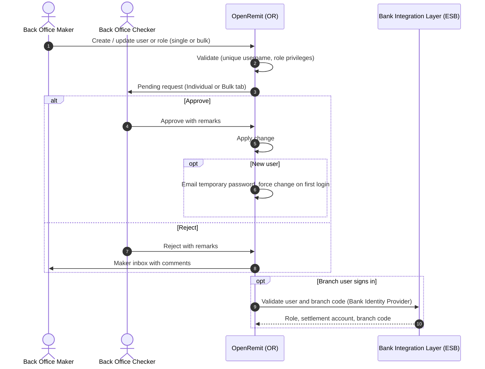

import { Hero, Capabilities } from '@site/src/components/DocKit';

<Hero title="Role & User" accent="Management" subtitle="Every role and user, in the Back Office, branches, partners and sub-agents, is created and changed under maker-checker control." />

<Capabilities tags={['Standard', 'Requires Bank Integration']} />

## Overview

OpenRemit manages four user populations:

- **Back Office** users, with roles built from permissions.
- **Branch** users.
- **Partner** users, created against their partner.
- **Sub-agent** users, created against their sub-agent.

Every creation, update, deactivation and bulk upload is raised by a **maker** and approved by a **checker**. Rejected requests return to the maker's inbox with the checker's comments.

## Significance

- **Segregation of duties**: no single user can grant access alone.
- **Least privilege**: roles group permissions, and a role change applies to all its users on approval.
- **Scale**: branch and sub-agent users can be onboarded in bulk from Excel.
- **Auditability**: every request, approval and rejection is logged.

## Usage

### Who uses it

| Role | Portal and menu | What they do |
|---|---|---|
| Back Office Maker | Back Office → **User Management → Role** | Creates or edits roles (code, description, status, permissions) |
| Back Office Maker | Back Office → **User Management → User** | Creates or edits Back Office users |
| Back Office Checker | Back Office → **User Management → Inbox** | Approves or rejects role and user requests |
| Back Office Maker | Back Office → **Branch Users** | Creates branch users individually or by Bulk Upload; View, Edit, Deactivate, Reset Password |
| Back Office Maker | Back Office → **Partners** | Creates partners and partner users |
| Back Office Maker | Back Office → **Sub Agents** | Creates sub-agents (with settlement account) and their users, individually or in bulk |
| Back Office Checker | Back Office → User / Partner / Sub-Agent Checker Inbox | Approves individual and bulk requests |

### User populations

| Population | Created in | Key fields | Notes |
|---|---|---|---|
| Back Office | User Management → User | User ID, name, CNIC, mobile, email, employee number, department, designation, role, status | A default super-admin role can only create admin users |
| Branch | Branch Users | Full name, username, email, mobile, settlement account, user type (maker / checker), branch code, designation | Validated against the Bank Identity Provider; bulk upload with a sample file |
| Partner | Partners → Add New Partner User | Name, father name, ID number, email, phone, username, partner, user type | Maker / checker per partner |
| Sub-agent | Sub Agents → User Management | Name, father name, ID number, email, phone, username, branch code, settlement account, sub-agent, user type | Bulk upload requires selecting the sub-agent first |

### Steps

1. The maker submits a create / update / deactivate request, or uploads a bulk file.
2. The request appears in the checker inbox, on the **Individual** or **Bulk** tab.
3. **Approve**: the change takes effect. A new user receives a temporary password by email and must change it on first login.
4. **Reject**: the request returns to the maker inbox with comments, for correction and resubmission.
5. Bulk uploads can be tracked in **Bulk Upload List** (File ID, Batch ID, rows, current stage such as Processing, Checker Pending or Failed).

### APIs involved

| Interface | API | Used for |
|---|---|---|
| Bank Identity Provider (e.g. Active Directory), through the Bank Integration Layer | Branch user validation | Confirms that the branch user and branch code match, and returns role, settlement account and branch code |

## Sequence Diagram

## Outcomes & Edge Cases

| Stage | Condition | Outcome |
|---|---|---|
| Request | Username not unique | Rejected by validation |
| Request | Role exceeds the maker's privileges | Rejected by validation |
| Role change | Approved | Applied to every user holding the role |
| Checker | Approves | Change applied; new users get a temporary password by email |
| Checker | Rejects | Back to the maker inbox with comments |
| Bulk upload | Invalid rows | Shown in the upload list (Failed / Checker Pending) for correction |
| Sub-agent | Payout by a sub-agent user | Credits the sub-agent's single settlement account |

## Related

- [Back Office: Branch Records](../../back-office/branch-records.md)
- [Back Office: Partners](../../back-office/partners.md)
- [Back Office: SubAgents](../../back-office/subagents.md)
- [Authentication](./authentication.md)
- [Audit Logs & Reports](./audit-logs-reports.md)
