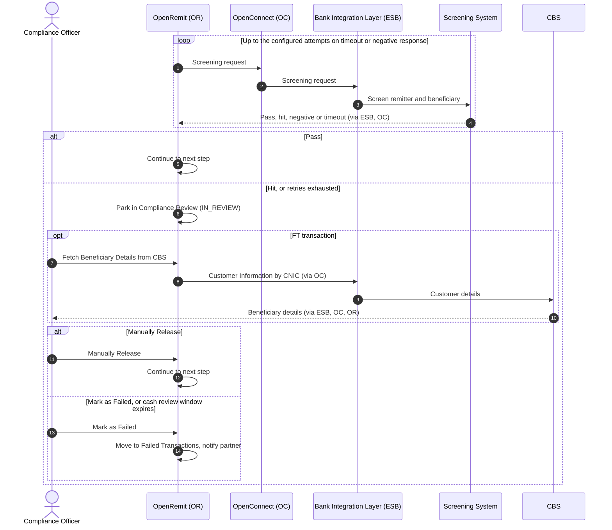

import { Hero, Capabilities } from '@site/src/components/DocKit';

<Hero title="Screening &" accent="Compliance Review" subtitle="Every remittance is screened for AML/CFT and sanctions. Hits are held for a Compliance Officer to release or fail." />

<Capabilities tags={['Standard', 'Configurable', 'Requires Bank Integration']} />

## Overview

OpenRemit sends each transaction's remitter and beneficiary to the Screening System through OpenConnect and the Bank Integration Layer. A pass continues processing. A hit, or a timeout after retries, parks the transaction in **Compliance Review**, where a Compliance Officer reviews the screening summary and either **Manually Releases** it or **Marks it as Failed**. Screening can run before posting (PRE) or after it (POST), and can be set per partner and per transaction type.

## Significance

- **AML/CFT compliance**: remittances to and from sanctioned or high-risk parties are stopped before payout.
- **Risk-based configuration**: sender and receiver screening can be set per partner and per transaction type.
- **Human decision**: borderline hits are reviewed by a Compliance Officer rather than rejected automatically.
- **Time-bound for cash**: cash payouts held by screening must be decided within a configured window.
- **Auditability**: every screening result and decision is logged against the transaction.

## Usage

### Who uses it

| Role | Portal and menu | What they do |
|---|---|---|
| Compliance Officer | Back Office → **Compliance Review** | Reviews held transactions; Manually Release or Mark as Failed |
| Back Office Maker | Back Office → **Partners** | Sets sender / receiver screening per transaction type |
| Back Office admin | Back Office → Screening configuration | Enables or disables screening per transaction type |
| Branch Maker | Branch Portal | Sees the screening-failure message and stops the cash payout |

### Steps

1. Open **Compliance Review**. The list shows Transaction ID, Remitting Institute, Type, Beneficiary Name, CNIC, Account, Amount and Agent Code.
2. Open **Action → View Details** to see the Screening Summary, Parties, Amounts & Purpose and Timeline (showing the failed screening step).
3. For an FT transaction, click **Fetch Beneficiary Details from CBS** for additional customer information. For IBFT, the Bank arranges the information from the other bank.
4. Click **Manually Release** to continue processing (e.g. to Title Fetch), or **Mark as Failed** to stop it.

### APIs involved

| Interface | API | Used for |
|---|---|---|
| Bank Integration Layer (ESB) | Screening | Screen remitter and beneficiary (AML/CFT, sanctions, fraud) |
| Bank Integration Layer (ESB) | Customer Information by CNIC | Fetch beneficiary details from CBS for review (FT) |

## Configuration

| Parameter | Description | Default |
|---|---|---|
| Screening by transaction type | Enable or disable screening for OTC, FT or IBFT. If disabled, the Bank carries the liability | default: enabled |
| Sender / Receiver screening | Per partner, per transaction type | default: TBD |
| Screening position | PRE (before Title Fetch, balance and transfer) or POST (after the transfer) | default: PRE |
| Retry attempts | Retries on screening timeout or negative response before parking | default: 3 |
| Cash payout review window | Time a Compliance Officer has to decide on a held cash payout before it fails | default: TBD |

## Sequence Diagram

## Outcomes & Edge Cases

| Stage | Condition | Outcome |
|---|---|---|
| Screening | Pass | Processing continues |
| Screening | Hit | Held in Compliance Review |
| Screening | Timeout or negative response | Retried; if retries run out, held in Compliance Review |
| Review | Manually Released | Continues to the next stage, e.g. Title Fetch |
| Review | Marked as Failed | Moved to Failed Transactions; for account transfers it can then be cancelled |
| Review | Cash payout not decided within the window | Marked failed; partner notified or transaction released |
| Bulk Retry | Screening failure selected | Not retried; screening holds are resolved only in Compliance Review |
| Configuration | Screening disabled for a type | Transactions of that type skip screening; the Bank carries the liability |

## Related

- [Back Office: Compliance](../../back-office/compliance.md)
- [Back Office: Partners](../../back-office/partners.md)
- [Suspicious Activity Controls](./suspicious-activity-controls.md)
- [Automated RFI](./automated-rfi.md)
- [System Restriction](./system-restriction.md)
- [COC / OTC Cash Payout](../financial/coc-otc-cash-payout.md)
