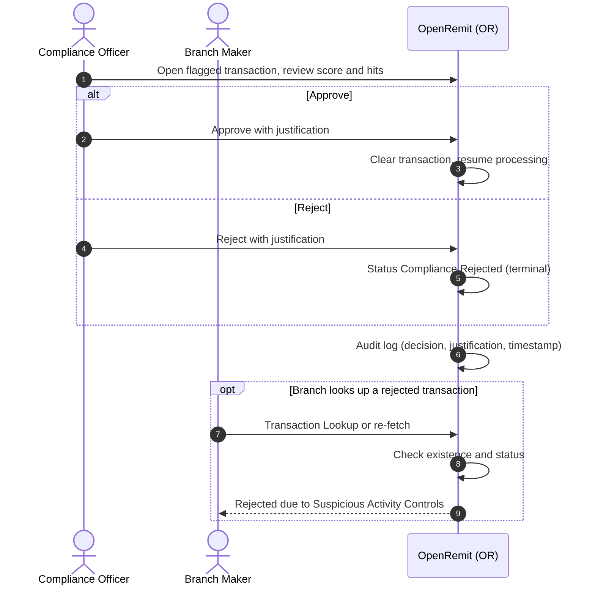

import { Hero, Capabilities } from '@site/src/components/DocKit';

<Hero title="Suspicious Activity" accent="Controls" subtitle="A Compliance Officer clears or rejects a flagged transaction. A rejection is final and is shown to the branch." />

<Capabilities tags={['Standard']} />

## Overview

When screening flags a transaction, the Compliance Officer opens it in Compliance Review, examines the screening score and hits, and makes one of two decisions:

- **Approve**: clears the transaction, and normal processing resumes.
- **Reject**: sets the status to *Compliance Rejected*. This is terminal: the transaction can never be re-fetched or paid.

The Compliance Officer's decision is final and immediate; there is no maker-checker step.

## Significance

- **AML/CFT control**: suspicious remittances are stopped permanently, not just delayed.
- **No back door at the branch**: a rejected cash payout cannot be re-fetched at a branch; the Branch Maker sees a clear rejection message.
- **Accountability**: every decision is logged with its type, justification and timestamp.

## Usage

### Who uses it

| Role | Portal and menu | What they do |
|---|---|---|
| Compliance Officer | Back Office → **Compliance Review** | Approves or rejects flagged transactions |
| Branch Maker | Branch Portal → **Transaction Lookup** | Sees the rejection message when looking up a rejected transaction |

### Steps

1. Open the flagged transaction in **Compliance Review** and review the screening score and hits.
2. Choose a decision and enter a justification.
   - **Approve**: processing resumes.
   - **Reject**: status becomes *Compliance Rejected*.
3. If a Branch Maker later looks up a rejected transaction, OpenRemit returns "Rejected due to Suspicious Activity Controls".

### APIs involved

No external API is called for the decision itself.

## Sequence Diagram

## Outcomes & Edge Cases

| Stage | Condition | Outcome |
|---|---|---|
| Decision | Approve | Cleared; normal processing resumes |
| Decision | Reject | *Compliance Rejected*; terminal |
| Branch lookup | Transaction is *Compliance Rejected* | Branch Maker sees "Rejected due to Suspicious Activity Controls"; cannot re-fetch |
| Audit | Any decision | Logged with type, justification and timestamp |

## Related

- [Back Office: Compliance](../../back-office/compliance.md)
- [Branch Portal: Transaction Lookup](../../branch-portal/transaction-lookup.md)
- [Screening & Compliance Review](./screening-compliance-review.md)
- [Automated RFI](./automated-rfi.md)
- [Audit Logs & Reports](./audit-logs-reports.md)
