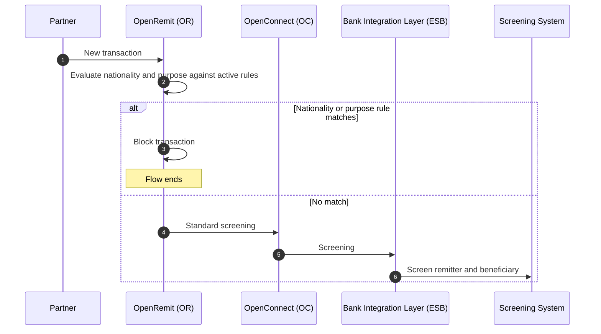

import { Hero, Capabilities } from '@site/src/components/DocKit';

<Hero title="System" accent="Restriction" subtitle="Block transactions by remitter nationality or purpose of payment, using rules the Operations team manages themselves without a code change." />

<Capabilities tags={['Configurable']} />

## Overview

System Restriction is a self-service screening layer, separate from the Screening System. The Operations team maintains two rule sets:

- **Nationality Block**: blocks transactions from remitters of a given nationality.
- **Purpose-of-Payment Block**: blocks transactions whose purpose matches a word or purpose code.

On every new transaction, OpenRemit evaluates the remitter's nationality and the purpose of payment against all active rules. A match blocks the transaction; otherwise it continues to standard screening.

## Significance

- **Fast policy response**: new restrictions take effect immediately, with no release cycle.
- **Time-bound rules**: each rule has an effective date and an optional end date.
- **Defence in depth**: a policy filter that runs before AML/CFT screening.
- **Exportable**: rule sets can be exported for review and audit.

## Usage

### Who uses it

| Role | Portal and menu | What they do |
|---|---|---|
| Operations team | Back Office → System Restriction → Nationality Block | Adds, edits, deletes and exports nationality rules |
| Operations team | Back Office → System Restriction → Purpose-of-Payment Block | Adds, edits, deletes and exports purpose rules |

### Rules

| Rule set | Fields | Notes |
|---|---|---|
| Nationality Block | Nationality, Effective Date, optional End Date | Permanent if End Date is blank. Filter by nationality, code, ISO 8583 code or dates. Export as `nationality-block-YYYY-MM-DD.csv` |
| Purpose-of-Payment Block | Blocked Word or Purpose Code, Match Type, Effective Date, optional End Date | Duplicate value / type / match combinations are rejected at entry. Export as `purpose-payment-block-YYYY-MM-DD.csv` |

Both screens support search, filters and **Reset Filters**.

## Configuration

| Parameter | Description | Default |
|---|---|---|
| Match type (Word) | How a blocked word is matched against the purpose | default: Contains |
| Match type (Purpose Code) | How a blocked purpose code is matched | default: Exact Match |
| End Date | Rule expiry | default: none (permanent) |

## Sequence Diagram

## Outcomes & Edge Cases

| Stage | Condition | Outcome |
|---|---|---|
| Evaluation | Nationality matches an active rule | Transaction blocked |
| Evaluation | Purpose word or code matches an active rule | Transaction blocked |
| Evaluation | No match | Continues to standard screening |
| Rule entry | Duplicate value / type / match combination | Rejected |
| Rule dates | Before the Effective Date or after the End Date | Rule not applied |

:::caution[TBD]
The source specification does not state what status a blocked transaction gets, or whether the partner receives a specific error code.
:::

## Related

- [Screening & Compliance Review](./screening-compliance-review.md)
- [B2C / C2B Limits & Keyword Block](./b2c-c2b-limits.md)
- [Audit Logs & Reports](./audit-logs-reports.md)
